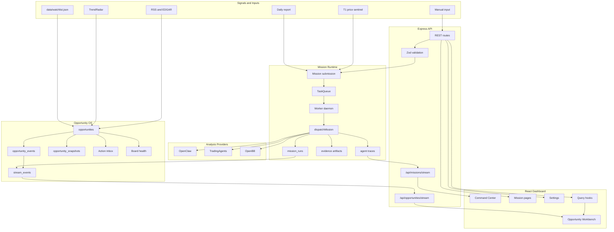
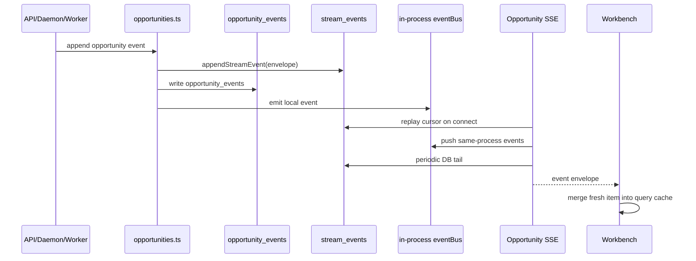
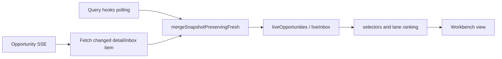

# Sineige Alpha Engine

Sineige Alpha Engine 是一个面向交易研究的 AI 工作台。它不是单纯的任务运行器，而是由两层系统组成：

- Mission 执行层：负责任务排队、执行、重试、取消、证据归档、运行轨迹和结果对比。
- Opportunity 机会层：负责把 IPO/分拆、产业链热量传导、代理叙事等主题沉淀成可跟踪、可排序、可行动的机会卡。

当前主入口是 Opportunity Workbench。系统会从价格哨兵、RSS/EDGAR、TrendRadar、手动输入等来源产生信号，再把信号转成 mission、opportunity、event、snapshot 和 action inbox。

## 目录

- [系统定位](#系统定位)
- [本轮成熟度优化](#本轮成熟度优化)
- [架构总览](#架构总览)
- [核心运行流程](#核心运行流程)
- [核心领域对象](#核心领域对象)
- [前端工作台](#前端工作台)
- [存储模型](#存储模型)
- [API 与 SSE](#api-与-sse)
- [目录结构](#目录结构)
- [启动与开发](#启动与开发)
- [验证命令](#验证命令)
- [运维与排障](#运维与排障)
- [后续路线](#后续路线)

## 系统定位

这个项目解决的问题是：把“发现市场机会”和“执行深度分析”放进同一个可审计系统里。

典型工作流：

1. 数据源产生信号，例如价格异动、RSS/EDGAR 更新、TrendRadar 新主题、手动输入。
2. 系统创建或更新 Opportunity，记录事件和快照。
3. 用户或自动化从 Opportunity 触发 Mission。
4. TaskQueue 调度 Worker 执行 Mission。
5. Worker 调用 OpenClaw、TradingAgents、OpenBB 等分析链。
6. 系统保存 run、evidence、trace、consensus、diff。
7. Dashboard 通过 REST、SSE 和 polling fallback 更新机会工作台。

核心目标不是“更多数据源”，而是让交易机会能被稳定地日常跟踪：为什么它重要、现在该做什么、证据在哪里、上次分析和这次有什么变化、失败后怎么恢复。

## 本轮成熟度优化

本分支聚焦系统稳定性、状态一致性和前端状态治理。

### 1. Mission 输入完整性

Mission 进入队列后不再只依赖 `query/depth/source` 重构输入。队列任务现在保存：

- `inputPayload`
- `inputHash`
- `dedupeKey`
- `idempotencyKey`

Worker 执行时优先使用原始 Mission input，并校验 `inputHash`。这样 `mode / tickers / opportunityId / date` 不会在队列执行阶段丢失。

相关文件：

- `src/workflows/mission-identity.ts`
- `src/workflows/mission-submission.ts`
- `src/utils/task-queue.ts`
- `src/worker.ts`

### 2. 任务幂等与去重

任务去重从 query-only 升级为稳定 mission identity：

- 同一个 `idempotencyKey` 返回同一个 mission。
- 同一个 query 但不同 `opportunityId` 可以创建不同任务。
- 兼容旧任务：没有新字段时仍保留旧 query fallback。

### 3. Durable stream event log

新增 `stream_events` 表作为跨进程事件日志。Mission events 和 Opportunity events 会写入 durable stream，Opportunity SSE 支持：

- cursor replay
- reconnect 后补齐 missed events
- DB tail 捕获 daemon/API 分进程写入的事件
- eventBus 继续负责本进程即时推送

相关文件：

- `src/workflows/stream-events.ts`
- `src/workflows/mission-events.ts`
- `src/workflows/opportunities.ts`
- `src/server/routes/opportunities.ts`

### 4. Mission DB read path

Mission 列表和详情优先走 SQLite index。artifact 仍保存大文本和证据，但 API 不再完全依赖扫描 JSON 文件。

如果 artifact 缺失，详情 API 会返回 DB index 中的 partial mission stub，而不是直接 500。

相关文件：

- `src/workflows/mission-index.ts`
- `src/server/routes/missions.ts`

### 5. Opportunity runtime validation

Opportunity 写入边界从浅层 passthrough 改成深层 Zod schema：

- `scores` 限制在 0-100。
- `heatProfile` 校验 temperature、validationStatus、edge kind、edge weight。
- `proxyProfile` 校验分数字段和已知 profile key。
- `ipoProfile` 校验 retained stake、字段级 evidence、confidence enum。

相关文件：

- `src/server/validation.ts`
- `src/__tests__/opportunity-validation.test.ts`

### 6. Workbench query layer 起步

Opportunity Workbench 的主数据源开始迁移到轻量 query hooks：

- `useOpportunityListQuery`
- `useOpportunityInboxQuery`
- `useOpportunityBoardHealthQuery`
- `useOpportunityEventsQuery`

新增 `mergeSnapshotPreservingFresh()`，避免 polling 旧快照覆盖 SSE 刚合并进去的新 opportunity/inbox item。

相关文件：

- `dashboard/src/queries/query-client.ts`
- `dashboard/src/queries/opportunity-queries.ts`
- `dashboard/src/pages/OpportunityWorkbench.tsx`
- `src/__tests__/query-client.test.ts`

### 7. 响应式底栏修复

底部 macro strip 不再硬编码 `left: 220px`。sidebar 宽度和 macro strip 高度改为 CSS 变量，720px 下 sidebar offset 归零，并给主内容保留底部空间。

相关文件：

- `dashboard/src/App.css`
- `dashboard/src/index.css`

## 架构总览



## 核心运行流程

### Mission 提交流程

```mermaid
sequenceDiagram
  participant UI as Dashboard/API
  participant Submit as createQueuedMission
  participant Mission as Mission store
  participant Queue as TaskQueue
  participant Worker as Worker
  participant Dispatch as dispatchMission

  UI->>Submit: mode, query, tickers, opportunityId, idempotencyKey
  Submit->>Queue: getByIdempotencyKey()
  alt existing idempotent task
    Queue-->>Submit: existing task
    Submit-->>UI: existing mission
  else new task
    Submit->>Mission: create mission record
    Submit->>Queue: enqueue with inputPayload, inputHash, dedupeKey
    Queue-->>Submit: task
    Submit-->>UI: mission + task
  end
  Worker->>Queue: acquire task
  Worker->>Mission: resolve original input
  Worker->>Worker: verify inputHash
  Worker->>Dispatch: execute mission
```



### Opportunity 事件流程



### Workbench 数据刷新流程



## 核心领域对象

### Mission 层

| 对象 | 作用 | 主要位置 |
| --- | --- | --- |
| `task` | 队列调度单元，保存 dedupe、idempotency、input hash、lease 信息 | SQLite `tasks` |
| `mission` | 一次分析请求的主记录 | `out/missions` + SQLite index |
| `mission_run` | Mission 的一次执行实例 | SQLite `mission_runs` |
| `mission_event` | Mission 生命周期事件 | JSONL + `stream_events` |
| `mission_evidence` | Run 级证据快照 | artifact JSON |
| `trace` | Agent 轨迹和 report | `out/traces` |

### Opportunity 层

| 对象 | 作用 | 主要位置 |
| --- | --- | --- |
| `opportunity` | 用户真正操作的交易机会卡 | SQLite `opportunities` |
| `opportunity_event` | 机会事件，例如 mission queued、relay triggered、proxy ignited | SQLite `opportunity_events` + `stream_events` |
| `opportunity_snapshot` | 机会版本快照 | SQLite `opportunity_snapshots` |
| `board_health` | New Codes、Heat Transfer、Proxy Desk 的板块指标 | 运行时聚合 |
| `inbox_item` | 工作台行动排序对象 | 运行时聚合 |

### Opportunity 类型

| 类型 | 工作台板块 | 用途 |
| --- | --- | --- |
| `ipo_spinout` | New Codes | IPO、分拆、独立交易窗口、lockup、coverage、first earnings |
| `relay_chain` | Heat Transfer | 龙头、瓶颈、二三层扩散、热量传导验证 |
| `proxy_narrative` | Proxy Desk | 政策/主题代理变量、映射合法性、稀缺性、可交易性 |
| `ad_hoc` | 通用 | 临时观察和手动分析 |

## 前端工作台

Dashboard 使用 React + Vite，主要页面包括：

- `/`：Opportunity Workbench
- `/command-center`：Mission 提交和队列观察
- `/missions`：Mission 列表
- `/missions/:id`：Mission 详情、run、evidence、trace
- `/watchlist`：动态 watchlist
- `/settings`：模型和运行配置

Opportunity Workbench 的主要模块：

- Action Inbox：按 act、review、monitor 分发行动。
- New Codes：IPO/分拆机会板块。
- Heat Transfer：产业链热量传导板块。
- Proxy Desk：代理叙事板块。
- Event Feed：Opportunity 事件流。
- Detail Drawer：机会详情、编辑、证据和恢复入口。
- Mission Recovery：失败/取消任务恢复入口。

当前前端状态分层：

| 状态类型 | 当前 owner |
| --- | --- |
| Server cache | `dashboard/src/queries/*` 起步接管 opportunity 数据 |
| Live events | `useOpportunityStream` + Workbench merge |
| URL state | search query、board filters |
| Local persistent UI | drafts、saved views |
| Ephemeral UI | drawer、focused lane、loading action |

## 存储模型

系统使用 SQLite + 文件 artifact 的混合模型。

SQLite 负责索引、状态和可查询事件：

- `tasks`
- `mission_runs`
- `missions_index`
- `mission_events`
- `mission_evidence_refs`
- `opportunities`
- `opportunity_events`
- `opportunity_snapshots`
- `stream_events`

文件 artifact 负责大文本和证据：

- `out/missions`
- `out/traces`
- `out/reports`
- `data/watchlist.json`
- `config/models.yaml`

设计原则：

- SQLite 是运行态查询入口。
- artifact 保留完整上下文和大文本。
- API read path 优先 SQLite，必要时 fallback 到 artifact。
- 事件流进入 durable `stream_events`，SSE 只是 projection。

## API 与 SSE

常用 API：

| Endpoint | 作用 |
| --- | --- |
| `GET /api/health` | 服务健康检查 |
| `GET /api/queue` | 队列状态 |
| `POST /api/trigger` | 快速触发 mission |
| `POST /api/missions` | 创建 mission |
| `GET /api/missions` | Mission 列表 |
| `GET /api/missions/:id` | Mission 详情 |
| `GET /api/missions/:id/events` | Mission 事件 |
| `POST /api/missions/:id/retry` | 重试 mission |
| `GET /api/opportunities` | Opportunity 列表 |
| `POST /api/opportunities` | 创建 Opportunity |
| `PATCH /api/opportunities/:id` | 更新 Opportunity |
| `GET /api/opportunities/inbox` | Action Inbox |
| `GET /api/opportunities/board-health` | 板块健康指标 |
| `GET /api/opportunity-events` | 最近 Opportunity events |
| `GET /api/opportunities/graphs/heat-transfer` | Heat Transfer graph |

SSE：

| Endpoint | 作用 |
| --- | --- |
| `GET /api/missions/stream` | Mission/agent 日志流 |
| `GET /api/opportunities/stream` | Opportunity durable event stream |

Opportunity stream 支持 reconnect cursor：

```text
GET /api/opportunities/stream?since=<lastEventId>
```

## 目录结构

```text
.
├── src
│   ├── server
│   │   ├── app.ts
│   │   ├── routes
│   │   └── validation.ts
│   ├── workflows
│   │   ├── mission-submission.ts
│   │   ├── mission-identity.ts
│   │   ├── mission-index.ts
│   │   ├── mission-events.ts
│   │   ├── stream-events.ts
│   │   ├── opportunities.ts
│   │   └── dispatch-engine.ts
│   ├── utils
│   │   └── task-queue.ts
│   ├── db
│   │   └── index.ts
│   ├── daemon
│   ├── agents
│   └── __tests__
├── dashboard
│   ├── src
│   │   ├── pages
│   │   ├── queries
│   │   ├── hooks
│   │   └── api.ts
│   └── package.json
├── docs
│   └── opportunity-runtime-maturity-technical-plan.md
├── config
├── data
└── out
```

## 启动与开发

安装依赖：

```bash
npm install
npm --prefix dashboard install
```

启动 API server：

```bash
npm run server
```

启动 daemon：

```bash
npm run daemon
```

启动前端：

```bash
npm run dev:dashboard
```

启动本地完整开发栈：

```bash
npm run dev:stack
```

如果只想启动不依赖外部 vendor 的开发栈：

```bash
npm run dev:stack:no-vendors
```

## 配置

主要配置入口：

- `.env`
- `config/models.yaml`
- `data/watchlist.json`

常见环境变量按当前代码约定配置 OpenClaw、TradingAgents、OpenBB、TrendRadar、Telegram 等服务。

模型配置由 `config/models.yaml` 管理，Dashboard 的 Settings 页面可读取和更新模型配置。

## 验证命令

提交前建议跑完整门禁：

```bash
npm test
npm run typecheck
npm --prefix dashboard run lint
npm --prefix dashboard run build
git diff --check
```

当前基线：

- `npm test`：30 test files，197 tests passed
- `npm run typecheck`：通过
- `npm --prefix dashboard run lint`：通过
- `npm --prefix dashboard run build`：通过

注意：Vite build 目前会提示主 bundle 超过 500 kB。这是体积提醒，不是构建失败。后续可以用 route-level dynamic import 或 chunk splitting 处理。

## 运维与排障

### Mission 没有按预期关联 Opportunity

检查 task 是否保存了完整 input：

- `inputPayload`
- `inputHash`
- `dedupeKey`
- `missionId`

Worker 会校验 `inputHash`。如果 hash mismatch，说明队列中的 payload 和 mission 原始输入不一致，应优先检查提交链路。

### SSE 没收到事件

Opportunity SSE 是 durable projection。排查顺序：

1. 看 `stream_events` 是否有新事件。
2. 看 `/api/opportunities/stream?since=<id>` 是否能 replay。
3. 看 API 进程是否能访问同一个 SQLite。
4. 看 Workbench polling fallback 是否能补上数据。

### Mission artifact 丢失

Mission API 会优先读 SQLite index。如果 artifact 丢失，详情应返回 partial metadata。若仍然 500，检查：

- `missions_index`
- artifact path
- `src/workflows/mission-index.ts`

### Opportunity 写入 400

当前写入边界会严格校验 profile：

- score 必须是 0-100。
- heat edge weight 必须是 0-100。
- enum 必须使用代码定义值。
- profile 不允许未知 key。

前端编辑或外部 API 调用如果失败，先看响应里的 `details[].path`。

## 后续路线

短期优先级：

1. 继续拆 API service layer，让 routes 更薄。
2. 给 Workbench query layer 增加统一 invalidation 和 reconnect 测试。
3. 把 Mission cancel 进一步传入外部调用链 AbortSignal。
4. 增加 migrations table，替代 `ALTER TABLE ... catch {}`。
5. 继续把 Mission canonical state 收敛到 SQLite。
6. 为 Opportunity 详情增加字段级 provenance 展示。
7. 做前端 chunk splitting，解决 Vite bundle size warning。

完整技术方案见：

```text
docs/opportunity-runtime-maturity-technical-plan.md
```
