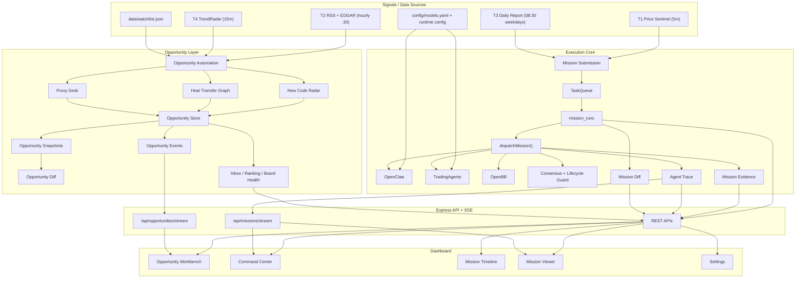
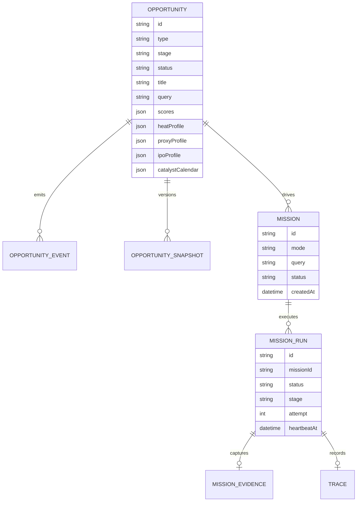
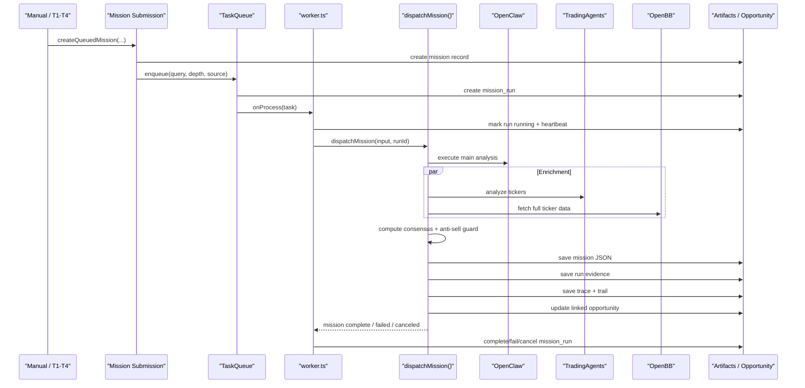

# Sineige Alpha Engine

> 一套把“分析执行平台”与“交易机会操作系统”叠加在一起的 AI 交易研究工作台。  
> 底层负责 `mission / run / evidence / trace` 的执行与留痕，上层负责 `opportunity / event / snapshot / diff` 的机会建模、传导排序和行动分发。

## 目录

- [1. 项目定位](#1-项目定位)
- [2. 当前系统长什么样](#2-当前系统长什么样)
- [3. 核心领域对象](#3-核心领域对象)
- [4. 总体架构图](#4-总体架构图)
- [5. 详细运行机制](#5-详细运行机制)
- [6. 前端页面与使用说明](#6-前端页面与使用说明)
- [7. 启动方式](#7-启动方式)
- [8. 环境变量与配置](#8-环境变量与配置)
- [9. API 与流式接口](#9-api-与流式接口)
- [10. 存储与产物](#10-存储与产物)
- [11. 仓库结构](#11-仓库结构)
- [12. 开发与排障](#12-开发与排障)

## 1. 项目定位

这个仓库现在不是单一工具，而是两个层级叠加出来的系统：

1. 执行内核  
   负责排队、执行、重试、取消、留痕、回放。核心对象是 `mission`、`mission_run`、`mission_evidence`、`trace`。

2. 机会层  
   负责把市场信息整理成可跟踪的交易机会。核心对象是 `opportunity`、`opportunity_event`、`opportunity_snapshot`、`opportunity_diff`。

从 repo 里的当前代码来看，系统主要服务 3 类工作：

- 自动扫描与事件触发：`src/worker.ts`
- 多智能体分析与证据归档：`src/workflows/dispatch-engine.ts`
- 机会卡、行动泳道、实时工作台：`dashboard/src/pages/OpportunityWorkbench.tsx`

## 2. 当前系统长什么样

### 2.1 一句话描述

系统会持续监听价格、RSS、EDGAR、TrendRadar 等来源，把它们转成排队任务和机会卡；任务完成后会保存 run 级证据、trace 和 diff，同时把结构化结果喂给前端的机会工作台。

### 2.2 它解决的核心问题

- 把“发现新东西”与“执行深分析”拆开，但保持关联。
- 把一次分析变成可追踪、可重试、可比较的 run。
- 把“最近该看什么”从任务列表，提升成机会视角的 `Action Inbox`。
- 把 `IPO / 分拆`、`产业链热量传导`、`题材代理变量` 三类机会统一到同一套前端工作流。

### 2.3 双层系统摘要

| 层级 | 主要对象 | 主要责任 | 当前入口 |
| --- | --- | --- | --- |
| 执行层 | `mission`, `mission_run`, `mission_evidence`, `trace` | 触发分析、并发执行、取消/恢复、保存原始证据 | `/command-center`, `/missions`, `/missions/:id` |
| 机会层 | `opportunity`, `opportunity_event`, `opportunity_snapshot`, `opportunity_diff` | 建模机会、维护催化日历、热量图谱、代理变量评分、行动排序 | `/` (Opportunity Workbench) |

## 3. 核心领域对象

### 3.1 执行层对象

| 对象 | 作用 | 主要持久化位置 |
| --- | --- | --- |
| `mission` | 一次分析请求的主记录 | `out/missions/<date>/<mission>.json` |
| `mission_run` | 某个 mission 的一次执行实例 | SQLite `mission_runs` |
| `task` | 队列里的调度单元 | SQLite `tasks` |
| `mission_evidence` | 某个 run 的完整证据快照 | `out/missions/<date>/<run>.evidence.json` |
| `trace` | 某个 run 的 agent 轨迹 | `out/traces/<date>/...json` + `_report.md` |
| `mission_diff` | 当前 run 与历史 run 的差异摘要 | 运行时聚合 |

### 3.2 机会层对象

| 对象 | 作用 | 主要持久化位置 |
| --- | --- | --- |
| `opportunity` | 交易者真正看的对象 | SQLite `opportunities` |
| `opportunity_event` | 结构化事件流 | SQLite `opportunity_events` |
| `opportunity_snapshot` | 机会快照版本 | SQLite `opportunity_snapshots` |
| `opportunity_diff` | thesis 级变化摘要 | 运行时聚合 |
| `board_health` | New Codes / Heat Transfer / Proxy Desk 头部指标 | 运行时聚合 |
| `inbox_item` | 机会工作台里用来排序和行动分发的对象 | 运行时聚合 |

### 3.3 Opportunity 类型

当前代码里定义了 4 类：

- `ipo_spinout`
- `relay_chain`
- `proxy_narrative`
- `ad_hoc`

其中前三类是工作台的正式板块：

- `ipo_spinout` → New Codes
- `relay_chain` → Heat Transfer
- `proxy_narrative` → Proxy Desk

## 4. 总体架构图

### 4.1 系统总览



### 4.2 领域关系图



### 4.3 Mission 执行时序图



## 5. 详细运行机制

### 5.1 进程启动顺序

`npm run daemon` 实际运行的是 `src/worker.ts`。从代码看，启动顺序是：

1. 输出 daemon 启动横幅。
2. 创建核心单例：
   - `AgentSwarmOrchestrator`
   - `TrendRadar`
   - `MacroContextEngine`
   - `NarrativeLifecycleEngine`
3. 执行健康检测：
   - `healthMonitor.checkConnectivity()`
4. 恢复遗留任务：
   - `taskQueue.recover()`
   - `requeueMissionRunsForTasks(...)`
5. 注册队列处理器：
   - `taskQueue.onProcess(...)`
6. 启动 API：
   - `startServer(3000)`
7. 启动 Telegram 交互机器人：
   - `startInteractiveBot()`
8. 注册 4 条 cron 触发链：
   - T1
   - T2
   - T3
   - T4
9. 如果命令行包含 `--run-now` / `--trend` / `--deep`，再执行一次即时扫描。

### 5.2 健康监控与降级模式

`src/utils/health-monitor.ts` 负责：

- 启动时探测 LLM API 可达性
- 记录连续失败次数
- 连续失败达到 `5` 次后进入降级模式
- 降级冷却窗口为 `10` 分钟
- 降级时通过 `shouldSkipAnalysis()` 控制是否跳过重分析
- Telegram 配置存在时发送健康告警；不存在时仅打印日志

### 5.3 队列机制

队列实现位于 `src/utils/task-queue.ts`，当前行为非常重要：

- 存储在 SQLite `tasks` 表
- 默认并发度：`3`
- 重复任务去重规则：同一个 `query` 只要还有 `pending/running` 就不会再次入队
- 任务状态：
  - `pending`
  - `running`
  - `done`
  - `failed`
  - `canceled`
- 启动恢复时会：
  - 删除过老的 `done/failed`
  - 把中断的 `running` 改回 `pending`
- `cancelTask()` 支持对 `pending/running` 任务强制取消

### 5.4 T1-T4 四条自动触发链

| Trigger | 调度 | 作用 | 关键行为 |
| --- | --- | --- | --- |
| `T1` | 每 5 分钟 | 价量哨兵 | 扫描 watchlist `target` 标的，命中严重异动时发送批量告警，`critical` 事件自动创建 quick mission |
| `T2` | 每小时第 30 分钟 | RSS + EDGAR | 轮询政策/RSS/公告；高命中关键词事件自动创建 standard mission；EDGAR filing 自动同步 New Code Radar |
| `T3` | 工作日 08:30 | 日报与赛道扫查 | 生成技术快照、ETF 概览、动态监控池、宏观与绩效摘要，并为每个赛道创建 deep mission |
| `T4` | 每 15 分钟 | TrendRadar | 扫描趋势，推送趋势概览；同步 Heat Transfer Graph；趋势报告提及 ticker 足够多时排队 standard mission |

#### T1 特别说明

- 默认关闭：`T1_SENTINEL_ENABLED_DEFAULT = false`
- 可以通过环境变量或运行时 API 打开
- 冷却时间默认 `30` 分钟

#### T2 特别说明

T2 里其实包含两条逻辑：

- RSS / 政策事件 → 可能直接触发分析任务
- EDGAR filing → 自动刷新 `ipo_spinout` 机会卡

#### T4 特别说明

T4 的作用已经不只是“生成一份趋势报告”，而是：

- 调用 `TrendRadar.scan()`
- 自动构建 / 同步 heat-transfer opportunities
- 在工作台上形成实时 `Heat Transfer` 板块与 `Action Inbox`

### 5.5 Mission 生命周期

Mission 入口主要有两个：

- `POST /api/missions`
- `POST /api/trigger`

二者最终都走 `createQueuedMission()`，关键步骤如下：

1. 生成 `mission` 记录
2. 追加 `created` 事件
3. 入队 `taskQueue.enqueue(...)`
4. 为该任务创建 `mission_run`
5. 如果带 `opportunityId`，把 mission 绑定到对应 opportunity
6. 追加 `queued` 事件

`mission_run` 的典型状态/阶段：

- 状态：
  - `queued`
  - `running`
  - `completed`
  - `failed`
  - `canceled`
- 阶段：
  - `queued`
  - `dispatch`
  - `scout`
  - `analyst`
  - `strategist`
  - `council`
  - `synthesis`
  - `completed`
  - `failed`
  - `canceled`

### 5.6 dispatchMission 具体做了什么

`src/workflows/dispatch-engine.ts` 是执行层核心。它会：

1. 创建或复用 mission record
2. 进入 OpenClaw 主分析阶段
3. 如果是 `explore`：
   - 先跑 OpenClaw
   - 从报告提取 ticker
   - 再对 ticker 跑 TA/OpenBB enrichment
4. 如果是 `analyze` / `review`：
   - OpenClaw 与 enrichment 并行
5. 解析结构化 verdict
6. 计算双大脑共识
7. 运行 lifecycle anti-sell guard
8. 触发 Telegram 入场/止损/否决汇总
9. 生成 decision trail
10. 保存证据、trace、mission 文件
11. 更新 linked opportunity

### 5.7 Opportunity 层如何生成

机会层不是单一数据源生成，而是多条路径叠加：

#### 5.7.1 New Code Radar

来自：

- `watchIPO(...)`
- `syncNewCodeRadarOpportunities(...)`
- `buildNewCodeRadarCandidates(...)`

它会根据 filing 阶段和已有机会卡，维护：

- `ipoProfile`
- `catalystCalendar`
- 字段级 evidence
- `trading_soon / pricing / filing` 这类状态

#### 5.7.2 Heat Transfer Graph

来自：

- `getActiveTickers()`
- `buildHeatTransferGraphs(...)`
- `syncHeatTransferGraphOpportunities(...)`

它会维护：

- leader / bottleneck / laggard / junk
- relay score
- breadth score
- validation status
- edges 与传导理由
- heat history 与 inflection

#### 5.7.3 Proxy Desk

来自：

- opportunity 的 `scores`
- `proxyProfile`
- 规则状态与点火/退潮事件

当前前端展示的点火/退潮，后端统一通过 `buildOpportunityBoardHealthMap()` 计算。

### 5.8 前后端如何同步实时状态

当前代码里有两条 SSE：

- `/api/missions/stream`
- `/api/opportunities/stream`

前端通过 `useAgentStream()` 和 `useOpportunityStream()` 订阅，特征是：

- 自动指数退避重连
- mission stream 用于 agent log / trace 可视化
- opportunity stream 用于工作台局部刷新、lane 头部跳变、`LIVE RANK`

也就是说，首页不是纯轮询页面，而是：

- 基础数据走 polling
- 关键跳变走 SSE
- 收到关键事件后，只局部刷新对应 inbox item / opportunity summary / board health

## 6. 前端页面与使用说明

当前 Dashboard 路由定义在 `dashboard/src/App.tsx`。

### 6.1 页面总览

| 路由 | 页面 | 作用 |
| --- | --- | --- |
| `/` | Opportunity Workbench | 默认首页，机会工作台 |
| `/command-center` | Command Center | 手动发任务、看执行控制台 |
| `/missions` | Mission Timeline | 查看任务时间线 |
| `/missions/:id` | Mission Viewer | 查看单任务详情、run、evidence、trace、compare |
| `/radar` | TrendRadar Hub | 趋势雷达视图 |
| `/radar-raw` | TrendRadar Raw | 原始 TrendRadar 数据透视 |
| `/watchlist` | Watchlist | 监控池与动态观察标的 |
| `/settings` | Settings | 模型配置页面 |

### 6.2 Opportunity Workbench

这是当前系统最重要的页面。

它主要由以下部分组成：

- 顶部 summary cards
- `Pulse` 总控卡
- `Action Inbox`
- 三大机会板块：
  - New Codes
  - Heat Transfer
  - Proxy Desk
- 手动创建机会卡表单
- 近期事件流

#### `Pulse` 卡

`Pulse` 会把 lane 和 board 的实时变化综合成：

- `LIVE`
- `RECENT`
- `STEADY`

它还能：

- 跳转到当前最应该看的 lane
- 直接执行该 lane 的默认动作
- 显示当前 focus opportunity 与备选动作

#### `Action Inbox`

`Action Inbox` 现在分成三条泳道：

- `Act Now`
- `Review Now`
- `Monitor`

每条泳道都不是简单的列表，而是：

- lane insight
- lane live signal
- lane default action
- lane 内部实时重排

#### 工作台快捷键

当前页面内建了这些快捷键：

- `1` → 跳到 `Act Now`
- `2` → 跳到 `Review Now`
- `3` → 跳到 `Monitor`
- `Shift + 1/2/3` → 直接执行对应泳道的默认动作

#### Drilldown 与状态保留

机会板块头部的 health chips 可以点击筛选。当前实现里：

- 筛选会写入 URL query
- 页面刷新后会恢复
- 无效筛选会被自动清理
- 创建机会卡草稿会保存在本地浏览器存储

### 6.3 Command Center

适合做“直接发任务”的操作：

- Explore 模式
- Analyze 模式
- 选择 `quick / standard / deep`
- 查看当前 queue、服务健康、最近 missions

如果你只是想快速扔一个题目让系统分析，这里最直接。

### 6.4 Mission Timeline

按时间列出 mission 和 legacy traces，适合：

- 快速浏览最近任务
- 看到 mission status / run status
- 打开 compare 视图

### 6.5 Mission Viewer

这是执行层最细的详情页，能看：

- mission 基本信息
- events
- 所有 runs
- run 级 evidence
- run 级 trace
- 当前 run 与历史 run 的 compare

如果你要做“这次和上次到底哪里变了”的审计，这里是主入口。

### 6.6 Settings

Settings 页编辑的是 `config/models.yaml`，不是临时内存状态。

页面支持：

- 查看当前 provider/base_url
- 修改模型档案
- 修改服务到模型的映射
- 保存回 YAML

这意味着：

- 模型配置是持久化的
- 重启后依然保留

与之相对，`/api/config` 的运行时配置是内存态：

- `t1Enabled`
- `leaderTickers`
- `sma250VetoEnabled`

这部分重启后会回到默认值。

## 7. 启动方式

### 7.1 启动前准备

#### 必需软件

- Node.js + npm
- Python 运行环境（如果你打算本地跑 OpenBB / TradingAgents / TrendRadar）
- Docker / Docker Compose（如果你选择容器方式）

#### 安装 Node 依赖

根目录与 dashboard 是两个独立的 Node 项目，都要安装依赖：

```bash
npm install
cd dashboard
npm install
cd ..
```

#### 环境变量文件

仓库里同时存在两份模板：

- 根目录 `.env.example`
- `config/.env.example`

建议以 `config/.env.example` 为主，因为它更完整，包含：

- LLM
- Web intelligence
- Financial data
- Telegram
- OpenBB / TradingAgents service URLs

如果你直接用 `npm run daemon`，根目录下的 `.env` 最稳妥：

```bash
cp config/.env.example .env
```

如果你还想用 `scripts/start-all.sh`，它会优先读取 `config/.env`，其次才是根目录 `.env`。所以可以再补一份：

```bash
cp config/.env.example config/.env
```

#### 端口约定

| 服务 | 端口 | 说明 |
| --- | --- | --- |
| OpenClaw API | `3000` | Express API + SSE |
| OpenBB | `8000` | 外部数据层 |
| TradingAgents | `8001` | 第二大脑 |
| Dashboard dev | `5173` | Vite 开发服务器 |
| Dashboard docker | `5173 -> 80` | Nginx 代理静态前端 |

### 7.2 方式 A：最小可运行开发模式

适合只想启动后端 + Dashboard，验证 UI、API、机会层与基础分析流。

#### Terminal 1：启动 daemon + API

```bash
npm run daemon
```

这条命令会同时做几件事：

- 启动 worker
- 启动 API server (`3000`)
- 注册 T1-T4
- 启动 Telegram 交互 bot

#### Terminal 2：启动 Dashboard

```bash
cd dashboard
npm run dev
```

打开：

- Dashboard: [http://localhost:5173](http://localhost:5173)
- API: [http://localhost:3000/api/health](http://localhost:3000/api/health)

#### 说明

即使 OpenBB / TradingAgents 没启动，前后端页面依然可以打开；但：

- 多服务健康卡会显示 offline
- enrichment 能力会缺失
- 某些 mission 只能部分完成或失败

### 7.3 方式 B：交互式单次分析

适合只想在命令行里直接问一个题目，不关心工作台。

```bash
npm start
```

这个入口来自 `src/index.ts`，会：

- 提示输入 narrative 或 ticker
- 启动 `AgentSwarmOrchestrator`
- 执行一次性 mission

### 7.4 方式 C：daemon 的手动即时扫描参数

`src/worker.ts` 支持以下参数：

#### 立即跑一轮 watchlist 扫描

```bash
npm run daemon -- --run-now
```

#### 立即跑一轮 TrendRadar

```bash
npm run daemon -- --run-now --trend
```

#### 立即排一条深度任务

```bash
npm run daemon -- --run-now --deep "AI data center bottleneck"
```

说明：

- `--run-now` 不会替代 daemon，而是在 daemon 启动后额外执行一次立即扫描
- `--deep "<query>"` 会创建一条高优先级 deep mission

### 7.5 方式 D：本地一键拉起全套服务

仓库自带：

```bash
./scripts/start-all.sh
```

它会尝试按顺序启动：

1. OpenBB API
2. TradingAgents API
3. OpenClaw daemon + API
4. Dashboard dev server
5. TrendRadar 后台循环

注意：

- 这个脚本依赖本地 vendor 目录和 Python/venv 形状
- 适合已经把 `vendors/openbb`、`vendors/trading-agents` 跑通的开发环境

### 7.6 方式 E：Docker Compose

```bash
docker compose up --build
```

当前 `docker-compose.yml` 会启动：

- `openclaw`
- `trading-agents`
- `trendradar`
- `openbb`
- `dashboard`

Compose 暴露的端口：

- `3000` → openclaw
- `8000` → openbb
- `8001` → trading-agents
- `5173` → dashboard

这是最接近“完整联调环境”的方式。

### 7.7 启动后的自检清单

建议按下面顺序验证：

```bash
curl http://localhost:3000/api/health
curl http://localhost:3000/api/health/services
curl http://localhost:3000/api/opportunities
curl http://localhost:3000/api/missions
```

然后打开：

- [http://localhost:5173](http://localhost:5173)
- 看首页 `Pulse`
- 看 `Action Inbox`
- 看 `Command Center`

## 8. 环境变量与配置

### 8.1 `.env` / `config/.env` 常用变量

| 变量 | 作用 | 说明 |
| --- | --- | --- |
| `LLM_API_KEY` | 主 LLM API Key | 必需，未配置时健康监控会提示 Mock/降级 |
| `LLM_BASE_URL` | OpenAI-compatible base URL | 由代码直接读取 |
| `LLM_MODEL` | 默认模型名 | 基础配置 |
| `ZHIPUAI_API_KEY` / `AI_API_KEY` | 兼容其他 provider | `config/.env.example` 中提供 |
| `FIRECRAWL_API_KEY` | Web intelligence | 可选 |
| `TAVILY_API_KEY` | Web intelligence | 可选 |
| `EXA_API_KEY` | Web intelligence | 可选 |
| `DESEARCH_API_KEY` | 社媒搜索 | 可选 |
| `FMP_API_KEY` | 金融数据 | OpenBB / 财务数据用 |
| `TELEGRAM_BOT_TOKEN` | Telegram 机器人 token | 可选 |
| `TELEGRAM_CHAT_ID` | Telegram chat id | 可选 |
| `OPENBB_API_URL` | OpenBB 地址 | 默认 `http://localhost:8000` |
| `TRADING_AGENTS_URL` | TradingAgents 地址 | 默认 `http://localhost:8001` |
| `POLL_INTERVAL_MS` | 轮询周期 | 基础配置 |
| `LOG_LEVEL` | 日志级别 | 基础配置 |
| `MOCK_LLM` | 是否启用 mock | 可选 |

### 8.2 代码支持但模板里不一定显式列出的变量

| 变量 | 作用 |
| --- | --- |
| `TASK_QUEUE_CONCURRENCY` | 覆盖默认并发数 |
| `T1_ENABLED` | 环境级打开/关闭 T1 |
| `T1_COOLDOWN_MS` | 覆盖 T1 冷却时间 |

### 8.3 模型配置

模型配置文件是：

- [`config/models.yaml`](config/models.yaml)

它是单一事实源，当前支持：

- 全局默认 provider/base_url
- `deep_think`
- `quick_think`
- service → profile 映射

Dashboard 的 Settings 页会直接保存回这个 YAML。

### 8.4 运行时配置

运行时配置通过：

- `GET /api/config`
- `PATCH /api/config`

当前支持的字段：

- `t1Enabled`
- `leaderTickers`
- `sma250VetoEnabled`

注意：这部分是内存态，不会写回文件。

## 9. API 与流式接口

下面只列核心接口，完整路由定义见 `src/server/app.ts`。

### 9.1 任务与执行层

| 方法 | 路径 | 作用 |
| --- | --- | --- |
| `GET` | `/api/health` | 系统健康摘要 |
| `GET` | `/api/health/services` | 多服务健康 |
| `GET` | `/api/queue` | 队列状态 |
| `POST` | `/api/trigger` | 兼容旧入口，手动下发任务 |
| `DELETE` | `/api/queue/:id` | 取消任务 |
| `GET` | `/api/missions` | mission 列表 |
| `GET` | `/api/missions/:id` | 单 mission 详情 |
| `GET` | `/api/missions/:id/events` | mission 事件流 |
| `GET` | `/api/missions/:id/runs` | run 列表 |
| `GET` | `/api/missions/:id/runs/:runId/evidence` | run 证据 |
| `POST` | `/api/missions` | 创建 mission |
| `POST` | `/api/missions/:id/retry` | 重试 mission |

### 9.2 机会层

| 方法 | 路径 | 作用 |
| --- | --- | --- |
| `GET` | `/api/opportunities` | 机会列表 |
| `GET` | `/api/opportunities/:id` | 单机会详情 |
| `POST` | `/api/opportunities` | 创建机会 |
| `PATCH` | `/api/opportunities/:id` | 更新机会 |
| `GET` | `/api/opportunities/inbox` | 工作台 inbox |
| `GET` | `/api/opportunities/board-health` | 三大板块健康摘要 |
| `GET` | `/api/opportunity-events` | 机会事件流历史 |
| `GET` | `/api/opportunities/:id/events` | 单机会事件 |
| `GET` | `/api/opportunities/:id/heat-history` | relay 历史 |
| `GET` | `/api/opportunities/graphs/heat-transfer` | heat transfer graph 列表 |
| `POST` | `/api/opportunities/graphs/heat-transfer/sync` | 同步 relay opportunities |
| `POST` | `/api/opportunities/radar/new-codes/refresh` | 刷新 New Code Radar |

### 9.3 配置与观测

| 方法 | 路径 | 作用 |
| --- | --- | --- |
| `GET` | `/api/config/models` | 读取 models.yaml |
| `PUT` | `/api/config/models` | 保存 models.yaml |
| `GET` | `/api/config` | 读取运行时配置 |
| `PATCH` | `/api/config` | 更新运行时配置 |
| `GET` | `/api/token-usage` | token 使用量 |
| `GET` | `/api/diagnostics` | 诊断与探针 |

### 9.4 SSE

| 路径 | 内容 |
| --- | --- |
| `/api/missions/stream` | agent log / mission 进度流 |
| `/api/opportunities/stream` | opportunity_event 实时流 |

### 9.5 例子

#### 创建机会卡

```bash
curl -X POST http://localhost:3000/api/opportunities \
  -H "Content-Type: application/json" \
  -d '{
    "type": "relay_chain",
    "title": "AI Memory Wall Relay",
    "query": "AI memory wall",
    "thesis": "Leader heat may transmit into bottleneck memory names.",
    "leaderTicker": "NVDA",
    "relatedTickers": ["MU"],
    "relayTickers": ["WDC"]
  }'
```

#### 创建 mission

```bash
curl -X POST http://localhost:3000/api/missions \
  -H "Content-Type: application/json" \
  -d '{
    "mode": "analyze",
    "query": "NVDA",
    "tickers": ["NVDA"],
    "depth": "deep",
    "source": "manual"
  }'
```

#### 打开 T1

```bash
curl -X PATCH http://localhost:3000/api/config \
  -H "Content-Type: application/json" \
  -d '{
    "t1Enabled": true
  }'
```

## 10. 存储与产物

### 10.1 SQLite

数据库文件：

- `data/openclaw.db`

当前至少包含这些表：

- `tasks`
- `mission_runs`
- `opportunities`
- `opportunity_snapshots`
- `opportunity_events`
- `narratives`

### 10.2 文件产物

| 路径 | 内容 |
| --- | --- |
| `out/missions/<date>/<mission>.json` | mission 主记录 |
| `out/missions/<date>/<run>.evidence.json` | run 级证据快照 |
| `out/traces/<date>/*.json` | run 级 trace |
| `out/traces/<date>/*_report.md` | 可读 trace 报告 |
| `out/trails/<date>/<mission>-trail.md` | 决策漏斗报告 |
| `vendors/trendradar/output` | TrendRadar 输出目录 |

### 10.3 watchlist / 配置源

| 路径 | 作用 |
| --- | --- |
| `data/watchlist.json` | 静态 watchlist、sector ETF、reddit sources、news keywords |
| `config/models.yaml` | 模型与服务映射 |
| `.env` / `config/.env` | 环境变量 |

## 11. 仓库结构

```text
.
├── README.md
├── package.json
├── docker-compose.yml
├── scripts/
│   └── start-all.sh
├── config/
│   ├── .env.example
│   └── models.yaml
├── data/
│   ├── openclaw.db
│   └── watchlist.json
├── dashboard/
│   ├── package.json
│   └── src/
│       ├── App.tsx
│       ├── api.ts
│       ├── hooks/useAgentStream.ts
│       ├── components/Layout.tsx
│       └── pages/
│           ├── OpportunityWorkbench.tsx
│           ├── CommandCenter.tsx
│           ├── MissionTimeline.tsx
│           ├── MissionViewer.tsx
│           ├── Watchlist.tsx
│           └── Settings.tsx
├── src/
│   ├── index.ts
│   ├── worker.ts
│   ├── server/app.ts
│   ├── db/index.ts
│   ├── utils/
│   │   ├── task-queue.ts
│   │   ├── event-bus.ts
│   │   ├── health-monitor.ts
│   │   ├── agent-logger.ts
│   │   ├── trail-renderer.ts
│   │   ├── telegram.ts
│   │   ├── openbb-provider.ts
│   │   └── ta-client.ts
│   ├── tools/
│   │   ├── market-data.ts
│   │   ├── rss-monitor.ts
│   │   └── edgar-monitor.ts
│   └── workflows/
│       ├── mission-submission.ts
│       ├── dispatch-engine.ts
│       ├── mission-runs.ts
│       ├── mission-evidence.ts
│       ├── mission-diff.ts
│       ├── opportunities.ts
│       ├── opportunity-calendars.ts
│       ├── heat-transfer-graph.ts
│       ├── opportunity-ranking.ts
│       ├── opportunity-actions.ts
│       └── opportunity-playbooks.ts
└── vendors/
    ├── openbb/
    ├── trading-agents/
    └── trendradar/
```

## 12. 开发与排障

### 12.1 常用命令

```bash
# 根目录测试
npm test

# 开发环境预检
npm run check:dev-env

# 一键开发栈（API + daemon + Dashboard + vendors）
npm run dev:stack

# 只跑 OpenClaw API/daemon/Dashboard，不启动 vendors
npm run dev:stack:no-vendors

# Dashboard 构建
cd dashboard
npm run build

# Dashboard 开发
npm run dev

# 后端 daemon
cd ..
npm run daemon
```

### 12.2 常见问题

#### 1. Dashboard 打开了，但很多卡显示 offline

优先检查：

- `http://localhost:3000/api/health/services`
- `OPENBB_API_URL`
- `TRADING_AGENTS_URL`

#### 2. 为什么 T1 没有触发？

因为默认就是关闭的。  
代码默认值：`T1_SENTINEL_ENABLED_DEFAULT = false`

打开方式：

- `PATCH /api/config`
- 或设置 `T1_ENABLED=true`

#### 3. 为什么 Telegram 没发消息？

如果未配置 `TELEGRAM_BOT_TOKEN` / `TELEGRAM_CHAT_ID`，代码会退化成只打印日志，不阻断主流程。

#### 4. 为什么 Settings 改了能保存，但运行时配置重启就没了？

因为两者不是一回事：

- Settings 页修改的是 `config/models.yaml`，会持久化
- `/api/config` 修改的是运行时内存配置，重启后重置

#### 5. 为什么有些机会卡有了，但还没有 mission？

这是正常的。机会层和执行层是叠加关系，不是强绑定关系：

- 机会卡可以先存在
- mission 可以之后再由手动动作或自动事件触发

#### 6. 为什么有 evidence / trace / diff，但位置不一样？

因为当前系统故意把“数据库元数据”和“文件型大对象”分开：

- SQLite：索引、状态、事件、快照
- 文件：大报告、evidence、trace、trail

### 12.3 推荐阅读顺序

如果你要继续开发这个仓库，建议按这个顺序读：

1. `src/worker.ts`
2. `src/server/app.ts`
3. `src/workflows/mission-submission.ts`
4. `src/workflows/dispatch-engine.ts`
5. `src/workflows/opportunities.ts`
6. `src/workflows/opportunity-ranking.ts`
7. `dashboard/src/pages/OpportunityWorkbench.tsx`
8. `dashboard/src/pages/MissionViewer.tsx`
9. `docs/system-maturity-improvement-plan.md`

---

如果你只想最快跑起来：

```bash
cp config/.env.example .env
npm install
cd dashboard && npm install && cd ..
npm run dev:stack:no-vendors
```

然后打开 [http://localhost:5173](http://localhost:5173)。
