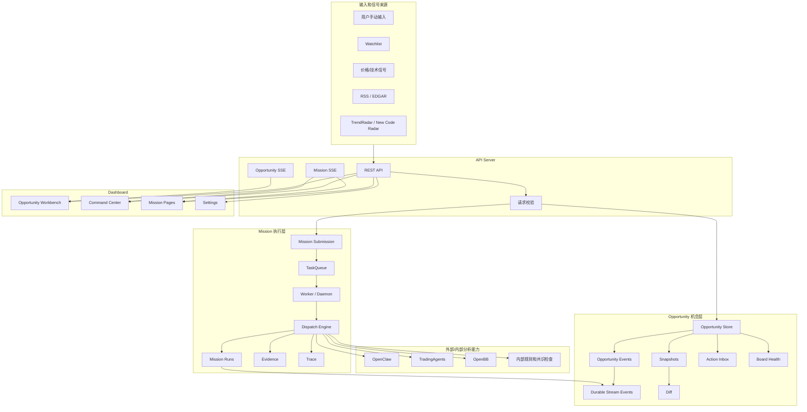
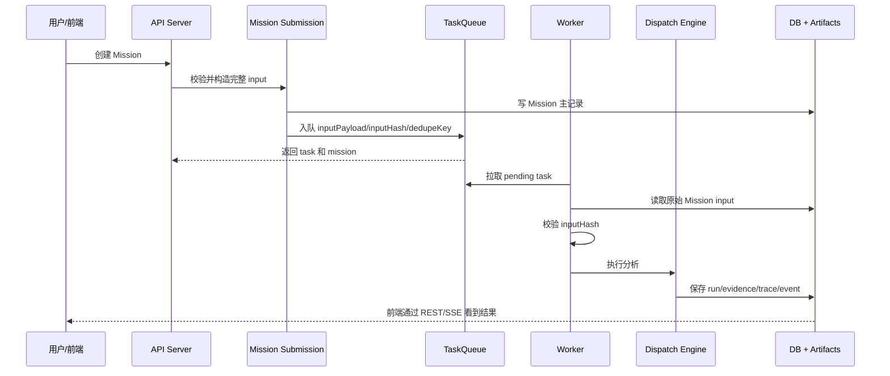
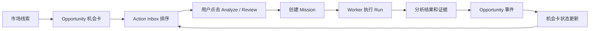
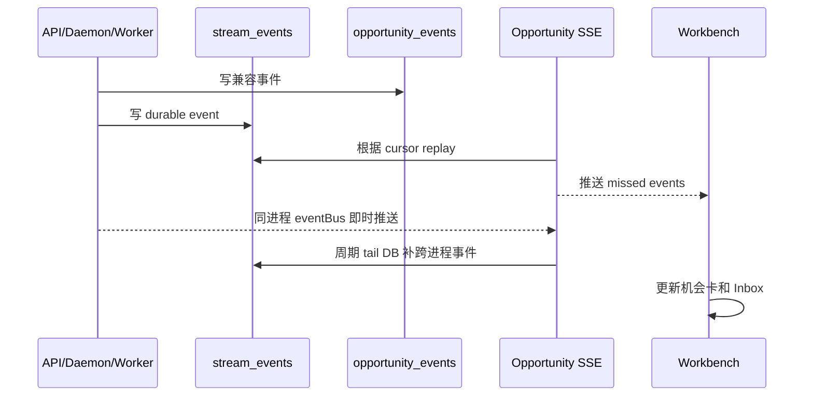

# Sineige Alpha Engine

一个面向交易研究的 AI 工作台。

它做的事可以用一句人话概括：

> 把市场里值得关注的线索整理成“机会卡”，再用 AI 分析任务去反复验证这些机会，最后把结果、证据、事件和后续动作沉淀下来。

这个项目不是投资建议系统，也不是自动下单系统。它是一个研究和决策辅助平台：帮你发现、整理、分析、复盘交易机会。

## 目录

- [先说人话：Mission 和 Opportunity 是什么](#先说人话mission-和-opportunity-是什么)
- [这个系统到底能干什么](#这个系统到底能干什么)
- [典型使用方式](#典型使用方式)
- [系统整体架构](#系统整体架构)
- [核心流程图](#核心流程图)
- [前端页面说明](#前端页面说明)
- [后端模块说明](#后端模块说明)
- [数据和文件都放在哪里](#数据和文件都放在哪里)
- [API 和实时推送](#api-和实时推送)
- [本地启动](#本地启动)
- [环境变量和外部服务](#环境变量和外部服务)
- [常用开发命令](#常用开发命令)
- [测试和质量门禁](#测试和质量门禁)
- [项目目录结构](#项目目录结构)
- [排障指南](#排障指南)
- [当前工程状态](#当前工程状态)
- [后续路线](#后续路线)

## 先说人话：Mission 和 Opportunity 是什么

### Mission 是什么

Mission 就是“一次分析任务”。

你可以把它理解成你对系统说的一句话：

> 帮我分析一下 NVDA、TSM、MU 这条 AI 算力供应链，现在有没有交易价值。

系统收到这句话后，会创建一个 Mission，然后把它放进任务队列，由 Worker 去执行。执行过程中可能会调用：

- OpenClaw：做主题、产业链、基本面和交易观点分析。
- TradingAgents：做多角色投资辩论和交易计划。
- OpenBB：拿结构化金融数据和技术指标。
- 内部规则：做一致性检查、SMA250 veto、风险标记、结果归档。

Mission 的特点：

- 它是一次性的分析动作。
- 它会进队列，可以等待、运行、失败、取消、重试。
- 它会产生报告、证据、运行轨迹和结果对比。
- 同一个问题可以跑多次，每次执行叫一个 Run。

简单说：

> Mission = “现在帮我查一次、分析一次、生成一次结论。”

### Opportunity 是什么

Opportunity 就是“一个值得长期跟踪的交易机会”。

它不是一次分析任务，而是一张机会卡。比如：

- “AI 算力从龙头向存储和封装扩散”
- “某个分拆 IPO 即将进入正式交易窗口”
- “某个股票成为政策主题的市场代理变量”

一个 Opportunity 里面会记录：

- 这个机会是什么。
- 相关 ticker 有哪些。
- 当前状态是观察、准备、活跃、降级还是归档。
- 为什么现在值得看。
- 下一催化是什么。
- 分数和排序依据是什么。
- 最近发生了什么事件。
- 跟它相关的 Mission 有哪些。
- 上一次分析和这一次有什么变化。

简单说：

> Opportunity = “这件事值得跟踪，它可能会反复触发多个 Mission。”

### 两者的关系

最容易理解的关系是：

> Opportunity 是一个研究档案，Mission 是这个档案里的一次调查。

比如你有一张机会卡：

> AI Infra Heat Transfer

这张卡可以触发很多次 Mission：

- 第一次：分析龙头是否还强。
- 第二次：分析瓶颈环节是否开始接力。
- 第三次：分析二三层 ticker 是否跟上。
- 第四次：复盘上次结论有没有被新数据推翻。

所以：

| 概念 | 人话解释 | 生命周期 |
| --- | --- | --- |
| Opportunity | 一个长期跟踪的交易机会 | 可以存在很多天、很多周 |
| Mission | 针对某个问题跑一次分析 | 一次执行完成后结束 |
| Run | Mission 的一次具体执行 | 每次 retry 都会产生新 run |
| Evidence | 这次 run 保存下来的证据包 | 用于审计和复盘 |
| Event | 系统记录的一条结构化事件 | 用于时间线和实时更新 |
| Snapshot | Opportunity 某一刻的快照 | 用于比较变化 |

### 一个完整例子

1. 系统发现 AI 供应链里 CRWV、MU、SNDK 有热度变化。
2. 系统创建一张 Opportunity：`AI Infra 热量传导链`。
3. Opportunity Workbench 把它排到 Action Inbox 里。
4. 你点击“Analyze”。
5. 系统创建一个 Mission：分析这条传导链是否成立。
6. Worker 执行 Mission，调用 OpenClaw、TradingAgents、OpenBB。
7. Mission 完成后，Opportunity 记录一个事件：`mission_completed`。
8. Workbench 更新机会卡，告诉你这个机会是升级、降级，还是继续观察。

## 这个系统到底能干什么

当前系统主要做 5 件事。

### 1. 发现线索

线索来源包括：

- 手动输入。
- Watchlist。
- 价格和技术信号。
- RSS / EDGAR。
- TrendRadar。
- New Code Radar。
- Heat Transfer Graph。

这些线索不一定马上变成交易动作。系统会先把它们整理成 Opportunity 或 Mission。

### 2. 管理机会

Opportunity Workbench 会把机会分成三类主板块：

| 板块 | Opportunity 类型 | 解决的问题 |
| --- | --- | --- |
| New Codes | `ipo_spinout` | 新股、分拆、正式交易日、lockup、首次覆盖、首份独立财报 |
| Heat Transfer | `relay_chain` | 龙头、瓶颈、二三层扩散、产业链热量传导 |
| Proxy Desk | `proxy_narrative` | 某个股票是否成了主题或政策的代理变量 |

还有一类 `ad_hoc`，用于临时研究。

### 3. 执行深度分析

Mission Runtime 负责把一次分析跑完整：

- 创建 Mission。
- 写入 TaskQueue。
- Worker 获取任务。
- 调用分析服务。
- 保存 run、trace、evidence。
- 计算 consensus。
- 记录事件。
- 回写 Opportunity。

### 4. 形成行动队列

Action Inbox 会把 Opportunity 分成三条行动泳道：

- `act`：现在更值得行动。
- `review`：需要复核、降级、恢复或排雷。
- `monitor`：继续观察。

排序依据不是单一分数，而是事件、催化、状态、最近变化、任务结果、机会类型共同决定。

### 5. 留痕和复盘

系统会保存：

- 每次 Mission 的输入。
- 每次 Run 的状态和耗时。
- OpenClaw / TradingAgents / OpenBB 的结果。
- Evidence JSON。
- Trace JSON 和 Markdown report。
- Opportunity event。
- Opportunity snapshot。
- Mission diff 和 Opportunity diff。

这让你可以回头问：

> 当时为什么判断它值得看？后来哪些事实改变了？AI 的结论有没有漂移？

## 典型使用方式

### 日常使用

1. 打开 Dashboard。
2. 先看 Opportunity Workbench。
3. 看 Action Inbox 里排在前面的机会。
4. 点开机会详情，查看 thesis、tickers、事件、催化和分数解释。
5. 对重要机会启动 Analyze 或 Review Mission。
6. Mission 完成后回到机会卡，看结论和变化。

### 手动研究一个问题

1. 打开 Command Center。
2. 输入 query，例如：

   ```text
   AI infrastructure supply chain: NVDA TSM MU SNDK
   ```

3. 选择分析深度。
4. 创建 Mission。
5. 在 Mission 页面看运行状态、报告和证据。

### 把一个主题变成长期机会

1. 在 Opportunity Workbench 创建 Opportunity。
2. 填入 title、query、ticker、thesis、stage、status。
3. 让系统围绕这张卡持续记录事件。
4. 每次新催化或新数据出现时，触发新的 Mission。
5. 通过 snapshots 和 diff 看机会是否变强或变弱。

## 系统整体架构



## 核心流程图

### 创建并执行 Mission



### Opportunity 如何驱动 Mission



### Opportunity 实时事件



## 前端页面说明

前端在 `dashboard/`，使用 React + Vite。

### Opportunity Workbench

路径：`/`

这是系统主页面。它回答的问题是：

> 今天最值得看什么？为什么？下一步该做什么？

主要模块：

- Action Inbox：把机会分成 act、review、monitor。
- New Codes：IPO/分拆机会。
- Heat Transfer：产业链热量传导机会。
- Proxy Desk：代理叙事机会。
- Event Feed：最近机会事件。
- Catalyst Reminder：催化日历提醒。
- Detail Drawer：机会详情、编辑、证据、任务恢复。
- Mission Recovery：失败或取消任务的恢复入口。

### Command Center

路径：`/command-center`

适合手动创建 Mission、观察队列、看实时日志。

### Mission Timeline

路径：`/missions`

查看历史 Mission、状态、最近 run、diff 和关联信息。

### Mission Viewer

路径：`/missions/:id`

查看某个 Mission 的完整详情：

- 输入是什么。
- 跑了几次。
- 当前状态。
- OpenClaw 报告。
- TradingAgents 结果。
- OpenBB 数据。
- Evidence。
- Trace。
- Diff。

### Settings

路径：`/settings`

管理模型配置和运行配置。模型配置主要来自 `config/models.yaml`。

## 后端模块说明

### API Server

入口：

```text
src/server/index.ts
src/server/app.ts
src/server/routes/*
```

职责：

- 提供 REST API。
- 提供 Mission SSE 和 Opportunity SSE。
- 校验请求 payload。
- 读取 Mission、Opportunity、Queue、Config、Trace、Report。
- 把前端动作转成 workflow 调用。

### Mission Submission

入口：

```text
src/workflows/mission-submission.ts
src/workflows/mission-identity.ts
```

职责：

- 构造标准 Mission input。
- 支持 idempotency。
- 生成 dedupeKey。
- 计算 inputHash。
- 创建 Mission record。
- 入队 TaskQueue。

### TaskQueue

入口：

```text
src/utils/task-queue.ts
```

职责：

- 保存 pending/running/done/failed/canceled task。
- 控制并发。
- 记录 lease、heartbeat、cancelRequestedAt、failureCode。
- 支持 dedupe 和 idempotency。
- Worker 重启后恢复 stale running task。

### Worker / Daemon

入口：

```text
src/worker.ts
src/daemon/*
```

职责：

- 从队列取任务。
- 解析 Mission input。
- 校验 inputHash。
- 调用 dispatch engine。
- 更新 run 状态。
- 处理取消和失败。

### Dispatch Engine

入口：

```text
src/workflows/dispatch-engine.ts
```

职责：

- 调用 OpenClaw。
- 调用 TradingAgents。
- 调用 OpenBB。
- 汇总 consensus。
- 保存 evidence 和 trace。
- 生成 mission diff。

### Opportunity Workflows

入口：

```text
src/workflows/opportunities.ts
src/workflows/opportunity-automation.ts
src/workflows/opportunity-ranking.ts
src/workflows/opportunity-board-health.ts
src/workflows/opportunity-history.ts
src/workflows/opportunity-diff.ts
src/workflows/opportunity-actions.ts
```

职责：

- 创建和更新 Opportunity。
- 记录 event 和 snapshot。
- 生成 board health。
- 构建 Action Inbox。
- 生成 suggested mission。
- 计算 heat inflection。
- 维护 catalyst calendar。

## 数据和文件都放在哪里

系统采用 SQLite + 文件 artifact 混合存储。

### SQLite

SQLite 负责可查询状态：

- `tasks`
- `mission_runs`
- `missions_index`
- `mission_events`
- `mission_evidence_refs`
- `opportunities`
- `opportunity_events`
- `opportunity_snapshots`
- `stream_events`

### 文件 artifact

文件负责保存大文本和完整证据：

- `out/missions/`
- `out/traces/`
- `out/reports/`
- `data/watchlist.json`
- `config/models.yaml`

### 为什么要混合存储

因为两类数据需求不同：

- 列表、状态、分页、事件、恢复，需要 SQLite。
- 大报告、完整证据、trace 原文，用文件更方便。

当前设计原则：

> SQLite 是系统状态和索引的主入口，文件 artifact 是大文本证据仓库。

## API 和实时推送

### 常用 REST API

| API | 作用 |
| --- | --- |
| `GET /api/health` | 健康检查 |
| `GET /api/queue` | 队列状态 |
| `POST /api/trigger` | 快速创建 Mission |
| `POST /api/missions` | 创建 Mission |
| `GET /api/missions` | Mission 列表 |
| `GET /api/missions/:id` | Mission 详情 |
| `GET /api/missions/:id/events` | Mission 事件 |
| `POST /api/missions/:id/retry` | 重试 Mission |
| `GET /api/opportunities` | Opportunity 列表 |
| `POST /api/opportunities` | 创建 Opportunity |
| `PATCH /api/opportunities/:id` | 更新 Opportunity |
| `GET /api/opportunities/inbox` | Action Inbox |
| `GET /api/opportunities/board-health` | 板块健康指标 |
| `GET /api/opportunity-events` | 最近 Opportunity 事件 |
| `GET /api/opportunities/graphs/heat-transfer` | Heat Transfer Graph |

### SSE

| SSE | 作用 |
| --- | --- |
| `GET /api/missions/stream` | Mission 和 agent 日志 |
| `GET /api/opportunities/stream` | Opportunity durable event stream |

Opportunity stream 支持断线重连补事件：

```text
GET /api/opportunities/stream?since=<lastEventId>
```

## 本地启动

### 1. 安装依赖

```bash
npm install
npm --prefix dashboard install
```

### 2. 配置环境变量

```bash
cp .env.example .env
```

至少需要配置：

```text
LLM_API_KEY=
LLM_BASE_URL=
LLM_MODEL=
OPENAI_API_KEY=
FMP_API_KEY=
```

不同外部服务可以按需配置。没有 vendor 服务时，部分能力会降级，但前端和核心 API 仍可开发。

### 3. 检查开发环境

```bash
npm run check:dev-env
```

### 4. 启动完整开发栈

```bash
npm run dev:stack
```

默认端口：

| 服务 | 地址 |
| --- | --- |
| API | `http://127.0.0.1:3000` |
| Dashboard | `http://127.0.0.1:5173` |
| OpenBB | `http://127.0.0.1:8000/docs` |
| TradingAgents | `http://127.0.0.1:8001/docs` |

### 5. 不启动外部 vendor

```bash
npm run dev:stack:no-vendors
```

或者只单独启动：

```bash
npm run dev:server
npm run dev:daemon
npm run dev:dashboard
```

## 环境变量和外部服务

主要配置文件：

- `.env`
- `.env.example`
- `config/models.yaml`
- `data/watchlist.json`

外部服务：

| 服务 | 用途 | 端口 |
| --- | --- | --- |
| OpenClaw | 核心 AI 分析 | API 内部调用 |
| OpenBB | 金融数据 | 8000 |
| TradingAgents | 多角色交易分析 | 8001 |
| TrendRadar | 主题雷达 | 本地 vendor |
| Telegram | 告警通知 | 可选 |

## 常用开发命令

```bash
# API server
npm run server

# daemon
npm run daemon

# worker all-in-one
npm run daemon:all

# Dashboard
npm run dev:dashboard

# 完整开发栈
npm run dev:stack

# 不启动 vendor 的开发栈
npm run dev:stack:no-vendors

# 环境检查
npm run check:dev-env
```

## 测试和质量门禁

提交前建议跑：

```bash
npm test
npm run typecheck
npm --prefix dashboard run lint
npm --prefix dashboard run build
git diff --check
```

当前基线：

- `npm test`：30 test files，197 tests passed。
- `npm run typecheck`：通过。
- `npm --prefix dashboard run lint`：通过。
- `npm --prefix dashboard run build`：通过。

注意：Dashboard build 目前会提示主 bundle 超过 500 kB。这是 Vite 的体积提醒，不是构建失败。后续可以通过页面级 dynamic import 或 chunk splitting 优化。

## 项目目录结构

```text
.
├── src
│   ├── server                 # Express API 和 routes
│   ├── workflows              # Mission 和 Opportunity 核心流程
│   ├── utils                  # task queue、logger、client、config
│   ├── db                     # SQLite 初始化和 migrations
│   ├── daemon                 # 后台任务入口
│   ├── agents                 # agent/discovery 相关逻辑
│   └── __tests__              # 后端和共享逻辑测试
├── dashboard
│   ├── src
│   │   ├── pages              # React 页面
│   │   ├── queries            # 前端 query hooks
│   │   ├── hooks              # SSE / polling hooks
│   │   └── api.ts             # 前端 API client
│   └── package.json
├── config                     # 模型和运行配置
├── data                       # watchlist 等本地数据
├── docs                       # 技术方案和设计文档
├── out                        # mission/report/trace/evidence 产物
├── scripts                    # 开发栈和环境检查脚本
├── vendors                    # OpenBB / TradingAgents / TrendRadar 等外部能力
└── docker                     # Docker 相关文件
```

## 排障指南

### 前端打不开

检查：

```bash
npm --prefix dashboard install
npm run dev:dashboard
```

默认地址：

```text
http://127.0.0.1:5173
```

### API 不通

检查：

```bash
npm run dev:server
curl http://127.0.0.1:3000/api/health
```

如果端口被占用，先找占用进程：

```bash
lsof -iTCP:3000 -sTCP:LISTEN
```

### Mission 一直 pending

通常是 daemon/worker 没启动。

检查：

```bash
npm run dev:daemon
```

再看：

```text
GET /api/queue
```

### Mission 结果没有关联回 Opportunity

检查 Mission input 是否带了：

- `opportunityId`
- `tickers`
- `mode`
- `source`

当前队列会保存完整 `inputPayload` 和 `inputHash`。如果 Worker 报 hash mismatch，要优先检查 Mission submit 和 queue 入队链路。

### Opportunity SSE 没更新

Opportunity SSE 是 durable stream projection。排查顺序：

1. `stream_events` 是否有新事件。
2. `/api/opportunities/stream?since=<eventId>` 是否能 replay。
3. API 和 daemon 是否使用同一个 SQLite。
4. Workbench polling fallback 是否能补上数据。

### Opportunity 创建或编辑返回 400

现在 API 会严格校验 profile：

- score 必须在 0-100。
- heat edge weight 必须在 0-100。
- enum 必须是系统定义值。
- profile 不允许未知字段。

看响应里的 `details[].path`，它会告诉你具体哪个字段不合法。

### 外部服务不可用

OpenBB、TradingAgents、TrendRadar 缺失时，部分分析会降级或失败。开发 UI 和 API 时可以用：

```bash
npm run dev:stack:no-vendors
```

## 当前工程状态

系统现在已经具备比较完整的“机会工作台 + 分析执行层”闭环：

- Mission input 在入队后保持完整，不会丢 `mode / tickers / opportunityId`。
- TaskQueue 支持 dedupe、idempotency、inputHash、lease/heartbeat 恢复。
- Opportunity 和 Mission event 会写入 durable `stream_events`。
- Opportunity SSE 支持 replay 和跨进程 DB tail。
- Mission 列表和详情优先走 SQLite index，artifact 缺失时有 partial fallback。
- Opportunity profile 写入有深层 Zod 校验。
- Workbench 的机会数据开始迁移到轻量 query layer。
- 720px 窄屏下底部 macro strip 不再被 sidebar offset 顶偏。

更详细的成熟度方案在：

```text
docs/opportunity-runtime-maturity-technical-plan.md
```

## 后续路线

优先做这些：

1. API routes 继续拆成更薄的 domain service。
2. 为 SQLite 引入 migrations table，替代 `ALTER TABLE ... catch {}`。
3. Mission cancel 继续向 OpenClaw / TradingAgents / OpenBB 调用链传递 AbortSignal。
4. Workbench query layer 增加统一 invalidation 和 SSE reconnect 测试。
5. Opportunity detail drawer 增加字段级 provenance 展示。
6. Mission recovery 面板显示失败原因、建议动作和预计成本。
7. Dashboard 做 code splitting，解决 Vite bundle size warning。
8. 进一步把 Mission canonical state 收敛进 SQLite。

## 重要提醒

这个项目是研究辅助工具，不是投资顾问，不自动下单，也不保证分析正确。任何交易决策都需要你自己判断风险、仓位和执行条件。
