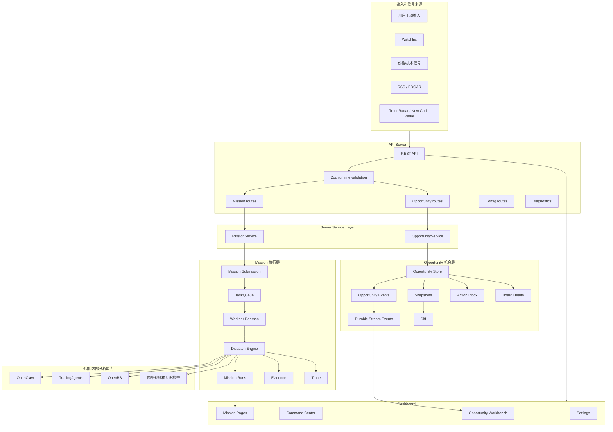
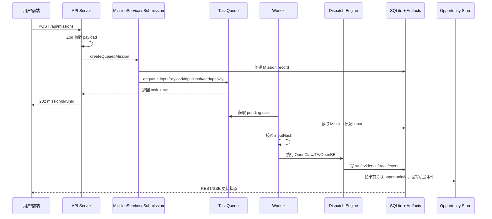
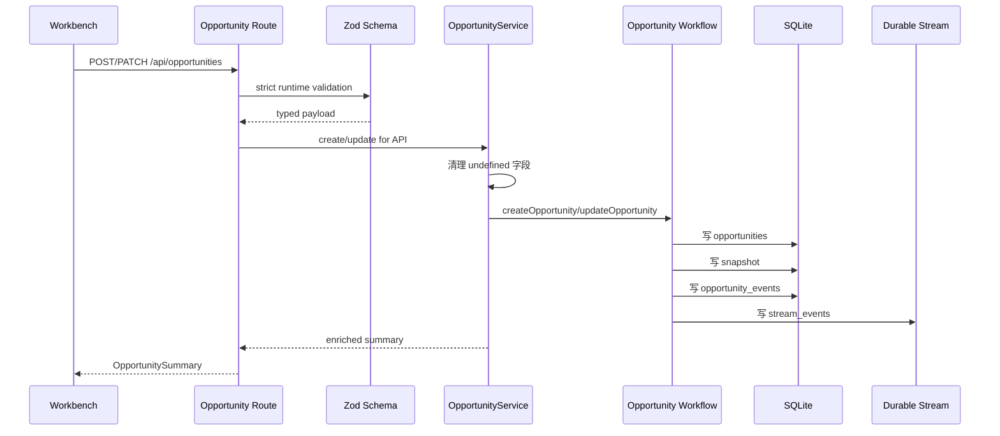
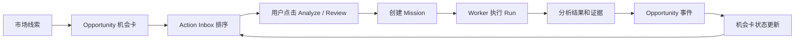
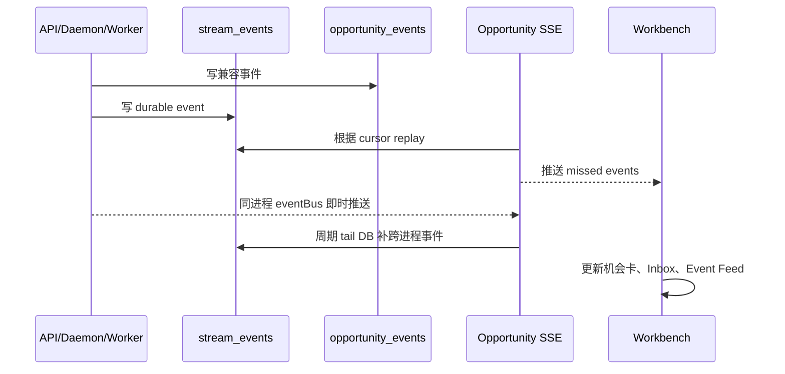
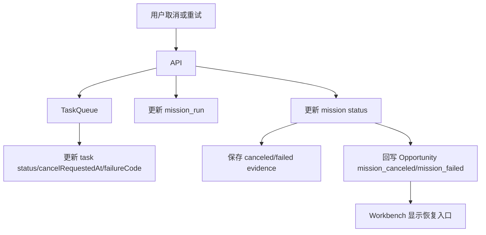

# Sineige Alpha Engine

一个面向交易研究的 AI 工作台。

用一句人话说，它做的是：

> 把市场里的线索整理成可跟踪的“机会卡”，再用 AI 分析任务反复验证这些机会，最后把结果、证据、事件、变化和下一步动作沉淀下来。

它不是投资建议系统，不自动下单，也不保证结论正确。它是研究辅助平台：帮你把信息流、分析任务、机会跟踪、证据归档和复盘流程放进同一个工作台。

## 目录

- [核心概念](#核心概念)
- [系统能做什么](#系统能做什么)
- [典型使用方式](#典型使用方式)
- [系统架构](#系统架构)
- [完整运行流程](#完整运行流程)
- [前端工作台](#前端工作台)
- [后端模块](#后端模块)
- [数据存储](#数据存储)
- [API 和实时推送](#api-和实时推送)
- [本地启动](#本地启动)
- [环境变量](#环境变量)
- [常用命令](#常用命令)
- [测试和质量门禁](#测试和质量门禁)
- [项目结构](#项目结构)
- [排障指南](#排障指南)
- [当前工程状态](#当前工程状态)
- [后续路线](#后续路线)
- [重要提醒](#重要提醒)

## 核心概念

### Mission 是什么

Mission 是一次分析任务。

你可以把它理解成你向系统发出的一个研究请求：

```text
帮我分析 AI 算力供应链里 NVDA、TSM、MU、SNDK 的传导是否还成立。
```

系统收到请求后，会创建一个 Mission，把它放进任务队列，然后由 Worker 执行。执行过程中可能会调用：

- OpenClaw：做主题、产业链、基本面、交易观点和结构化 verdict。
- TradingAgents：做多角色投资辩论、风险拆解和交易计划。
- OpenBB：获取结构化金融数据、技术指标和市场数据。
- 内部规则：做共识合成、SMA250 veto、冲突识别、风险标记和结果归档。

Mission 的特点：

- 它是“一次分析动作”。
- 它有输入、状态、队列任务、run、事件、证据和 trace。
- 它可以等待、运行、完成、失败、取消、重试。
- 同一个 Mission 可以 retry，多次执行会产生多个 Run。

简单说：

> Mission = “现在帮我查一次、分析一次、生成一次结论。”

### Opportunity 是什么

Opportunity 是一个值得长期跟踪的交易机会。

它不是一次分析任务，而是一张机会卡。比如：

- `AI 算力从龙头向存储和封装扩散`
- `某个分拆 IPO 即将进入正式交易窗口`
- `某个股票成为政策主题的市场代理变量`
- `某条产业链热度从主线向二三层 ticker 传导`

Opportunity 会记录：

- 这个机会是什么。
- 相关 ticker 是哪些。
- 当前处在观察、准备、活跃、冷却还是归档。
- 为什么现在值得看。
- 下一催化是什么。
- 机会分数和排序理由是什么。
- 最近发生了哪些事件。
- 关联了哪些 Mission。
- 最近一次分析相比上一次有什么变化。

简单说：

> Opportunity = “这件事值得持续跟踪，它会反复触发多个 Mission。”

### Mission 和 Opportunity 的关系

最容易理解的关系是：

> Opportunity 是研究档案，Mission 是这个档案里的一次调查。

例如有一张机会卡：

```text
AI Infra Heat Transfer
```

它可能触发很多次 Mission：

- 第一次：分析龙头是否仍然强。
- 第二次：分析瓶颈环节是否开始接力。
- 第三次：分析二三层 ticker 是否补涨。
- 第四次：复盘上次结论是否被新数据推翻。
- 第五次：在新催化前做交易前检查。

### 关键对象

| 概念 | 人话解释 | 系统角色 |
| --- | --- | --- |
| Opportunity | 一张长期跟踪的机会卡 | 机会操作系统的核心对象 |
| Mission | 针对一个问题跑一次 AI 分析 | 执行层的核心对象 |
| Run | Mission 的一次具体执行 | retry 会产生新 run |
| Task | 队列里的执行任务 | Worker 消费的对象 |
| Evidence | 一次 run 保存下来的证据包 | 审计和复盘依据 |
| Event | 一条结构化系统事件 | 时间线和 SSE 的数据来源 |
| Snapshot | Opportunity 在某一刻的快照 | 用于 diff 和回放 |
| Trace | Agent 执行过程记录 | 排障、审计和调试依据 |

## 系统能做什么

### 1. 发现市场线索

线索来源包括：

- 手动输入。
- Watchlist。
- 价格和技术信号。
- RSS / EDGAR。
- TrendRadar。
- New Code Radar。
- Heat Transfer Graph。

这些线索不一定马上变成交易动作。系统会先把它们整理成 Mission 或 Opportunity。

### 2. 管理交易机会

Opportunity Workbench 目前围绕四类机会组织：

| 类型 | 标识 | 解决的问题 |
| --- | --- | --- |
| New Codes | `ipo_spinout` | 新股、分拆、正式交易日、lockup、首次覆盖、首份独立财报 |
| Heat Transfer | `relay_chain` | 龙头、瓶颈、二三层扩散、产业链热量传导 |
| Proxy Desk | `proxy_narrative` | 某个股票是否成为主题或政策代理变量 |
| Ad Hoc | `ad_hoc` | 临时研究、人工创建、未归类机会 |

### 3. 执行 AI 深度分析

Mission Runtime 负责把一次分析跑完整：

1. 接收请求。
2. 生成标准 Mission input。
3. 写入 Mission 主记录。
4. 入队 TaskQueue。
5. Worker 拉取任务。
6. 调用 OpenClaw / TradingAgents / OpenBB。
7. 计算 consensus。
8. 保存 run、evidence、trace、event。
9. 回写 Opportunity。
10. 前端通过 REST / SSE 看到结果。

### 4. 形成行动队列

Action Inbox 会把 Opportunity 分成三类：

| 泳道 | 含义 |
| --- | --- |
| `act` | 现在更值得行动或推进 |
| `review` | 需要复核、恢复、降级或排雷 |
| `monitor` | 继续观察，等待更明确催化 |

排序不是单一分数，而是综合：

- Opportunity 类型。
- 当前 stage/status。
- 最近 Mission 结果。
- 最近事件。
- 催化时间。
- 分数变化。
- heat inflection。
- 是否失败、取消或需要恢复。

### 5. 留痕、审计和复盘

系统会保存：

- Mission 原始输入。
- Task queue payload、dedupeKey 和 inputHash。
- 每次 Run 的状态、阶段、耗时和失败原因。
- OpenClaw / TradingAgents / OpenBB 结果。
- Evidence JSON。
- Trace JSON。
- Markdown report。
- Opportunity event。
- Durable stream event。
- Opportunity snapshot。
- Mission diff 和 Opportunity diff。

这让你可以回头问：

```text
当时为什么看这个机会？
系统基于什么证据得出结论？
后来哪些事实改变了？
AI 的结论有没有漂移？
这次失败是外部服务问题，还是系统状态问题？
```

## 典型使用方式

### 日常机会工作流

1. 打开 Dashboard。
2. 先看 Opportunity Workbench。
3. 查看 Action Inbox 里排在前面的机会。
4. 点开机会详情抽屉，查看 thesis、tickers、事件、催化、分数和最近任务。
5. 对重要机会启动 Analyze / Review Mission。
6. Mission 完成后回到机会卡，看结论、事件和变化。
7. 根据结果把机会推进、降级、归档或继续监控。

### 手动研究一个问题

1. 打开 Command Center。
2. 输入 query，例如：

   ```text
   AI infrastructure supply chain: NVDA TSM MU SNDK
   ```

3. 选择分析深度。
4. 创建 Mission。
5. 在 Mission 页面看运行状态、报告、trace 和 evidence。

### 把主题变成长期机会

1. 在 Workbench 创建 Opportunity。
2. 填入 title、query、ticker、thesis、stage、status。
3. 系统开始围绕这张卡记录事件。
4. 每次新催化、新数据或新问题出现时，触发新的 Mission。
5. 通过 snapshots 和 diff 看机会变强还是变弱。

## 系统架构



## 完整运行流程

### Mission 创建和执行流程



### Opportunity 创建和更新流程



### Opportunity 如何驱动 Mission



### Opportunity 实时事件流程



### 取消和重试流程



## 前端工作台

前端在 `dashboard/`，使用 React + Vite。

### Opportunity Workbench

路径：`/`

这是系统主页面。它回答的问题是：

```text
今天最值得看什么？为什么？下一步该做什么？
```

主要模块：

- Action Inbox：把机会分成 act、review、monitor。
- Board Columns：New Codes、Heat Transfer、Proxy Desk 等机会板块。
- Event Feed：最近机会事件。
- Heat Snapshot Strip：热量传导快照。
- Catalyst Reminder：催化日期提醒。
- Detail Drawer：机会详情、编辑、事件、任务恢复。
- Mission Recovery：失败、取消或陈旧任务的恢复入口。
- Saved View / Filters：保存视图、板块筛选、URL 状态同步。

### Command Center

路径：`/command-center`

适合：

- 手动创建 Mission。
- 查看队列状态。
- 观察实时 agent log。
- 快速发起单次分析。

### Mission Timeline

路径：`/missions`

用于查看历史 Mission：

- 输入。
- 当前状态。
- 最近 run。
- diff。
- 关联机会。
- 执行耗时。

### Mission Viewer

路径：`/missions/:id`

用于查看某个 Mission 的完整详情：

- 原始 input。
- run 列表。
- event timeline。
- OpenClaw 报告。
- TradingAgents 结果。
- OpenBB 数据。
- consensus。
- evidence。
- trace。
- diff。

### Settings

路径：`/settings`

用于管理：

- 模型配置。
- runtime config。
- token usage。
- service model map。

模型配置主要来自：

```text
config/models.yaml
```

## 后端模块

### API Server

入口：

```text
src/server/index.ts
src/server/app.ts
src/server/routes/*
```

职责：

- 提供 REST API。
- 提供 Mission SSE 和 Opportunity SSE。
- 校验请求 payload。
- 读取 Mission、Opportunity、Queue、Config、Trace、Report。
- 把前端动作转成 service/workflow 调用。

### Server Service Layer

入口：

```text
src/server/services/mission-service.ts
src/server/services/opportunity-service.ts
```

职责：

- 把 route 从业务拼装里解放出来。
- 统一 Mission summary/detail/event/evidence/retry 的查询逻辑。
- 统一 Opportunity summary/inbox/board-health/create/update 的业务拼装。
- 在 API 边界清理 payload，避免畸形对象进入 workflow。
- 保持 HTTP route 薄，方便后续拆分和测试。

### Validation

入口：

```text
src/server/validation.ts
```

职责：

- 用 Zod 做运行时校验。
- Mission payload 校验 `mode/query/tickers/depth/source/opportunityId`。
- Opportunity create/update 校验 stage/status/type/scores/profile。
- Opportunity profile 使用 strict schema，拒绝未知字段。
- score 和 heat edge weight 限制在 0 到 100。

### Mission Submission

入口：

```text
src/workflows/mission-submission.ts
src/workflows/mission-identity.ts
```

职责：

- 构造标准 Mission input。
- 支持 idempotency。
- 生成 dedupeKey。
- 计算 inputHash。
- 创建 Mission record。
- 入队 TaskQueue。
- 保持 `mode / tickers / opportunityId` 不丢失。

### TaskQueue

入口：

```text
src/utils/task-queue.ts
```

职责：

- 保存 pending/running/done/failed/canceled task。
- 控制并发。
- 记录 lease、heartbeat、cancelRequestedAt、failureCode。
- 支持 dedupe 和 idempotency。
- Worker 重启后恢复 stale running task。
- 保存完整 Mission `inputPayload` 和 `inputHash`。

### Worker / Daemon

入口：

```text
src/worker.ts
src/daemon/*
```

职责：

- 从队列取任务。
- 解析 Mission input。
- 校验 inputHash。
- 调用 dispatch engine。
- 更新 run 状态。
- 处理取消和失败。
- 把 Mission 结果回写 Opportunity。

### Dispatch Engine

入口：

```text
src/workflows/dispatch-engine.ts
src/workflows/consensus.ts
src/workflows/mission-diff.ts
src/workflows/mission-evidence.ts
```

职责：

- 调用 OpenClaw。
- 调用 TradingAgents。
- 调用 OpenBB。
- 汇总 consensus。
- 保存 evidence 和 trace。
- 生成 mission diff。
- 记录执行事件。

### Opportunity Workflows

入口：

```text
src/workflows/opportunities.ts
src/workflows/opportunity-automation.ts
src/workflows/opportunity-ranking.ts
src/workflows/opportunity-board-health.ts
src/workflows/opportunity-history.ts
src/workflows/opportunity-diff.ts
src/workflows/opportunity-actions.ts
src/workflows/opportunity-playbooks.ts
src/workflows/heat-transfer-graph.ts
```

职责：

- 创建和更新 Opportunity。
- 记录 event 和 snapshot。
- 生成 board health。
- 构建 Action Inbox。
- 生成 suggested mission。
- 计算 heat inflection。
- 维护 catalyst calendar。
- 生成 playbook 和 why-now summary。

### Config 和 Diagnostics

入口：

```text
src/server/routes/config.ts
src/server/routes/diagnostics.ts
src/config/runtime-config.ts
src/utils/model-config.ts
```

职责：

- 读取和更新模型配置。
- 管理 runtime config。
- 暴露 token usage。
- 检查服务健康。
- 支持前端 Settings 页面。

## 数据存储

系统采用 SQLite + 文件 artifact 混合存储。

### SQLite

SQLite 负责可查询状态、索引和事件：

| 表 | 作用 |
| --- | --- |
| `tasks` | 队列任务 |
| `mission_runs` | Mission 每次执行记录 |
| `missions_index` | Mission 可查询索引 |
| `mission_events` | Mission 事件索引 |
| `mission_evidence_refs` | Evidence 文件引用 |
| `opportunities` | Opportunity 主表 |
| `opportunity_events` | Opportunity 兼容事件 |
| `opportunity_snapshots` | Opportunity 快照 |
| `stream_events` | durable SSE 事件流 |

### 文件 artifact

文件负责保存大文本、完整证据和调试产物：

| 路径 | 作用 |
| --- | --- |
| `out/missions/` | Mission 主 artifact |
| `out/traces/` | Agent trace JSON |
| `out/reports/` | Markdown report |
| `data/watchlist.json` | Watchlist |
| `config/models.yaml` | 模型配置 |

### 为什么混合存储

两类数据的需求不一样：

- 列表、状态、分页、事件、恢复、搜索，需要 SQLite。
- 大报告、完整证据、trace 原文，用文件更方便。

当前原则：

> SQLite 是系统状态、索引、事件和恢复的主入口，文件 artifact 是大文本证据仓库。

## API 和实时推送

### Mission API

| API | 作用 |
| --- | --- |
| `POST /api/missions` | 创建 Mission |
| `GET /api/missions` | Mission 列表 |
| `GET /api/missions/:id` | Mission 详情 |
| `GET /api/missions/:id/events` | Mission 事件 |
| `GET /api/missions/:id/runs` | Mission run 列表 |
| `GET /api/missions/:id/runs/:runId/evidence` | Run evidence |
| `POST /api/missions/:id/retry` | 重试 Mission |
| `GET /api/missions/stream` | Mission SSE |

### Opportunity API

| API | 作用 |
| --- | --- |
| `GET /api/opportunities` | Opportunity 列表 |
| `POST /api/opportunities` | 创建 Opportunity |
| `GET /api/opportunities/:id` | Opportunity 详情 |
| `PATCH /api/opportunities/:id` | 更新 Opportunity |
| `GET /api/opportunities/:id/events` | Opportunity 事件 |
| `GET /api/opportunities/:id/heat-history` | Heat history |
| `GET /api/opportunities/inbox` | Action Inbox |
| `GET /api/opportunities/inbox/:id` | 单个 Inbox item |
| `GET /api/opportunities/board-health` | 板块健康指标 |
| `GET /api/opportunity-events` | 最近 Opportunity 事件 |
| `GET /api/opportunities/graphs/heat-transfer` | Heat Transfer Graph |
| `POST /api/opportunities/graphs/heat-transfer/sync` | 同步热量传导机会 |
| `POST /api/opportunities/radar/new-codes/refresh` | 刷新 New Code Radar |
| `GET /api/opportunities/stream` | Opportunity SSE |

### Queue、Report、Trace、Config API

| API | 作用 |
| --- | --- |
| `GET /api/health` | 系统健康 |
| `GET /api/health/services` | 外部服务健康 |
| `GET /api/diagnostics` | 诊断信息 |
| `GET /api/queue` | 队列状态 |
| `DELETE /api/queue/:id` | 取消任务 |
| `POST /api/trigger` | 快速创建 Mission |
| `GET /api/watchlist/dynamic` | 动态标的池 |
| `GET /api/watchlist/static` | 静态 watchlist |
| `GET /api/reports` | 报告列表 |
| `GET /api/reports/content` | 报告内容 |
| `GET /api/traces` | Trace 列表 |
| `GET /api/traces/content` | Trace 内容 |
| `GET /api/traces/byMission/:missionId` | 根据 Mission 查 trace |
| `GET /api/trendradar/latest` | 最新 TrendRadar |
| `GET /api/trendradar/raw` | TrendRadar 原始数据 |

### SSE

| SSE | 作用 |
| --- | --- |
| `GET /api/stream` | 兼容 agent log stream |
| `GET /api/missions/stream` | Mission 和 agent 日志 |
| `GET /api/opportunities/stream` | Opportunity durable event stream |

Opportunity stream 支持断线重连：

```text
GET /api/opportunities/stream?since=<lastEventId>
```

也支持 `Last-Event-ID` header。

## 本地启动

### 1. 安装依赖

```bash
npm install
npm --prefix dashboard install
```

### 2. 配置环境变量

```bash
cp .env.example .env
```

至少需要配置：

```text
LLM_API_KEY=
LLM_BASE_URL=
LLM_MODEL=
OPENAI_API_KEY=
FMP_API_KEY=
```

外部服务缺失时，部分能力会降级或失败，但前端和核心 API 仍可开发。

### 3. 检查开发环境

```bash
npm run check:dev-env
```

### 4. 启动完整开发栈

```bash
npm run dev:stack
```

默认端口：

| 服务 | 地址 |
| --- | --- |
| API | `http://127.0.0.1:3000` |
| Dashboard | `http://127.0.0.1:5173` |
| OpenBB | `http://127.0.0.1:8000/docs` |
| TradingAgents | `http://127.0.0.1:8001/docs` |

### 5. 不启动 vendor

```bash
npm run dev:stack:no-vendors
```

也可以分别启动：

```bash
npm run dev:server
npm run dev:daemon
npm run dev:dashboard
```

## 环境变量

主要配置文件：

- `.env`
- `.env.example`
- `config/models.yaml`
- `data/watchlist.json`

常用环境变量：

| 变量 | 作用 |
| --- | --- |
| `LLM_API_KEY` | 通用 LLM provider key |
| `LLM_BASE_URL` | LLM API base URL |
| `LLM_MODEL` | 默认模型 |
| `OPENAI_API_KEY` | OpenAI key |
| `FMP_API_KEY` | 金融数据 key |
| `TAVILY_API_KEY` | Web intelligence，可选 |
| `EXA_API_KEY` | Web intelligence，可选 |
| `DESEARCH_API_KEY` | Web intelligence，可选 |
| `POLL_INTERVAL_MS` | 轮询间隔 |
| `LOG_LEVEL` | 日志级别 |

外部服务：

| 服务 | 用途 | 默认端口 |
| --- | --- | --- |
| OpenClaw | 核心 AI 分析 | 由 Node 侧调用 |
| OpenBB | 金融数据 | `8000` |
| TradingAgents | 多角色交易分析 | `8001` |
| TrendRadar | 主题雷达 | 本地 vendor |
| Telegram | 告警通知 | 可选 |

## 常用命令

```bash
# API server
npm run server

# daemon
npm run daemon

# worker all-in-one
npm run daemon:all

# Dashboard
npm run dev:dashboard

# 完整开发栈
npm run dev:stack

# 不启动 vendor 的开发栈
npm run dev:stack:no-vendors

# 环境检查
npm run check:dev-env
```

## 测试和质量门禁

提交前建议跑：

```bash
npm test
npm run typecheck
npm --prefix dashboard run lint
npm --prefix dashboard run build
git diff --check
```

当前本地验证基线：

| 命令 | 状态 |
| --- | --- |
| `npm test` | 39 test files，249 tests passed |
| `npm run typecheck` | passed |
| `npm --prefix dashboard run lint` | passed |
| `git diff --check` | passed |

Dashboard build 可能会提示主 bundle 超过 500 kB。这是 Vite 的体积提醒，不等同于构建失败。后续可以通过页面级 dynamic import 或 chunk splitting 优化。

## 项目结构

```text
.
├── src
│   ├── server
│   │   ├── app.ts                  # Express app
│   │   ├── routes                  # API routes
│   │   ├── services                # Mission/Opportunity service layer
│   │   └── validation.ts           # Zod runtime schemas
│   ├── workflows                   # Mission 和 Opportunity 核心流程
│   ├── utils                       # task queue、logger、clients、config
│   ├── db                          # SQLite 初始化
│   ├── daemon                      # 后台任务入口
│   ├── agents                      # ticker discovery 等 agent 逻辑
│   └── __tests__                   # 后端和共享逻辑测试
├── dashboard
│   ├── src
│   │   ├── pages                   # React 页面
│   │   ├── queries                 # query hooks
│   │   ├── hooks                   # SSE / polling hooks
│   │   └── api.ts                  # 前端 API client
│   └── package.json
├── config                          # 模型和运行配置
├── data                            # watchlist、queue 等本地数据
├── docs                            # 技术方案和设计文档
├── out                             # mission/report/trace/evidence 产物
├── scripts                         # 开发栈和环境检查脚本
├── vendors                         # OpenBB / TradingAgents / TrendRadar 等外部能力
└── docker                          # Docker 相关文件
```

## 排障指南

### 前端打不开

检查：

```bash
npm --prefix dashboard install
npm run dev:dashboard
```

默认地址：

```text
http://127.0.0.1:5173
```

### API 不通

检查：

```bash
npm run dev:server
curl http://127.0.0.1:3000/api/health
```

如果端口被占用：

```bash
lsof -iTCP:3000 -sTCP:LISTEN
```

### Mission 一直 pending

通常是 daemon/worker 没启动。

检查：

```bash
npm run dev:daemon
```

再看：

```text
GET /api/queue
```

### Mission 结果没有关联回 Opportunity

检查 Mission input 是否带了：

- `opportunityId`
- `tickers`
- `mode`
- `source`

当前队列会保存完整 `inputPayload` 和 `inputHash`。如果 Worker 报 hash mismatch，要优先检查 Mission submit 和 queue 入队链路。

### Opportunity SSE 没更新

Opportunity SSE 是 durable stream projection。排查顺序：

1. `stream_events` 是否有新事件。
2. `/api/opportunities/stream?since=<eventId>` 是否能 replay。
3. API 和 daemon 是否使用同一个 SQLite。
4. Workbench polling fallback 是否能补上数据。

### Opportunity 创建或编辑返回 400

现在 API 会严格校验 payload：

- `title` 或 `query` 至少要有一个。
- `type/stage/status` 必须是系统定义值。
- score 必须在 0 到 100。
- heat edge weight 必须在 0 到 100。
- profile 不允许未知字段。
- `catalystCalendar` item 不允许未知字段。

看响应里的 `details[].path`，它会指出具体哪个字段不合法。

### 外部服务不可用

OpenBB、TradingAgents、TrendRadar 缺失时，部分分析会降级或失败。开发 UI 和核心 API 时可以用：

```bash
npm run dev:stack:no-vendors
```

## 当前工程状态

系统现在已经具备“机会工作台 + 分析执行层”的闭环：

- Mission input 入队后保持完整，不丢 `mode / tickers / opportunityId`。
- TaskQueue 支持 dedupe、idempotency、inputHash、lease/heartbeat 恢复。
- Mission run 有统一状态、阶段、heartbeat、cancel 和 failure 字段。
- Mission 列表和详情优先走 SQLite index，必要时 fallback 到文件 artifact。
- Mission evidence 可以按 run 查询，并校验 mission ownership。
- Opportunity create/update 使用 Zod strict runtime validation。
- Opportunity profile、scores、catalystCalendar 在 API 边界做运行时校验。
- Opportunity 和 Mission 聚合逻辑已开始从 route 下沉到 service layer。
- Opportunity event 会写入 durable `stream_events`。
- Opportunity SSE 支持 replay 和跨进程 DB tail。
- Workbench 有 Action Inbox、board health、detail drawer、mission recovery 和响应式优化。

## 后续路线

更完整的技术方案在：

```text
docs/next-phase-technical-design.md
docs/opportunity-runtime-maturity-technical-plan.md
```

优先级建议如下。

### Phase 1：API 和存储边界继续收口

- 继续把 `app.ts` 里的 health、queue、trace、report、TrendRadar 拆到独立 route/service。
- 为 SQLite 引入 migrations table，替代 `ALTER TABLE ... catch {}`。
- 把 Mission canonical index 扩展为可查询的 mission/event/evidence_ref 主入口。
- 为 Opportunity create/update 增加更多 domain-level invariant。

### Phase 2：执行生命周期增强

- 让 cancel 继续向 OpenClaw / TradingAgents / OpenBB 调用链传递 AbortSignal。
- 增强 run 的 failureCode、degradedFlags 和 recovery suggestion。
- 增加失败任务恢复 API。
- 支持 stale run 自动恢复和 UI 明示。

### Phase 3：Workbench 查询层重构

- 提取统一 API client。
- 收敛 SSE store、polling store、local draft 和 URL query 的状态来源。
- 增加 SSE reconnect 和 cache invalidation 测试。
- 拆分 Opportunity Workbench 为更小的页面模块。

### Phase 4：证据、解释和复盘能力

- 增加 source provenance。
- 增加字段级 evidence。
- 增加机会评分解释器。
- 增加催化日历提醒。
- 增加交易前检查清单。
- 增加策略回测和复盘视图。

### Phase 5：前端性能和产品化

- Dashboard code splitting。
- Workbench 大列表虚拟化。
- 响应式继续覆盖 720px、960px、1440px。
- 优化长标题、窄屏底栏、卡片操作按钮。
- 给失败、降级、恢复和排序理由做更明确的 UI 表达。

## 重要提醒

这个项目是研究辅助工具，不是投资顾问，不自动下单，也不保证分析正确。任何交易决策都需要你自己判断风险、仓位、流动性、交易计划和执行条件。
