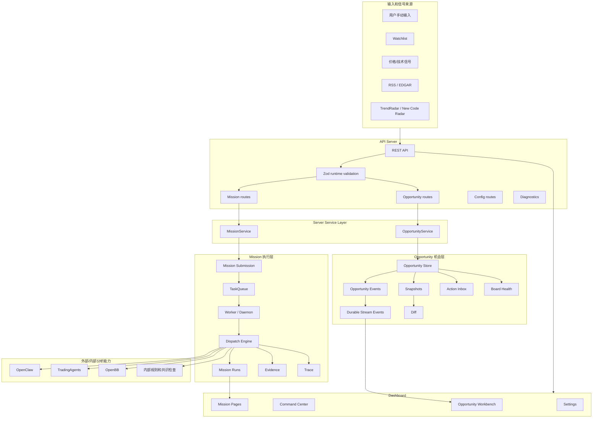
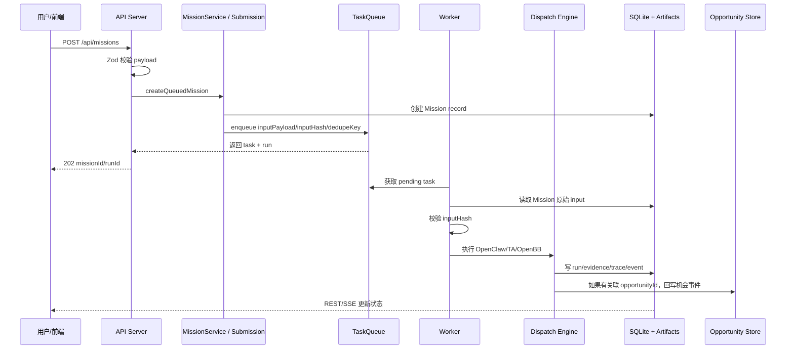
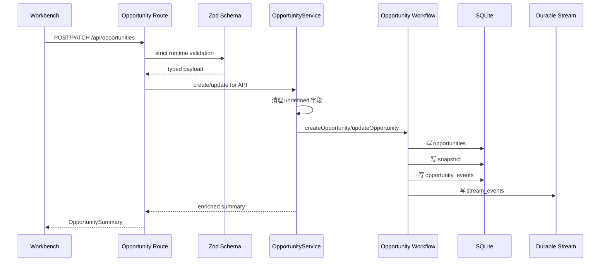
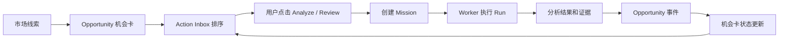
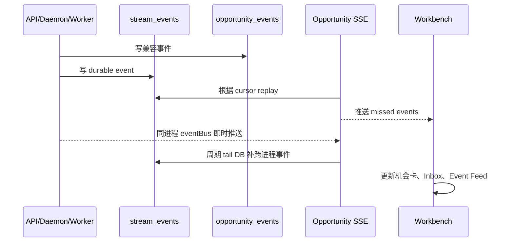
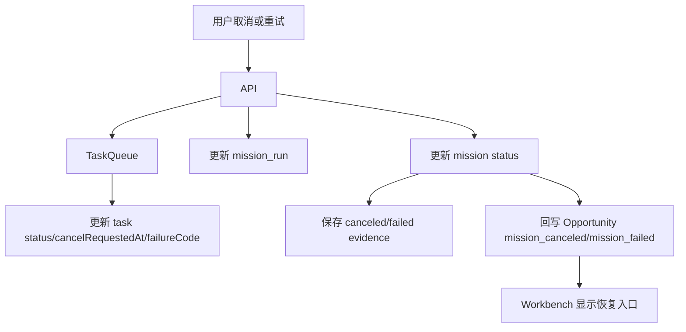

# Sineige Alpha Engine

一个面向交易研究的 AI 工作台。

用一句人话说，它做的是：

> 把市场里的线索整理成可跟踪的“机会卡”，再用 AI 分析任务反复验证这些机会，最后把结果、证据、事件、变化和下一步动作沉淀下来。

它不是投资建议系统，不自动下单，也不保证结论正确。它是研究辅助平台：帮你把信息流、分析任务、机会跟踪、证据归档和复盘流程放进同一个工作台。

## 目录

- [核心概念](#核心概念)
- [系统能做什么](#系统能做什么)
- [典型使用方式](#典型使用方式)
- [系统架构](#系统架构)
- [完整运行流程](#完整运行流程)
- [前端工作台](#前端工作台)
- [后端模块](#后端模块)
- [数据存储](#数据存储)
- [API 和实时推送](#api-和实时推送)
- [本地启动](#本地启动)
- [环境变量](#环境变量)
- [常用命令](#常用命令)
- [测试和质量门禁](#测试和质量门禁)
- [项目结构](#项目结构)
- [排障指南](#排障指南)
- [当前工程状态](#当前工程状态)
- [后续路线](#后续路线)
- [重要提醒](#重要提醒)

## 核心概念

### Mission 是什么

Mission 是一次分析任务。

你可以把它理解成你向系统发出的一个研究请求：

```text
帮我分析 AI 算力供应链里 NVDA、TSM、MU、SNDK 的传导是否还成立。
```

系统收到请求后，会创建一个 Mission，把它放进任务队列，然后由 Worker 执行。执行过程中可能会调用：

- OpenClaw：做主题、产业链、基本面、交易观点和结构化 verdict。
- TradingAgents：做多角色投资辩论、风险拆解和交易计划。
- OpenBB：获取结构化金融数据、技术指标和市场数据。
- 内部规则：做共识合成、SMA250 veto、冲突识别、风险标记和结果归档。

Mission 的特点：

- 它是“一次分析动作”。
- 它有输入、状态、队列任务、run、事件、证据和 trace。
- 它可以等待、运行、完成、失败、取消、重试。
- 同一个 Mission 可以 retry，多次执行会产生多个 Run。

简单说：

> Mission = “现在帮我查一次、分析一次、生成一次结论。”

### Opportunity 是什么

Opportunity 是一个值得长期跟踪的交易机会。

它不是一次分析任务，而是一张机会卡。比如：

- `AI 算力从龙头向存储和封装扩散`
- `某个分拆 IPO 即将进入正式交易窗口`
- `某个股票成为政策主题的市场代理变量`
- `某条产业链热度从主线向二三层 ticker 传导`

Opportunity 会记录：

- 这个机会是什么。
- 相关 ticker 是哪些。
- 当前处在观察、准备、活跃、冷却还是归档。
- 为什么现在值得看。
- 下一催化是什么。
- 机会分数和排序理由是什么。
- 最近发生了哪些事件。
- 关联了哪些 Mission。
- 最近一次分析相比上一次有什么变化。

简单说：

> Opportunity = “这件事值得持续跟踪，它会反复触发多个 Mission。”

### Mission 和 Opportunity 的关系

最容易理解的关系是：

> Opportunity 是研究档案，Mission 是这个档案里的一次调查。

例如有一张机会卡：

```text
AI Infra Heat Transfer
```

它可能触发很多次 Mission：

- 第一次：分析龙头是否仍然强。
- 第二次：分析瓶颈环节是否开始接力。
- 第三次：分析二三层 ticker 是否补涨。
- 第四次：复盘上次结论是否被新数据推翻。
- 第五次：在新催化前做交易前检查。

### 关键对象

| 概念 | 人话解释 | 系统角色 |
| --- | --- | --- |
| Opportunity | 一张长期跟踪的机会卡 | 机会操作系统的核心对象 |
| Mission | 针对一个问题跑一次 AI 分析 | 执行层的核心对象 |
| Run | Mission 的一次具体执行 | retry 会产生新 run |
| Task | 队列里的执行任务 | Worker 消费的对象 |
| Evidence | 一次 run 保存下来的证据包 | 审计和复盘依据 |
| Event | 一条结构化系统事件 | 时间线和 SSE 的数据来源 |
| Snapshot | Opportunity 在某一刻的快照 | 用于 diff 和回放 |
| Trace | Agent 执行过程记录 | 排障、审计和调试依据 |

## 系统能做什么

### 1. 发现市场线索

线索来源包括：

- 手动输入。
- Watchlist。
- 价格和技术信号。
- RSS / EDGAR。
- TrendRadar。
- New Code Radar。
- Heat Transfer Graph。

这些线索不一定马上变成交易动作。系统会先把它们整理成 Mission 或 Opportunity。

### 2. 管理交易机会

Opportunity Workbench 目前围绕四类机会组织：

| 类型 | 标识 | 解决的问题 |
| --- | --- | --- |
| New Codes | `ipo_spinout` | 新股、分拆、正式交易日、lockup、首次覆盖、首份独立财报 |
| Heat Transfer | `relay_chain` | 龙头、瓶颈、二三层扩散、产业链热量传导 |
| Proxy Desk | `proxy_narrative` | 某个股票是否成为主题或政策代理变量 |
| Ad Hoc | `ad_hoc` | 临时研究、人工创建、未归类机会 |

### 3. 执行 AI 深度分析

Mission Runtime 负责把一次分析跑完整：

1. 接收请求。
2. 生成标准 Mission input。
3. 写入 Mission 主记录。
4. 入队 TaskQueue。
5. Worker 拉取任务。
6. 调用 OpenClaw / TradingAgents / OpenBB。
7. 计算 consensus。
8. 保存 run、evidence、trace、event。
9. 回写 Opportunity。
10. 前端通过 REST / SSE 看到结果。

### 4. 形成行动队列

Action Inbox 会把 Opportunity 分成三类：

| 泳道 | 含义 |
| --- | --- |
| `act` | 现在更值得行动或推进 |
| `review` | 需要复核、恢复、降级或排雷 |
| `monitor` | 继续观察，等待更明确催化 |

排序不是单一分数，而是综合：

- Opportunity 类型。
- 当前 stage/status。
- 最近 Mission 结果。
- 最近事件。
- 催化时间。
- 分数变化。
- heat inflection。
- 是否失败、取消或需要恢复。

### 5. 留痕、审计和复盘

系统会保存：

- Mission 原始输入。
- Task queue payload、dedupeKey 和 inputHash。
- 每次 Run 的状态、阶段、耗时和失败原因。
- OpenClaw / TradingAgents / OpenBB 结果。
- Evidence JSON。
- Trace JSON。
- Markdown report。
- Opportunity event。
- Durable stream event。
- Opportunity snapshot。
- Mission diff 和 Opportunity diff。

这让你可以回头问：

```text
当时为什么看这个机会？
系统基于什么证据得出结论？
后来哪些事实改变了？
AI 的结论有没有漂移？
这次失败是外部服务问题，还是系统状态问题？
```

## 典型使用方式

### 日常机会工作流

1. 打开 Dashboard。
2. 先看 Opportunity Workbench。
3. 查看 Action Inbox 里排在前面的机会。
4. 点开机会详情抽屉，查看 thesis、tickers、事件、催化、分数和最近任务。
5. 对重要机会启动 Analyze / Review Mission。
6. Mission 完成后回到机会卡，看结论、事件和变化。
7. 根据结果把机会推进、降级、归档或继续监控。

### 手动研究一个问题

1. 打开 Command Center。
2. 输入 query，例如：

   ```text
   AI infrastructure supply chain: NVDA TSM MU SNDK
   ```

3. 选择分析深度。
4. 创建 Mission。
5. 在 Mission 页面看运行状态、报告、trace 和 evidence。

### 把主题变成长期机会

1. 在 Workbench 创建 Opportunity。
2. 填入 title、query、ticker、thesis、stage、status。
3. 系统开始围绕这张卡记录事件。
4. 每次新催化、新数据或新问题出现时，触发新的 Mission。
5. 通过 snapshots 和 diff 看机会变强还是变弱。

## 系统架构


```mermaid
flowchart TB
  subgraph Inputs["输入和信号来源"]
    User["用户手动输入"]
    Watchlist["Watchlist"]
    Price["价格/技术信号"]
    RSS["RSS / EDGAR"]
    Radar["TrendRadar / New Code Radar"]
  end

  subgraph API["API Server"]
    REST["REST API"]
    Validation["Zod runtime validation"]
    MissionRoute["Mission routes"]
    OpportunityRoute["Opportunity routes"]
    ConfigRoute["Config routes"]
    Diagnostics["Diagnostics"]
  end

  subgraph Services["Server Service Layer"]
    MissionService["MissionService"]
    OpportunityService["OpportunityService"]
  end

  subgraph Runtime["Mission 执行层"]
    Submission["Mission Submission"]
    Queue["TaskQueue"]
    Worker["Worker / Daemon"]
    Dispatch["Dispatch Engine"]
    Runs["Mission Runs"]
    Evidence["Evidence"]
    Trace["Trace"]
  end

  subgraph Providers["外部/内部分析能力"]
    OpenClaw["OpenClaw"]
    TA["TradingAgents"]
    OpenBB["OpenBB"]
    Rules["内部规则和共识检查"]
  end

  subgraph OpportunityOS["Opportunity 机会层"]
    OppStore["Opportunity Store"]
    OppEvents["Opportunity Events"]
    StreamEvents["Durable Stream Events"]
    Snapshots["Snapshots"]
    Diff["Diff"]
    Inbox["Action Inbox"]
    BoardHealth["Board Health"]
  end

  subgraph UI["Dashboard"]
    Workbench["Opportunity Workbench"]
    Command["Command Center"]
    MissionPages["Mission Pages"]
    Settings["Settings"]
  end

  Inputs --> REST
  REST --> Validation
  Validation --> MissionRoute
  Validation --> OpportunityRoute
  MissionRoute --> MissionService
  OpportunityRoute --> OpportunityService
  MissionService --> Submission
  OpportunityService --> OppStore

  Submission --> Queue
  Queue --> Worker
  Worker --> Dispatch
  Dispatch --> OpenClaw
  Dispatch --> TA
  Dispatch --> OpenBB
  Dispatch --> Rules
  Dispatch --> Runs
  Dispatch --> Evidence
  Dispatch --> Trace

  OppStore --> OppEvents
  OppEvents --> StreamEvents
  OppStore --> Snapshots
  Snapshots --> Diff
  OppStore --> Inbox
  OppStore --> BoardHealth

  REST --> UI
  StreamEvents --> Workbench
  Runs --> MissionPages
```

## 完整运行流程

### Mission 创建和执行流程


```mermaid
sequenceDiagram
  participant UI as 用户/前端
  participant API as API Server
  participant Service as MissionService / Submission
  participant Queue as TaskQueue
  participant Worker as Worker
  participant Dispatch as Dispatch Engine
  participant Store as SQLite + Artifacts
  participant Opp as Opportunity Store

  UI->>API: POST /api/missions
  API->>API: Zod 校验 payload
  API->>Service: createQueuedMission
  Service->>Store: 创建 Mission record
  Service->>Queue: enqueue inputPayload/inputHash/dedupeKey
  Queue-->>API: 返回 task + run
  API-->>UI: 202 missionId/runId
  Worker->>Queue: 获取 pending task
  Worker->>Store: 读取 Mission 原始 input
  Worker->>Worker: 校验 inputHash
  Worker->>Dispatch: 执行 OpenClaw/TA/OpenBB
  Dispatch->>Store: 写 run/evidence/trace/event
  Dispatch->>Opp: 如果有关联 opportunityId，回写机会事件
  Store-->>UI: REST/SSE 更新状态
```

### Opportunity 创建和更新流程


```mermaid
sequenceDiagram
  participant UI as Workbench
  participant API as Opportunity Route
  participant Validation as Zod Schema
  participant Service as OpportunityService
  participant Workflow as Opportunity Workflow
  participant DB as SQLite
  participant Stream as Durable Stream

  UI->>API: POST/PATCH /api/opportunities
  API->>Validation: strict runtime validation
  Validation-->>API: typed payload
  API->>Service: create/update for API
  Service->>Service: 清理 undefined 字段
  Service->>Workflow: createOpportunity/updateOpportunity
  Workflow->>DB: 写 opportunities
  Workflow->>DB: 写 snapshot
  Workflow->>DB: 写 opportunity_events
  Workflow->>Stream: 写 stream_events
  Service-->>API: enriched summary
  API-->>UI: OpportunitySummary
```

### Opportunity 如何驱动 Mission


```mermaid
flowchart LR
  Signal["市场线索"] --> Opp["Opportunity 机会卡"]
  Opp --> Inbox["Action Inbox 排序"]
  Inbox --> UserAction["用户点击 Analyze / Review"]
  UserAction --> Mission["创建 Mission"]
  Mission --> Run["Worker 执行 Run"]
  Run --> Result["分析结果和证据"]
  Result --> OppEvent["Opportunity 事件"]
  OppEvent --> OppUpdate["机会卡状态更新"]
  OppUpdate --> Inbox
```

### Opportunity 实时事件流程


```mermaid
sequenceDiagram
  participant Writer as API/Daemon/Worker
  participant EventLog as stream_events
  participant Legacy as opportunity_events
  participant SSE as Opportunity SSE
  participant UI as Workbench

  Writer->>Legacy: 写兼容事件
  Writer->>EventLog: 写 durable event
  SSE->>EventLog: 根据 cursor replay
  SSE-->>UI: 推送 missed events
  Writer-->>SSE: 同进程 eventBus 即时推送
  SSE->>EventLog: 周期 tail DB 补跨进程事件
  UI->>UI: 更新机会卡、Inbox、Event Feed
```

### 取消和重试流程


```mermaid
flowchart TB
  User["用户取消或重试"] --> API["API"]
  API --> Queue["TaskQueue"]
  Queue --> TaskState["更新 task status/cancelRequestedAt/failureCode"]
  API --> RunState["更新 mission_run"]
  API --> MissionState["更新 mission status"]
  MissionState --> Evidence["保存 canceled/failed evidence"]
  MissionState --> Opp["回写 Opportunity mission_canceled/mission_failed"]
  Opp --> UI["Workbench 显示恢复入口"]
```

## 前端工作台

前端在 `dashboard/`，使用 React + Vite。

### Opportunity Workbench

路径：`/`

这是系统主页面。它回答的问题是：

```text
今天最值得看什么？为什么？下一步该做什么？
```

主要模块：

- Action Inbox：把机会分成 act、review、monitor。
- Board Columns：New Codes、Heat Transfer、Proxy Desk 等机会板块。
- Event Feed：最近机会事件。
- Heat Snapshot Strip：热量传导快照。
- Catalyst Reminder：催化日期提醒。
- Detail Drawer：机会详情、编辑、事件、任务恢复。
- Mission Recovery：失败、取消或陈旧任务的恢复入口。
- Saved View / Filters：保存视图、板块筛选、URL 状态同步。

### Evidence Center

路径：`/evidence`

用于跨 Opportunity 查看字段级证据：

- 按 ticker、标题、field、source、value、note 搜索。
- 按 status、confidence、kind、field、source 过滤。
- 查看 evidence 当前是否 active 或 invalidated。
- 勾选多条 evidence 后批量作废 active 证据，或批量恢复 invalidated 证据。
- 从 evidence 行跳回相关 Opportunity 或最新 Mission。

### Catalyst Reminders

路径：`/catalysts`

用于跨 Opportunity 查看催化提醒审计：

- 查询已处理、稍后处理、恢复、订阅、取消订阅等人工偏好。
- 查看当前有效订阅、lead days、snooze 时间和 reminder note。
- 按 Opportunity、偏好、关键词和 active subscription 过滤。
- 导出当前有效订阅为 ICS 日历。

### Pre-trade Audit

路径：`/pretrade`

用于把执行前的风险卡口放到一张审计表里：

- 汇总交易前人工确认、重新打开、催化阻塞和字段级人工 evidence。
- 按 Opportunity、类别、状态和关键词过滤。
- 快速定位 missed、overdue、missing date 这类会阻塞交易前检查的催化项。
- 从审计行跳回对应 Opportunity。

### Review Playback

路径：`/review-playback`

用于把一次机会从发现到复核的关键事件串成复盘时间线：

- 汇总 Mission 完成/失败/取消、交易前检查、催化提醒、字段级 evidence、thesis 和 signal 事件。
- 顶部 Outcome Summary 会把复盘事件折成 blocked / review / ready / quiet，并显示 risk score、阻塞数、失败任务、完成任务和 evidence 变化。
- Performance / Risk 面板会在单机会范围内展示 entry signal、exit/risk signal、持有期、真实 return / max drawdown、价格点数量、price cache fresh/stale/missing 状态、逐笔 trade legs、partial exit、position sizing、sizing rules、open exposure、收益/回撤贡献、Exit attribution、Execution quality、Plan repair suggestions、Risk backtest verdict、win rate、avg return、avg drawdown、risk-at-stop、budget usage、payoff、stop/target/risk budget 计划字段、目标捕获率、滑点、催化触发数、pre-trade block 是否命中，以及没有价格时的 heat delta / drawdown 代理指标；多机会模式会先在每个 Opportunity 内部配对 entry/exit，再聚合成跨机会 Risk backtest，并按机会类型、阶段和状态展示 Backtest slices；Strategy backtest 会进一步按策略族展示覆盖率、priced legs、最佳策略族、最弱策略族、平均收益、胜率、预算使用和问题数量，并支持用 Backtest ticker、strategy family、from、to 单独过滤策略/风险回测样本，同时保留事件时间线原始查询结果。
- Backtest Workspace 会把当前筛选范围、Strategy/Risk backtest、样本质量、数据质量、问题数量和 pre-trade blocker 折成 readiness score、ready/watch/repair/empty 状态、决策建议和下一步动作。
- 按 Opportunity、类别、风险语气和关键词过滤。
- 保存常用回测视图，把关键词、Opportunity、类别、语气、Backtest ticker、strategy family 和时间窗口保存到浏览器本地，后续可一键应用或删除。
- 区分 positive、warning、negative、neutral，优先定位失败、阻塞和 thesis 变化。
- 从复盘行跳回对应 Opportunity 或 Mission。

### Field Registry

路径：`/field-registry`

用于治理字段证据的默认解释规则：

- 按 field、label、source、group、kind 搜索和过滤。
- 对比系统默认值和当前 effective override。
- 查看 overridden、base-only 和 custom 字段。
- 编辑字段默认 label、kind、source、confidence、note。
- 一键重置 override，恢复系统默认。
- 查看单字段 registry audit trail。
- 生成 registry 导出 JSON，包含 overrides、effective registry 和 diff report。
- 粘贴导出 JSON 或 `{ "items": [...] }` 执行 dry-run / apply 批量导入。
- 查看全局差异审计报表：override coverage、base/custom 字段数、drift 维度和最近 audit。

### Command Center

路径：`/command-center`

适合：

- 手动创建 Mission。
- 查看队列状态。
- 观察实时 agent log。
- 快速发起单次分析。
- 查看 Mission / artifact / field evidence 诊断卡。
- 对可自动修复的问题执行 repair / backfill / refresh。
- 对缺字段元数据的 field evidence 人工问题，跳到 Evidence Center 定位，或跳到 Field Registry 生成 import draft 并 dry-run。

### Mission Timeline

路径：`/missions`

用于查看历史 Mission：

- 输入。
- 当前状态。
- 最近 run。
- diff。
- 关联机会。
- 执行耗时。

### Mission Viewer

路径：`/missions/:id`

用于查看某个 Mission 的完整详情：

- 原始 input。
- run 列表。
- event timeline。
- OpenClaw 报告。
- TradingAgents 结果。
- OpenBB 数据。
- consensus。
- evidence。
- trace。
- diff。

### Settings

路径：`/settings`

用于管理：

- 模型配置。
- runtime config。
- token usage。
- service model map。

模型配置主要来自：

```text
config/models.yaml
```

## 后端模块

### API Server

入口：

```text
src/server/index.ts
src/server/app.ts
src/server/routes/*
```

职责：

- 提供 REST API。
- 提供 Mission SSE 和 Opportunity SSE。
- 校验请求 payload。
- 读取 Mission、Opportunity、Queue、Config、Trace、Report。
- 把前端动作转成 service/workflow 调用。

### Server Service Layer

入口：

```text
src/server/services/mission-service.ts
src/server/services/opportunity-service.ts
```

职责：

- 把 route 从业务拼装里解放出来。
- 统一 Mission summary/detail/event/evidence/retry 的查询逻辑。
- 统一 Opportunity summary/inbox/board-health/create/update 的业务拼装。
- 在 API 边界清理 payload，避免畸形对象进入 workflow。
- 保持 HTTP route 薄，方便后续拆分和测试。

### Validation

入口：

```text
src/server/validation.ts
```

职责：

- 用 Zod 做运行时校验。
- Mission payload 校验 `mode/query/tickers/depth/source/opportunityId`。
- Opportunity create/update 校验 stage/status/type/scores/profile。
- Opportunity profile 使用 strict schema，拒绝未知字段。
- score 和 heat edge weight 限制在 0 到 100。

### Mission Submission

入口：

```text
src/workflows/mission-submission.ts
src/workflows/mission-identity.ts
```

职责：

- 构造标准 Mission input。
- 支持 idempotency。
- 生成 dedupeKey。
- 计算 inputHash。
- 创建 Mission record。
- 入队 TaskQueue。
- 保持 `mode / tickers / opportunityId` 不丢失。

### TaskQueue

入口：

```text
src/utils/task-queue.ts
```

职责：

- 保存 pending/running/done/failed/canceled task。
- 控制并发。
- 记录 lease、heartbeat、cancelRequestedAt、failureCode。
- 支持 dedupe 和 idempotency。
- Worker 重启后恢复 stale running task。
- 保存完整 Mission `inputPayload` 和 `inputHash`。

### Worker / Daemon

入口：

```text
src/worker.ts
src/daemon/*
```

职责：

- 从队列取任务。
- 解析 Mission input。
- 校验 inputHash。
- 调用 dispatch engine。
- 更新 run 状态。
- 处理取消和失败。
- 把 Mission 结果回写 Opportunity。

### Dispatch Engine

入口：

```text
src/workflows/dispatch-engine.ts
src/workflows/consensus.ts
src/workflows/mission-diff.ts
src/workflows/mission-evidence.ts
```

职责：

- 调用 OpenClaw。
- 调用 TradingAgents。
- 调用 OpenBB。
- 汇总 consensus。
- 保存 evidence 和 trace。
- 生成 mission diff。
- 记录执行事件。

### Opportunity Workflows

入口：

```text
src/workflows/opportunities.ts
src/workflows/opportunity-automation.ts
src/workflows/opportunity-ranking.ts
src/workflows/opportunity-board-health.ts
src/workflows/opportunity-history.ts
src/workflows/opportunity-diff.ts
src/workflows/opportunity-actions.ts
src/workflows/opportunity-playbooks.ts
src/workflows/heat-transfer-graph.ts
```

职责：

- 创建和更新 Opportunity。
- 记录 event 和 snapshot。
- 生成 board health。
- 构建 Action Inbox。
- 生成 suggested mission。
- 计算 heat inflection。
- 维护 catalyst calendar。
- 生成 playbook 和 why-now summary。

### Config 和 Diagnostics

入口：

```text
src/server/routes/config.ts
src/server/routes/diagnostics.ts
src/config/runtime-config.ts
src/utils/model-config.ts
```

职责：

- 读取和更新模型配置。
- 管理 runtime config。
- 暴露 token usage。
- 检查服务健康。
- 支持前端 Settings 页面。

## 数据存储

系统采用 SQLite + 文件 artifact 混合存储。

### SQLite

SQLite 负责可查询状态、索引和事件：

| 表 | 作用 |
| --- | --- |
| `tasks` | 队列任务 |
| `mission_runs` | Mission 每次执行记录 |
| `missions` | Mission canonical metadata、inputHash、artifact integrity |
| `missions_index` | Mission 可查询索引 |
| `mission_events` | Mission 事件索引 |
| `mission_evidence_refs` | Evidence 文件引用 |
| `mission_artifacts` | Mission 文件产物统一引用 |
| `opportunities` | Opportunity 主表 |
| `opportunity_field_evidence` | Opportunity 字段级 evidence / provenance canonical rows |
| `opportunity_field_registry_overrides` | Opportunity 字段 label、kind、source、confidence、note 的可编辑 registry override |
| `opportunity_field_registry_audit` | Opportunity 字段 registry override 更新/重置审计历史 |
| `opportunity_events` | Opportunity 兼容事件 |
| `opportunity_snapshots` | Opportunity 快照 |
| `stream_events` | durable SSE 事件流 |

### 文件 artifact

文件负责保存大文本、完整证据和调试产物：

| 路径 | 作用 |
| --- | --- |
| `out/missions/` | Mission 主 artifact |
| `out/traces/` | Agent trace JSON |
| `out/reports/` | Markdown report |
| `data/watchlist.json` | Watchlist |
| `config/models.yaml` | 模型配置 |

### 为什么混合存储

两类数据的需求不一样：

- 列表、状态、分页、事件、恢复、搜索，需要 SQLite。
- 大报告、完整证据、trace 原文，用文件更方便。

当前原则：

> SQLite 是系统状态、索引、事件和恢复的主入口，文件 artifact 是大文本证据仓库。

## API 和实时推送

### Mission API

| API | 作用 |
| --- | --- |
| `POST /api/missions` | 创建 Mission |
| `GET /api/missions` | Mission 列表 |
| `GET /api/missions/:id` | Mission 详情 |
| `GET /api/missions/:id/events` | Mission 事件 |
| `GET /api/missions/:id/artifacts` | Mission artifact refs |
| `GET /api/missions/:id/runs` | Mission run 列表 |
| `GET /api/missions/:id/runs/:runId/evidence` | Run evidence |
| `POST /api/missions/:id/retry` | 重试 Mission |
| `GET /api/missions/stream` | Mission SSE |

### Opportunity API

| API | 作用 |
| --- | --- |
| `GET /api/opportunities` | Opportunity 列表 |
| `POST /api/opportunities` | 创建 Opportunity |
| `GET /api/opportunities/:id` | Opportunity 详情 |
| `PATCH /api/opportunities/:id` | 更新 Opportunity |
| `GET /api/opportunities/:id/events` | Opportunity 事件 |
| `GET /api/opportunities/:id/heat-history` | Heat history |
| `GET /api/opportunities/inbox` | Action Inbox |
| `GET /api/opportunities/inbox/:id` | 单个 Inbox item |
| `GET /api/opportunities/board-health` | 板块健康指标 |
| `GET /api/opportunity-events` | 最近 Opportunity 事件 |
| `GET /api/opportunity-field-evidence` | 跨 Opportunity 查询字段级 evidence，支持分页和过滤 |
| `POST /api/opportunity-field-evidence/bulk-status` | 跨 Opportunity 批量作废或恢复字段级 evidence，返回逐条处理结果 |
| `GET /api/opportunity-catalyst-reminders` | 跨 Opportunity 查询催化提醒处理、订阅和取消订阅审计 |
| `GET /api/opportunity-catalyst-reminders.ics` | 导出当前有效催化提醒订阅的 ICS 日历 |
| `GET /api/opportunity-pretrade-audit` | 跨 Opportunity 查询交易前确认、催化阻塞和人工 evidence 审计 |
| `GET /api/opportunity-review-playback` | 跨 Opportunity 查询 Mission、交易前检查、催化、evidence、thesis 和 signal 的复盘时间线，并返回 Outcome Summary 与 Performance / Risk Summary；`backtestTicker/backtestStrategy/backtestFrom/backtestTo` 可单独收窄 Strategy / Risk backtest 样本 |
| `GET /api/opportunities/graphs/heat-transfer` | Heat Transfer Graph |
| `POST /api/opportunities/graphs/heat-transfer/sync` | 同步热量传导机会 |
| `POST /api/opportunities/radar/new-codes/refresh` | 刷新 New Code Radar |
| `GET /api/opportunities/price-history/diagnostics` | 查询 Opportunity / Watchlist ticker 的价格历史 cache 覆盖率、新鲜度、缺失和 orphan 状态 |
| `POST /api/opportunities/price-history/refresh` | 从 OpenBB 拉取历史价格并增量合并到 `data/price-history.json`，支持 symbols、limit、force 和 staleAfterHours |
| `GET /api/opportunities/stream` | Opportunity SSE |
| `POST /api/opportunities/:id/pretrade-confirmations` | 记录交易前检查人工确认 |
| `POST /api/opportunities/:id/catalyst-reminders` | 记录催化提醒已处理、稍后处理、恢复、订阅或取消订阅的人工偏好 |
| `POST /api/opportunities/:id/field-evidence` | 记录单条字段级 evidence |
| `POST /api/opportunities/:id/field-evidence/batch` | 批量记录字段级 evidence，支持 batchId/clientId 去重、逐条失败结果和部分成功 |
| `POST /api/opportunities/:id/field-evidence/:evidenceId/invalidate` | 作废字段级 evidence |
| `POST /api/opportunities/:id/field-evidence/:evidenceId/restore` | 恢复字段级 evidence |
| `GET /api/opportunity-field-registry` | 字段 registry effective 列表，包含 base 默认值和 override diff |
| `GET /api/opportunity-field-registry/history` | 字段 registry override 审计历史 |
| `GET /api/opportunity-field-registry/report` | 字段 registry 差异审计报表，按 group/kind/confidence/changed field 汇总 |
| `GET /api/opportunity-field-registry/export` | 导出字段 registry overrides、effective registry 和 diff report |
| `POST /api/opportunity-field-registry/import` | 批量导入字段 registry overrides，支持 dry-run、逐条结果和重复 field 检测 |
| `PUT /api/opportunity-field-registry/:field` | 新增或更新字段 registry override |
| `DELETE /api/opportunity-field-registry/:field` | 删除字段 registry override，恢复系统默认 |

列表接口默认保持旧行为，直接返回数组。`GET /api/missions` 和 `GET /api/opportunities` 支持显式分页 envelope：

```text
?envelope=1&limit=50
?cursor=<nextCursor>
?format=page
```

启用后响应形态：

```json
{
  "items": [],
  "pageInfo": {
    "limit": 50,
    "nextCursor": null,
    "hasMore": false
  }
}
```

前端 API 层已经提供 `PageEnvelope<T>`、`fetchMissionsPage()`、`fetchOpportunitiesPage()` 和 legacy array wrapper。Workbench 当前通过 query hook 消费 Opportunity page envelope，并把轮询快照、SSE 刷新结果和 board health 合并逻辑收口到 `useOpportunityLiveStore`。

### Queue、Report、Trace、Config API

| API | 作用 |
| --- | --- |
| `GET /api/health` | 系统健康 |
| `GET /api/health/services` | 外部服务健康 |
| `GET /api/diagnostics` | 诊断信息 |
| `GET /api/diagnostics/db-migrations` | SQLite migration 健康 |
| `GET /api/diagnostics/missions` | Mission canonical 覆盖率诊断 |
| `GET /api/diagnostics/mission-artifacts` | Mission artifact 健康 |
| `GET /api/diagnostics/mission-artifacts/repair-plan` | Mission artifact dry-run 修复建议 |
| `GET /api/diagnostics/opportunity-field-evidence` | Opportunity field evidence canonical 覆盖率 |
| `GET /api/diagnostics/opportunity-field-evidence/repair-plan` | Opportunity field evidence 修复队列 dry-run 计划 |
| `POST /api/diagnostics/mission-artifacts/repair` | 执行安全的 Mission artifact 选择性修复 |
| `POST /api/diagnostics/missions/backfill` | 补齐历史 Mission canonical rows |
| `POST /api/diagnostics/mission-artifacts/backfill` | 补齐历史 artifact refs |
| `POST /api/diagnostics/mission-artifacts/refresh-integrity` | 刷新 artifact integrity metadata |
| `POST /api/diagnostics/opportunity-field-evidence/backfill` | 补齐历史字段级 evidence canonical rows |
| `POST /api/diagnostics/opportunity-field-evidence/repair` | 执行安全的 Opportunity field evidence 自动修复 |
| `GET /api/queue` | 队列状态 |
| `DELETE /api/queue/:id` | 取消任务 |
| `POST /api/trigger` | 快速创建 Mission |
| `GET /api/watchlist/dynamic` | 动态标的池 |
| `GET /api/watchlist/static` | 静态 watchlist |
| `GET /api/reports` | 报告列表 |
| `GET /api/reports/content` | 报告内容 |
| `GET /api/traces` | Trace 列表 |
| `GET /api/traces/content` | Trace 内容 |
| `GET /api/traces/byMission/:missionId` | 根据 Mission 查 trace |
| `GET /api/trendradar/latest` | 最新 TrendRadar |
| `GET /api/trendradar/raw` | TrendRadar 原始数据 |

### SSE

| SSE | 作用 |
| --- | --- |
| `GET /api/stream` | 兼容 agent log stream |
| `GET /api/missions/stream` | Mission 和 agent 日志 |
| `GET /api/opportunities/stream` | Opportunity durable event stream |

Opportunity stream 支持断线重连：

```text
GET /api/opportunities/stream?since=<lastEventId>
```

也支持 `Last-Event-ID` header。

## 本地启动

### 1. 安装依赖

```bash
npm install
npm --prefix dashboard install
```

### 2. 配置环境变量

```bash
cp .env.example .env
```

至少需要配置：

```text
LLM_API_KEY=
LLM_BASE_URL=
LLM_MODEL=
OPENAI_API_KEY=
FMP_API_KEY=
```

外部服务缺失时，部分能力会降级或失败，但前端和核心 API 仍可开发。

### 3. 检查开发环境

```bash
npm run check:dev-env
```

### 4. 启动完整开发栈

```bash
npm run dev:stack
```

默认端口：

| 服务 | 地址 |
| --- | --- |
| API | `http://127.0.0.1:3000` |
| Dashboard | `http://127.0.0.1:5173` |
| OpenBB | `http://127.0.0.1:8000/docs` |
| TradingAgents | `http://127.0.0.1:8001/docs` |

### 5. 不启动 vendor

```bash
npm run dev:stack:no-vendors
```

也可以分别启动：

```bash
npm run dev:server
npm run dev:daemon
npm run dev:dashboard
```

## 环境变量

主要配置文件：

- `.env`
- `.env.example`
- `config/models.yaml`
- `data/watchlist.json`

常用环境变量：

| 变量 | 作用 |
| --- | --- |
| `LLM_API_KEY` | 通用 LLM provider key |
| `LLM_BASE_URL` | LLM API base URL |
| `LLM_MODEL` | 默认模型 |
| `OPENAI_API_KEY` | OpenAI key |
| `FMP_API_KEY` | 金融数据 key |
| `TAVILY_API_KEY` | Web intelligence，可选 |
| `EXA_API_KEY` | Web intelligence，可选 |
| `DESEARCH_API_KEY` | Web intelligence，可选 |
| `POLL_INTERVAL_MS` | 轮询间隔 |
| `LOG_LEVEL` | 日志级别 |

外部服务：

| 服务 | 用途 | 默认端口 |
| --- | --- | --- |
| OpenClaw | 核心 AI 分析 | 由 Node 侧调用 |
| OpenBB | 金融数据 | `8000` |
| TradingAgents | 多角色交易分析 | `8001` |
| TrendRadar | 主题雷达 | 本地 vendor |
| Telegram | 告警通知 | 可选 |

## 常用命令

```bash
# API server
npm run server

# daemon
npm run daemon

# worker all-in-one
npm run daemon:all

# Dashboard
npm run dev:dashboard

# 完整开发栈
npm run dev:stack

# 不启动 vendor 的开发栈
npm run dev:stack:no-vendors

# 环境检查
npm run check:dev-env

# SQLite migration registry 检查
npm run db:migrate:check

# 补齐历史 Mission canonical rows
npm run db:missions:backfill

# 补齐历史 Mission artifact refs
npm run db:mission-artifacts:backfill

# 刷新缺失的 Mission artifact integrity metadata
npm run db:mission-artifacts:refresh

# 把历史 field_evidence_* 事件补齐到 Opportunity field evidence canonical 表
npm run db:opportunity-field-evidence:backfill

# Dashboard 720/960/1440 视口验收，默认自动启动 Vite 并 mock API
npm run dashboard:viewport-check

# Workbench 大列表压力档，独立输出报告，避免污染默认 baseline
npm run dashboard:viewport-check -- --stress-opportunities 500 --out-dir out/viewport-qa-stress-500 --no-trend

# Workbench 连续展开压力档，记录每轮 DOM / 卡片数 / 耗时
npm run dashboard:viewport-check -- --stress-opportunities 500 --stress-expand-rounds 3 --out-dir out/viewport-qa-stress-expand-500 --no-trend

# Dashboard build size 体积验收，默认先执行 dashboard build
npm run dashboard:build-size-check

# Dashboard 聚合质量验收，串联 build size 与 viewport 并输出总报告
npm run dashboard:quality-check
```

## 测试和质量门禁

提交前建议跑：

```bash
npm test
npm run typecheck
npm run db:migrate:check
npm --prefix dashboard run lint
npm --prefix dashboard run build
npm run dashboard:viewport-check
npm run dashboard:build-size-check
npm run dashboard:quality-check -- --from-existing
git diff --check
```

当前本地验证基线：

| 命令 | 状态 |
| --- | --- |
| `npm test` | 57 test files，451 tests passed |
| `npm run typecheck` | passed |
| `npm run db:migrate:check` | passed，12 migrations |
| `npm --prefix dashboard run lint` | passed |
| `npm --prefix dashboard run build` | passed |
| `npm run dashboard:viewport-check` | 93 viewport/page/state checks passed，189/189 interaction checks，0 soft warnings |
| `npm run dashboard:build-size-check` | 48 assets checked，total gzip 265.2KB，initial JS 76.7KB gzip，0 soft warnings |
| `npm run dashboard:quality-check` | aggregate status ok，0 hard failures，0 warnings |
| `git diff --check` | passed |

Dashboard 已经启用页面级 dynamic import，并把 Opportunity Workbench、Mission Viewer、Command Center、Watchlist、Evidence Center、Catalyst Reminders、Pre-trade Audit、Review Playback、Field Registry、Settings 与 TrendRadar 的 route CSS 拆成独立 chunk；FieldEvidencePanel、MissionRecoveryPanel 和 CatalystReminderStrip 也已从 Workbench 主 chunk 拆成按需懒加载 chunk。共享 workflow/feed/stream/timeline 样式已迁到 `dashboard/src/styles/workflow-shared.css`，app shell 样式已迁到 `dashboard/src/styles/app-shell.css`。Vite/Rolldown chunk splitting 已把 React/Router 固定到 `react-vendor`，并把 Mission Viewer 的 markdown 解析链固定到 `markdown-vendor`，且不会让 `markdown-vendor` 进入首页 initial resources。

`npm run dashboard:viewport-check` 会自动启动本地 Vite、warm up route chunks、mock 核心 API，并检查 Workbench、Command Center、Mission Timeline、Evidence Center、Catalyst Reminders、Pre-trade Audit、Review Playback、Field Registry、TrendRadar、TrendRadar Raw、Mission Viewer、Watchlist、Settings 在 720/960/1440 下的横向溢出、文本溢出和 console error。当前覆盖 93 个 viewport/page/state checks，Interaction Checks 为 189/189，通过 Workbench 大列表、恢复动作、Command Center 诊断、Mission 恢复、Evidence/Field Registry、Pre-trade、Review Playback、TrendRadar Raw 和 Watchlist 的关键交互。

Command Center 诊断异常态已覆盖 DB migrations 降级、Mission canonical backfill、Mission artifacts repair/refresh、Opportunity field evidence repair/backfill/inspect/registry draft、Price History cache 覆盖率/refresh、多按钮无重叠和操作点击。报告会写入 `out/viewport-qa`，并记录 navigation/action/screenshot/inspect 耗时、DOM 节点数、页面高度、渲染卡片数和截图体积。`--stress-opportunities <n>` 可以把 Workbench 压力态切到 500/1000 张，`--stress-expand-rounds <n>` 会额外连续滚动虚拟列表；warning 默认只提示，传入 `--fail-on-warning` 才会变成失败。

`npm run dashboard:build-size-check` 会先执行 dashboard production build，再读取 `dashboard/dist`，把所有 JS/CSS/HTML/image/font 产物的原始体积、gzip 体积、initial resources、largest JS/CSS chunks、tracked chunks 和趋势对比写入 `out/dashboard-build-size/report.json`、`latest.json` 和 `summary.md`。默认 soft warning 包括总 gzip 超过 320KB、总 JS gzip 超过 240KB、initial JS gzip 超过 150KB、最大 JS chunk 超过 90KB、最大 CSS chunk 超过 8KB、React vendor 超过 85KB、markdown vendor 超过 55KB、Opportunity Workbench chunk 超过 45KB、asset 数超过 80，以及 markdown vendor / route chunk / workflow shared chunk 意外进入 initial resources；趋势退化也需要同时满足相对和绝对涨幅。当前 Vite chunk 策略使用 Rolldown `codeSplitting.groups` 并关闭依赖递归吸附，让 `markdown-vendor` 保持在 Mission Viewer 路由加载路径之外，MissionRecoveryPanel 独立为约 1.3KB gzip 的恢复交互 chunk，FieldEvidencePanel 独立为约 7.8KB gzip 的证据交互 chunk，Evidence Center 独立为约 3.1KB gzip 的证据索引 chunk，Field Registry 独立为约 4.8KB gzip 的规则治理 chunk，Catalyst Reminders 独立为约 2.1KB gzip 的提醒审计页 chunk，Pre-trade Audit 独立为约 2.0KB gzip 的交易前审计页 chunk，Review Playback 独立为约 8.1KB gzip 的复盘回放页 chunk，Opportunity Workbench 主 chunk 约 41.5KB gzip，首页 initial JS 约 76.7KB gzip，入口 `index` chunk 约 6.1KB gzip。后续重点是继续扩展页面级视觉 smoke、调优虚拟列表真实卡片高度，以及让 build size 趋势和 viewport 趋势一起进入发布门禁。

`npm run dashboard:quality-check` 会串联 `dashboard:build-size-check` 和 `dashboard:viewport-check`，再把两份报告聚合到 `out/dashboard-quality/report.json` 和 `summary.md`。需要快速查看最近一次结果时可以使用 `npm run dashboard:quality-check -- --from-existing`，它不会重新构建或截图，只汇总已有报告。聚合报告会给出总状态、hard failure、soft warning、initial resources、slowest viewport check 和 warning/failure preview。

## 项目结构

```text
.
├── src
│   ├── server
│   │   ├── app.ts                  # Express app
│   │   ├── routes                  # 按领域拆分的 API routes
│   │   ├── services                # Mission/Opportunity/Queue/Health/Stream service layer
│   │   └── validation.ts           # Zod runtime schemas
│   ├── workflows                   # Mission 和 Opportunity 核心流程
│   ├── utils                       # task queue、logger、clients、config
│   ├── db                          # SQLite 初始化
│   ├── daemon                      # 后台任务入口
│   ├── agents                      # ticker discovery 等 agent 逻辑
│   └── __tests__                   # 后端和共享逻辑测试
├── dashboard
│   ├── src
│   │   ├── pages                   # React 页面
│   │   ├── queries                 # query hooks
│   │   ├── hooks                   # SSE / polling hooks
│   │   ├── styles                  # app shell 与共享 workflow 样式
│   │   └── api.ts                  # 前端 API client
│   └── package.json
├── config                          # 模型和运行配置
├── data                            # watchlist、queue 等本地数据
├── docs                            # 技术方案和设计文档
├── out                             # mission/report/trace/evidence 产物
├── scripts                         # 开发栈、环境检查、Dashboard 视口验收脚本
├── vendors                         # OpenBB / TradingAgents / TrendRadar 等外部能力
└── docker                          # Docker 相关文件
```

## 排障指南

### 前端打不开

检查：

```bash
npm --prefix dashboard install
npm run dev:dashboard
```

默认地址：

```text
http://127.0.0.1:5173
```

### API 不通

检查：

```bash
npm run dev:server
curl http://127.0.0.1:3000/api/health
```

如果端口被占用：

```bash
lsof -iTCP:3000 -sTCP:LISTEN
```

### Mission 一直 pending

通常是 daemon/worker 没启动。

检查：

```bash
npm run dev:daemon
```

再看：

```text
GET /api/queue
```

### Mission 结果没有关联回 Opportunity

检查 Mission input 是否带了：

- `opportunityId`
- `tickers`
- `mode`
- `source`

当前队列会保存完整 `inputPayload` 和 `inputHash`。如果 Worker 报 hash mismatch，要优先检查 Mission submit 和 queue 入队链路。

### Opportunity SSE 没更新

Opportunity SSE 是 durable stream projection。排查顺序：

1. `stream_events` 是否有新事件。
2. `/api/opportunities/stream?since=<eventId>` 是否能 replay。
3. API 和 daemon 是否使用同一个 SQLite。
4. Workbench polling fallback 是否能补上数据。

### Opportunity 创建或编辑返回 400

现在 API 会严格校验 payload：

- `title` 或 `query` 至少要有一个。
- `type/stage/status` 必须是系统定义值。
- score 必须在 0 到 100。
- heat edge weight 必须在 0 到 100。
- profile 不允许未知字段。
- `catalystCalendar` item 不允许未知字段。

看响应里的 `details[].path`，它会指出具体哪个字段不合法。

### 外部服务不可用

OpenBB、TradingAgents、TrendRadar 缺失时，部分分析会降级或失败。开发 UI 和核心 API 时可以用：

```bash
npm run dev:stack:no-vendors
```

## 当前工程状态

系统现在已经具备“机会工作台 + 分析执行层”的闭环：

- Mission input 入队后保持完整，不丢 `mode / tickers / opportunityId`。
- TaskQueue 支持 dedupe、idempotency、inputHash、lease/heartbeat 恢复。
- Mission retry/recovery 已有服务端活跃任务幂等保护：同一 `missionId + depth + opportunityId` 的重复恢复请求会复用已有 pending/running retry，并支持客户端 `Idempotency-Key`。
- Mission run 有统一状态、阶段、heartbeat、cancel 和 failure 字段。
- Mission 列表和详情优先走 SQLite `missions` canonical table，再 fallback 到旧 index 和文件 artifact。
- Mission evidence 可以按 run 查询，并校验 mission ownership。
- Mission 主 artifact、事件日志和 evidence 文件会登记到 `mission_artifacts`，并记录 sha256、size、contentType，后续 trace/report/provenance 可以复用同一个 artifact 入口。
- 历史 `missions_index` 可以通过 `npm run db:missions:backfill` 或 CommandCenter 的 Backfill 动作补齐到正式 `missions` 表，并修复 latest run/event 引用。
- Mission canonical coverage diagnostics 会检查 missing canonical row、stale row、orphan row、artifact path mismatch 和 artifact integrity gap。
- Mission artifact health diagnostics 会检查 missing、unreadable、checksum mismatch、size mismatch 和 metadata gap，并在 CommandCenter 展示。
- Mission artifact repair plan 会把 artifact 问题分成 automatic、manual review 和 blocked 三类，作为安全修复入口的 dry-run 清单。
- Mission artifact repair API 默认只执行 automatic 修复；checksum/size mismatch 需要显式 manual review 开关，missing/unreadable 不会自动改。
- 历史 Mission artifact refs 可以通过 `npm run db:mission-artifacts:backfill` 或 CommandCenter 的 Backfill 动作补齐。
- 缺失的 artifact integrity metadata 可以通过 `npm run db:mission-artifacts:refresh` 或 CommandCenter 的 Refresh 动作补齐；默认不会覆盖 mismatch。
- 历史 `field_evidence_recorded/invalidated/restored` 事件可以通过 `npm run db:opportunity-field-evidence:backfill` 或 CommandCenter 的 Field Evidence Backfill 动作补齐到 `opportunity_field_evidence` canonical 表。
- Opportunity field evidence diagnostics 会检查 missing canonical row、orphan canonical row、status mismatch 和 missing field meta；repair plan 会把问题拆成 automatic / manual review / blocked 三类。自动修复只处理 missing canonical row 和 status mismatch：前者从审计事件重放 canonical row，后者以事件流同步 canonical status；orphan canonical 和缺 field metadata 保留为人工复核。
- Opportunity Detail 的 Field Evidence 抽屉会汇总同一字段的当前采用值、替代来源和冲突值，避免人工在多条 evidence 里反推系统采信依据。
- Field Evidence 抽屉支持把替代来源一键带入 Add evidence 草稿，并保留 value/note；冲突字段和单来源低可信字段可以批量生成 manual review 草稿，统一确认后通过批量 API 写入 `field_evidence_recorded` 审计事件和 canonical 表。批量 API 使用 `batchId/clientId` 做幂等去重，返回 recorded / duplicate / failed 的逐条结果，失败草稿会留在前端等待重试。
- Evidence Center 支持跨 Opportunity 查询 canonical evidence，并可对已选 active evidence 批量作废、对 invalidated evidence 批量恢复；批量状态 API 会校验原因和逐条 item，返回 invalidated / restored / not_found / failed 结果，前端只清理成功或已不存在的选择项。
- Source Provenance 抽屉区块会按字段聚合来源和字段 evidence，标出 confirmed、weak、missing 和 conflict，优先暴露需要人工复核的来源问题。
- Opportunity field registry 支持可编辑 override：字段 label、kind、默认 source、默认 confidence 和 note 可以通过 API 或 Field Evidence 抽屉保存/重置，summary、source provenance 和人工 evidence 表单都会消费同一套 effective registry；更新和重置会写入 `opportunity_field_registry_audit`，抽屉会展示当前字段最近 registry 变更。
- SQLite migration registry 会记录 description、checksum、duration、status 和 error，并提供 `npm run db:migrate:check`；当前显式 registry 为 12 条 migration。
- Opportunity create/update 使用 Zod strict runtime validation。
- Opportunity profile、scores、catalystCalendar 在 API 边界做运行时校验。
- Opportunity 和 Mission 聚合逻辑已开始从 route 下沉到 service layer。
- Opportunity heat-transfer graph、New Code Radar refresh 和 Opportunity SSE replay/tail 已下沉到 service layer，route 只保留 HTTP 编排。
- Opportunity events、heat-history 查询和通用 API 错误处理已进入 service/helper 层，query limit 会统一拒绝 `0/-1/NaN` 这类不安全值。
- API 错误响应已统一为兼容 envelope：保留 `error`，并新增稳定 `code` 和可选 `details`。
- Mission 和 Opportunity 列表已支持 opt-in pagination envelope；默认数组响应保持兼容。
- Dashboard API/query 层已接入 `PageEnvelope<T>`，Mission/Opportunity legacy caller 继续拿数组，Workbench Opportunity 查询和 Mission 列表查询开始消费分页响应。
- Opportunity SSE 到 query refresh 的映射已下沉到 `useOpportunityLiveUpdates`，并有 invalidation map 和 deduped refresh plan 测试覆盖；mission 相关事件会触发 queue/mission list 失效标记，刷新失败会被隔离为 settled result。
- SSE stream lifecycle 已抽成可测试 controller；Opportunity stream 断线重连会携带 last event replay cursor，并覆盖 pending reconnect cleanup。
- Workbench 的 Opportunity live state 已下沉到 `useOpportunityLiveStore`，轮询快照不会覆盖更新的 SSE/详情刷新结果，并有 live merge/remove 测试覆盖。
- Workbench 的 live clock、lane focus、Action Inbox 快捷键已下沉到 `interaction-state` hook，页面主文件只组装数据、动作和视图。
- Workbench actions 已拆成 creation/detail/mission/automation hooks，`actions.ts` 只保留页面兼容门面；Heat Graph 生成 Relay Opportunity 的字段映射有测试覆盖。
- Workbench 页面入口已拆成薄入口、`workbench-controller`、`OpportunityWorkbenchView` 和 `WorkbenchSections`：controller 组装数据/动作/派生状态，view 只负责页面顺序，sections 承接 header、control、action/review、creation/feed、board、detail 大区块。
- Workbench search 现在会生成字段级命中解释，Board 卡片能显示命中标题、标的、论点、任务等来源；Board list 渲染已从 column 中拆出，大列表使用 per-column 虚拟滚动和离屏绘制优化。
- Workbench draft 和 saved views 的 localStorage 读写已收口到 `workbench-storage` adapter，坏 JSON、无浏览器环境和写入失败都有安全 fallback。
- Workbench saved views 支持置顶和默认视图；没有显式 URL 查询参数时，默认视图优先于 last view 恢复。
- Workbench 会把当前搜索、board filter 和 Action Inbox 聚焦泳道保存为 last view；没有显式 URL 查询参数时，下次打开会恢复上次工作区状态，同时保留其它 URL 参数。
- Queue polling 已进入 `useQueueQuery`，CommandCenter 和 Opportunity Workbench 共享同一套 queue 查询入口；创建、取消、重试和恢复动作会触发 queue refresh。
- CommandCenter 的 health、service diagnostics、DB migrations、Mission canonical health、Mission artifact health、Mission artifact repair plan、Opportunity field evidence repair plan 和 Opportunity price history diagnostics polling 已进入 `useCommandCenterDiagnostics`。
- Heat Transfer Graph polling 已进入 `useHeatTransferGraphsQuery`，同步热图后会刷新 graph list 和 board health。
- API route 已按领域拆出 `health`、`queue`、`mission-diagnostics`、`missions`、`opportunities`、`config`、`artifacts`、`trendradar`，`app.ts` 只负责挂载。
- Opportunity event 会写入 durable `stream_events`。
- Opportunity SSE 支持 replay 和跨进程 DB tail。
- Dashboard SSE helper 已覆盖 replay cursor、lastEventId 优先级和 replay frame 去重。
- Workbench 有 Action Inbox、board health、detail drawer、mission recovery 和响应式优化。

## 后续路线

更完整的技术方案在：

```text
docs/next-phase-technical-design.md
docs/opportunity-runtime-maturity-technical-plan.md
```

优先级建议如下。

### Phase 1：API 和存储边界继续收口

- `app.ts` 已完成薄挂载，health、queue、Mission diagnostics、trace/report artifacts、TrendRadar、Opportunity operations/stream/query 都在独立 route/service/helper；API error envelope 与列表 pagination envelope 已有，前端 API/query 层已能消费 Mission/Opportunity page envelope。下一步继续把 pagination/cursor contract 扩到更多列表接口。
- 所有新增 schema 继续进入 `src/db/migrations.ts` 的显式 registry。
- 为正式 `missions` 表补 dry-run 修复报告，并继续把 `mission_artifacts` 的人工复核修复做成更明确的 UI 流程。
- 为 Opportunity create/update 增加更多 domain-level invariant。

### Phase 2：执行生命周期增强

- 让 cancel 继续向 OpenClaw / TradingAgents / OpenBB 调用链传递 AbortSignal。
- 增强 run 的 failureCode、degradedFlags 和 recovery suggestion。
- 失败任务恢复 API、Workbench 恢复反馈、失败建议、前端重复点击保护、服务端 active retry 幂等、retry recoveryAudit、恢复动作成本提示和基于 `failureCode/degradedFlags` 的恢复诊断已完成；Workbench 会区分主动取消、输入校验、执行超时、依赖服务异常、接口限流、stale 恢复和部分降级，并高亮推荐恢复动作。下一步继续补恢复操作的历史筛选和更细的成本统计。
- 支持 stale run 自动恢复和 UI 明示。

### Phase 3：Workbench 查询层重构

- 统一 API client、Mission/Opportunity page envelope wrapper、Mission/Opportunity 列表 query hook、Opportunity live store、Workbench interaction hooks 和 action controller hooks 已有，下一步继续扩 query store 能力。
- SSE 到 query refresh 的 `useOpportunityLiveUpdates`、live state store、invalidation map、deduped refresh plan、queue/diagnostics/heat graph query hook 已有；draft、saved-view、默认/置顶视图和 last-view/localStorage 已有统一 storage adapter。
- SSE replay cursor、lastEventId、replay 去重、hook 级 reconnect 和 cache invalidation plan 测试已有。
- Opportunity Workbench 已拆出薄入口、controller、view composition、layout sections、Board list、搜索命中解释和 per-column 大列表虚拟滚动；下一步继续做搜索/排序解释视觉打磨、虚拟滚动真实数据微调和 query store 能力扩展。

### Phase 4：证据、解释和复盘能力

- Source provenance 初版已接入 Opportunity summary 和详情抽屉：从 IPO 字段 evidence、catalyst source/confidence、最新 Mission 和最新 Opportunity event 派生来源摘要；字段 label、kind、source、confidence 的基础规则已收口到 `src/workflows/opportunity-field-registry.ts`，并由 `opportunity_field_registry_overrides` 支持可编辑 override，避免后端汇总、手动 evidence 和前端表单各自猜字段语义。详情抽屉会按 field 聚合 provenance 和 field evidence，显示 adopted value、冲突 value group、source count、confidence 和复核提示；conflict / missing / weak 字段会优先暴露。Registry override 更新/重置已写入 `opportunity_field_registry_audit`，并提供 `/api/opportunity-field-registry/history` 查询。Field Registry 独立页已接入 `/field-registry`：可以搜索、过滤、对比 base/effective diff、编辑 override、重置默认并查看 audit trail；现在也支持全局 diff report、registry JSON 导出，以及 dry-run / apply 批量导入并返回逐条结果。下一步继续把 registry 导入结果和 Evidence Center 的缺失字段修复建议联动。
- 字段级 evidence 已扩展成统一 summary：覆盖 Opportunity 基础字段、score snapshot、relay/proxy profile、IPO/catalyst source、最新 Mission、最新 event 和人工补充证据，详情抽屉会显示 confirmed/total 与字段覆盖数；score/profile 会在有 latest run evidence 时提供 Mission Viewer `?run=` 深链，latest Mission/event 也会带 artifact 反查入口。详情抽屉现在可以手动给字段记录 evidence/source/confidence/note，并通过 `field_evidence_recorded` 事件进入审计流，同时双写 `opportunity_field_evidence` canonical 表；录错或过期的人工证据可以通过 `field_evidence_invalidated` 作废，summary 会隐藏已作废项但保留审计事件并更新 canonical 状态；被作废的人工证据可以通过 `field_evidence_restored` 恢复，审计视图可按 recorded / invalidated / restored、field、source、confidence 过滤。人工记录表单现在直接使用 summary 中已经归一化的字段 kind，不再用 `scores.*` 这类字符串规则推断；summary 会优先读 canonical rows，旧事件流作为历史 fallback。字段级 review 现在会说明当前采用值、采用原因、冲突值分组、低可信字段和复核提示，并可把替代来源带入 Add evidence 草稿；冲突和低可信字段可以批量生成 manual review 草稿，编辑 source/value/confidence/note 后通过 `POST /api/opportunities/:id/field-evidence/batch` 统一确认写入审计流和 canonical 表。服务端会校验每条草稿、按 `batchId/clientId` 跳过重复写入，并把部分失败结果返回前端；前端会保留失败草稿，用同一个 batch id 重试，避免成功项重复落库。Field Evidence 抽屉可以保存或重置当前字段的 registry 默认 label、kind、source、confidence 和 note，保存后 source provenance、summary 和人工记录表单会统一使用 effective registry；抽屉会显示当前字段最近 registry audit trail。Evidence Center 已接入 `GET /api/opportunity-field-evidence`，可以跨机会按关键词、field、source、status、confidence、kind 分页查询 canonical evidence，并从行内跳转到相关 Opportunity 或最新 Mission；也已接入 `POST /api/opportunity-field-evidence/bulk-status`，支持勾选多条 evidence 后批量作废 active 项或恢复 invalidated 项，并返回逐条结果。Command Center 已接入 Opportunity field evidence repair plan：missing canonical 和 status mismatch 可以自动修复，orphan canonical 与 missing field metadata 会留作人工复核。
- 机会评分解释器已增强：关键评分因子会优先使用统一 fieldEvidence，缺失时回退 sourceProvenance/profile 数据，卡片和详情抽屉会显示证据来源、可信度、正向/负向/观察方向和相对权重；下一步继续用真实排序数据校准权重。
- 催化日历提醒已增强：Workbench 详情抽屉会把 missed、overdue、today、soon、missing date、observed、watch 等催化状态转成下一步行动，例如复核错过、今天验证、提前准备、补日期和复盘观察；单机会催化提醒也已按紧急度排序，避免 pre-trade 消费原始日历顺序。提醒现在支持人工“已处理”、“稍后”、“恢复”、“订阅”和“取消订阅”，前端用本地偏好即时隐藏/显示处理状态并保存 3d lead 订阅状态，后端通过 `catalyst_reminder_updated` 写入 Opportunity 事件流，meta 会保留 reminderId、catalyst label、urgency、actionKind、preference、snoozedUntil 和 subscriptionLeadDays；详情抽屉会展示催化提醒 audit trail，Catalyst Reminders 独立页可以跨机会查询偏好审计，并把当前有效订阅导出为 ICS 日历。
- 交易前检查清单已和催化提醒联动：missed / overdue / missing date 会成为执行前 block，observed / watch 会成为 warn，today / soon 会成为 pass；详情抽屉 QA 已硬断言 missing-date 催化会进入 pre-trade 的 `fill_date` 阻塞项。非 pass 清单项可以在前端本地标记已处理并记录 evidence/source note，并会通过 pre-trade confirmation API 写入 Opportunity 事件流；Opportunity event 查询支持 type filter，详情抽屉会拉取并展示 pre-trade audit trail，人工确认不会覆盖系统自动 readiness。催化提醒偏好也已进入同一事件审计链路，提醒偏好查询页和外部 ICS 日历导出已完成。
- Review Playback 独立页已接入 `/review-playback`，通过 `GET /api/opportunity-review-playback` 把 Mission 结果、机会事件、交易前检查、催化处理和字段级 evidence 串成复盘时间线，并由服务端聚合 Outcome Summary、risk score、阻塞数、失败任务、evidence 变化、Performance / Risk Summary、逐笔 trade legs、Position sizing、Exit attribution、Execution quality、Plan repair suggestions、Risk backtest、Backtest slices 和 Strategy backtest；价格优先用 price-history cache，缺价格时回退事件 meta 或保留 event-only 复盘腿。Backtest Workspace 已把当前样本折成 readiness score、ready/watch/repair/empty 状态、决策建议和下一步动作；Backtest ticker / strategy family / from / to 已能单独过滤策略/风险回测样本而不改变事件时间线查询结果，常用过滤组合也可保存成本地回测视图。
- Pre-trade Audit 独立页已接入 `/pretrade`，通过 `GET /api/opportunity-pretrade-audit` 跨机会查询交易前确认、催化阻塞和人工 evidence，并支持 Opportunity、类别、状态和关键词过滤。下一步继续推进 Review Playback 的正式回测/复盘页。

### Phase 5：前端性能和产品化

- Dashboard code splitting 已有，Opportunity Workbench、Mission Viewer、Command Center、Evidence Center、Catalyst Reminders、Pre-trade Audit、Review Playback、Field Registry、Watchlist、Settings 和 TrendRadar CSS 已拆成 route-level CSS chunk；共享 workflow/feed/stream/timeline 样式已迁到 `dashboard/src/styles/workflow-shared.css`；app shell 样式已迁到 `dashboard/src/styles/app-shell.css`；React/Router 和 markdown 解析链已有稳定 vendor chunk；首屏壳层图标已轻量化，`lucide-react` 不再进入 initial resources；MissionRecoveryPanel 已从 Workbench 主 chunk 拆成低频懒加载 chunk，Workbench 主 chunk 回到 45KB gzip 软阈值以内；Evidence Center、Catalyst Reminders、Pre-trade Audit、Review Playback 和 Field Registry 作为独立 route chunk 进入 viewport smoke；`dashboard:viewport-check`、`dashboard:build-size-check` 和 `dashboard:quality-check` 已作为前端质量门禁。
- Workbench 大列表已有 per-column 虚拟滚动、滚动位置记忆、动态 row estimate、active row 键盘定位、Enter 打开详情、详情抽屉焦点恢复和 `content-visibility`；viewport QA 已硬断言 drawer 焦点恢复、虚拟卡片 drawer 焦点恢复、active row 导航、Enter 后恢复列表焦点、键盘滚动、filter scope reset 和滚动位置恢复，Workbench 压力态检查为 21/21 通过；Command Center 诊断异常态已覆盖 DB migrations 降级、Mission canonical backfill、Mission artifacts repair/refresh、Opportunity field evidence repair/backfill/inspect/registry draft、Price History cache 覆盖率/refresh、多按钮无重叠和操作点击；Field Registry 已覆盖搜索、overridden scope、base/effective diff、diff report、导出 JSON、dry-run 导入、URL import draft、保存 override 和重置 override；Pre-trade Audit 已覆盖确认项、催化阻塞、人工 evidence、指标卡和过滤交互；Review Playback 已覆盖 Outcome Summary、Performance / Risk Summary、Price cache freshness、Position sizing、Sizing rules、Scaled down、Open exposure、Exit attribution、Risk reduction、Execution quality、Early exit、Plan repairs、Add stop loss、Risk backtest、Backtest slices、Strategy family backtest filter、Saved backtest view save/apply/delete、Relay chain slice、Unfavorable verdict、Trade legs、Partial exit、Mission、Pre-trade、Evidence、Risk 指标和过滤交互；叠加 Workbench 恢复成功/失败动作、恢复成本提示、恢复重复点击保护、Mission 运行中取消、Mission 失败恢复、Mission Timeline 恢复审计/筛选、Workbench source provenance 抽屉断言、field evidence filter/artifact link/record/invalidate/restore/batch draft 断言、score evidence/contribution 抽屉断言、catalyst action 抽屉断言、catalyst reminder preference 审计/恢复/订阅断言、pre-trade catalyst link 断言、manual pre-trade confirmation、审计同步与详情抽屉 audit trail 断言、TrendRadar Raw 搜索/筛选/分页/横向滚动和 Watchlist 搜索/展开/收起后总 Interaction Checks 为 189/189 通过；`--stress-opportunities` 和 `--stress-expand-rounds` 压力档也已支持，当前默认 120 张 mock 机会卡压力态最大 DOM 3577、最多挂载 9 张机会卡，720px 总耗时 4858ms，0 soft warning；后续按真实数据规模继续微调 overscan 和更细的卡片内操作焦点。
- TrendRadar Raw 已拆出过滤/统计/分页状态 helper，页面支持标题/来源/标签搜索、80 条稳定分页、状态统计条、长标题双行截断、来源/标签紧凑展示和可聚焦横向表格；viewport QA 已覆盖 Raw 正常态、空态和 260 条长表格压力态，并对压力态硬断言初始分页、搜索、状态筛选、下一页和窄屏横向滚动。
- TrendRadar Hub 已拆出聚合 helper，平台分组不再在渲染中重复 filter，页面补充信号/平台/波次统计、长标题截断和懒加载报告 iframe；Watchlist 已拆出搜索/分组/排序/统计 helper，页面支持代码/名称/趋势/来源搜索、状态统计、稳定排序、价格变化和长理由截断，大分组默认只展示前 9 个并可展开；viewport QA 已覆盖 TrendRadar 72 条长标题压力态和 Watchlist 84 标的大监控池压力态，Watchlist stress 的 720px 页面高度已收敛到 8308px。
- 响应式继续覆盖 720px、960px、1440px。
- 优化长标题、窄屏底栏、卡片操作按钮。
- 给失败、降级、恢复和排序理由做更明确的 UI 表达。

## 重要提醒

这个项目是研究辅助工具，不是投资顾问，不自动下单，也不保证分析正确。任何交易决策都需要你自己判断风险、仓位、流动性、交易计划和执行条件。
