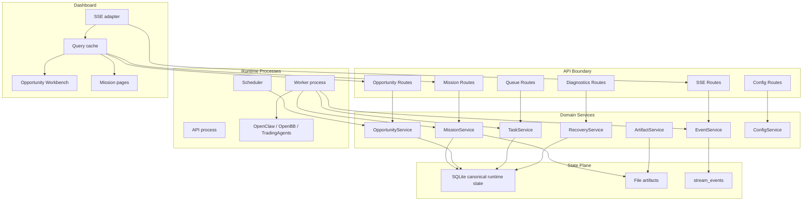

# Next Phase Technical Design

Last updated: 2026-04-29  
Baseline branch: `codex/opportunity-runtime-maturity`  
Scope: API service layer, SQLite migrations, Mission canonical store, cancellation, Workbench query layer, provenance, recovery UX, frontend performance.

## 1. Executive Summary

当前系统已经完成了第一轮成熟化：

- Mission 入队保留完整 input，并用 `inputHash / dedupeKey / idempotencyKey` 防止语义丢失。
- Opportunity 和 Mission events 已经开始写入 durable `stream_events`。
- Mission API 已经优先读 SQLite index，artifact 缺失时能返回 partial stub。
- Opportunity 写入已经有深层 Zod validation。
- Workbench 已经有轻量 query hooks 的第一版。
- 窄屏底部 macro strip 的布局错位已修复。

下一阶段目标不是继续堆数据源，而是把系统变成一个“日常可用、可恢复、可审计、可解释”的交易机会工作台。

一句话目标：

> 让用户每天打开 Workbench 时，可以清楚知道哪些机会值得行动、为什么排序靠前、背后证据是什么、失败任务如何恢复、系统状态是否可信。

本方案把 README 中的后续路线拆成 9 个工程 workstream，其中第 9 个是基于当前运行机制补充的诊断能力：

1. API service layer：把 routes 从“大杂烩”变薄。
2. SQLite migration system：把已有 migration registry 产品化，替代散落的 `ALTER TABLE ... catch {}`。
3. Mission canonical DB：进一步把 Mission 状态收敛到 SQLite。
4. Cancellation lifecycle：把取消语义传到 OpenClaw / TradingAgents / OpenBB 调用链。
5. Workbench query layer v2：统一 cache、invalidation、SSE reconnect 和 polling fallback。
6. Field provenance：给 Opportunity 字段加证据来源链。
7. Mission recovery UX：失败/取消任务能给出恢复建议和成本提示。
8. Frontend performance：做 code splitting 和样式拆分，解决 bundle warning 和长期维护问题。
9. Observability and diagnostics：让系统健康、事件滞后、vendor 状态、artifact 状态可见。

## 2. Design Principles

### 2.1 SQLite owns runtime state

SQLite 负责可查询、可恢复、可审计的运行态状态：

- task
- mission
- run
- event
- evidence ref
- opportunity
- snapshot
- provenance

文件 artifact 继续保存大文本：

- OpenClaw report
- TradingAgents result
- OpenBB evidence snapshot
- trace JSON
- generated markdown report

### 2.2 Routes only speak HTTP

Routes 不应该知道复杂业务细节。下一阶段 routes 只做：

- 解析 request
- 调用 validation
- 调用 domain service
- 返回统一 response

业务逻辑进入 service layer。

### 2.3 Event log is the replay boundary

`eventBus` 只负责本进程 fanout。跨进程、断线重连、审计和回放都以 `stream_events` 为准。

### 2.4 Frontend state ownership must be explicit

Workbench 的状态分成四类：

| State | Owner |
| --- | --- |
| Server cache | query layer |
| Live update | SSE adapter + query invalidation |
| URL state | router/search params |
| Local UI state | component state/localStorage |

页面组件不再自己手写多个 polling 和多个 merge effect。

### 2.5 Incremental rollout, no big bang rewrite

现有系统已经能用。所有重构都要：

- additive first
- dual-write where needed
- fallback where possible
- feature flag for risky read path
- tests before removing old path

## 3. Current Baseline

### 3.1 Already implemented

| Area | Current baseline |
| --- | --- |
| Task identity | `inputPayload`, `inputHash`, `dedupeKey`, `idempotencyKey` |
| Durable event | `stream_events`, Opportunity SSE replay/tail |
| Mission read path | `missions_index`, indexed events, evidence refs |
| Validation | deep Opportunity profile schemas |
| Frontend query | initial `dashboard/src/queries/*` |
| Responsive | macro strip uses CSS variables |
| Tests | 197 passing tests at last validation |

### 3.2 Main remaining gaps

| Gap | User-visible symptom |
| --- | --- |
| Routes too fat | API changes are risky, behavior hidden in route files |
| Migrations half-productized | schema changes still include silent `ALTER TABLE ... catch {}` |
| Mission canonical state split | DB can list missions, but artifacts still own too much detail |
| Cancellation not fully bounded | long vendor calls may continue after user cancels |
| Workbench state still mixed | query layer exists, but invalidation and live merge are incomplete |
| Provenance missing | user sees a field but not “where did this come from?” |
| Recovery UX shallow | failed task shows status, but not enough reason/action/cost |
| Bundle size warning | dashboard main JS chunk is above Vite warning threshold |

## 4. Target Architecture



## 5. Workstream A: API Service Layer

### 5.1 Problem

当前 routes 仍然承担太多责任，尤其是 Opportunity routes：

- 拼 summary
- 读 latest mission/run/events
- 计算 board health
- 处理 SSE replay/tail
- 调用 automation
- 处理 validation 后的业务参数

这会导致：

- API behavior 难测试。
- route 文件继续变大。
- 同一段 summary 构造逻辑很难被 CLI、daemon、tests 复用。
- 分页和 include 参数难做。

### 5.2 Target structure

新增：

```text
src/server/services/
  mission-service.ts
  opportunity-service.ts
  task-service.ts
  event-service.ts
  artifact-service.ts
  recovery-service.ts
  config-service.ts
  diagnostics-service.ts
  errors.ts
```

Routes 只保留 HTTP glue：

```ts
router.get('/opportunities', async (req, res) => {
  const query = parseOpportunityListQuery(req.query);
  const result = await opportunityService.list(query);
  res.json(result);
});
```

Service 负责业务：

```ts
type OpportunityListQuery = {
  limit: number;
  cursor?: string;
  include?: Array<'mission' | 'diff' | 'timeline' | 'playbook' | 'history'>;
};

type OpportunityService = {
  list(query: OpportunityListQuery): Promise<OpportunitySummaryPage>;
  get(id: string, include: OpportunityInclude[]): Promise<OpportunityDetail | null>;
  create(input: CreateOpportunityInput): Promise<OpportunityRecord>;
  update(id: string, input: UpdateOpportunityInput): Promise<OpportunityRecord>;
  buildSummary(record: OpportunityRecord, include: OpportunityInclude[]): Promise<OpportunitySummaryRecord>;
};
```

### 5.3 Unified API error shape

Current errors are mixed. Standardize:

```json
{
  "error": "Invalid request payload",
  "code": "validation_failed",
  "details": [
    {
      "path": "heatProfile.edges.0.weight",
      "message": "Expected number between 0 and 100"
    }
  ],
  "requestId": "req_..."
}
```

Suggested error codes:

| Code | Meaning |
| --- | --- |
| `validation_failed` | request payload/query invalid |
| `not_found` | requested entity missing |
| `conflict` | duplicate or incompatible state |
| `canceled` | user/system canceled operation |
| `vendor_unavailable` | OpenClaw/OpenBB/TA unavailable |
| `artifact_missing` | DB row exists but artifact missing |
| `internal_error` | unexpected failure |

### 5.4 API include strategy

Opportunity list should be lighter by default:

```text
GET /api/opportunities?limit=60
GET /api/opportunities?limit=60&include=mission,playbook
GET /api/opportunities/:id?include=events,timeline,diff,evidence,provenance
```

Default list should include:

- base opportunity fields
- latest event metadata
- lightweight why now
- suggested primary action

Heavy fields move to detail:

- full recent timeline
- full diff
- evidence refs
- provenance
- heat history

### 5.5 Implementation steps

1. Add `src/server/services/errors.ts`.
2. Extract `buildOpportunitySummary()` from route into `opportunity-service.ts`.
3. Extract mission list/detail/retry into `mission-service.ts`.
4. Move SSE replay/tail helpers into `event-service.ts`.
5. Replace route logic with service calls.
6. Add service-level unit tests with mocked workflows.
7. Add route-level tests for HTTP shape only.

### 5.6 Acceptance

- `src/server/routes/opportunities.ts` no longer owns summary construction.
- `src/server/routes/missions.ts` no longer owns list detail assembly.
- Service tests cover happy path and missing artifact path.
- API errors use consistent `{ error, code, details }`.
- Existing API clients continue working.

## 6. Workstream B: SQLite Migration System

### 6.1 Problem

Current DB layer already has `schema_migrations` and `applyMigration()`, but older schema changes still use:

```ts
try { await db.exec(`ALTER TABLE ...`); } catch {}
```

That pattern hides:

- whether migration ran
- why it failed
- whether column already existed or SQL broke
- migration order
- checksum drift

### 6.2 Target migration registry

Add a migration registry:

```text
src/db/migrations.ts
```

```ts
export interface MigrationDefinition {
  id: string;
  description: string;
  up: string;
  checksum: string;
}

export const migrations: MigrationDefinition[] = [
  {
    id: '001_core_schema_registry',
    description: 'Create schema_migrations',
    checksum: '...',
    up: `...`,
  },
];
```

Upgrade `schema_migrations`:

```sql
CREATE TABLE IF NOT EXISTS schema_migrations (
  id TEXT PRIMARY KEY,
  description TEXT,
  checksum TEXT,
  appliedAt TEXT NOT NULL,
  durationMs INTEGER,
  error TEXT
);
```

### 6.3 Column-safe helper

For existing local DB compatibility, use explicit helpers instead of silent catch:

```ts
async function addColumnIfMissing(
  db: Database,
  table: string,
  column: string,
  definition: string,
): Promise<void>
```

It should:

1. Read `PRAGMA table_info(table)`.
2. If column exists, log skip.
3. If missing, run `ALTER TABLE`.
4. Record migration id.

### 6.4 Backup and dry-run

Before larger canonical Mission migrations:

```bash
npm run db:backup
npm run db:migrate:check
```

Suggested scripts:

```json
{
  "db:backup": "ts-node -O '{\"verbatimModuleSyntax\": false}' src/db/backup.ts",
  "db:migrate:check": "ts-node -O '{\"verbatimModuleSyntax\": false}' src/db/check-migrations.ts"
}
```

### 6.5 Acceptance

- No new schema change uses silent `catch {}`.
- `schema_migrations` records description/checksum/duration.
- Existing local DB migrates without losing data.
- Failed migration records enough diagnostic info.
- Tests cover fresh DB and old DB shape.

## 7. Workstream C: Mission Canonical DB

### 7.1 Problem

Current Mission read path is better, but still split:

- `missions_index` contains metadata and input.
- full Mission artifact remains the main detailed record.
- status transitions still need stronger DB canonical update semantics.
- artifact refs exist, but artifact integrity is not tracked strongly enough.

### 7.2 Target tables

Add canonical `missions` table:

```sql
CREATE TABLE missions (
  id TEXT PRIMARY KEY,
  mode TEXT NOT NULL,
  query TEXT NOT NULL,
  tickers TEXT,
  depth TEXT,
  source TEXT,
  opportunityId TEXT,
  status TEXT NOT NULL,
  createdAt TEXT NOT NULL,
  updatedAt TEXT NOT NULL,
  inputPayload TEXT NOT NULL,
  inputHash TEXT NOT NULL,
  latestRunId TEXT,
  latestEventId TEXT,
  artifactPath TEXT,
  artifactSha256 TEXT,
  artifactSizeBytes INTEGER
);

CREATE INDEX idx_missions_updated
  ON missions (updatedAt DESC);

CREATE INDEX idx_missions_opportunity_updated
  ON missions (opportunityId, updatedAt DESC);

CREATE INDEX idx_missions_status_updated
  ON missions (status, updatedAt DESC);
```

Add artifact table:

```sql
CREATE TABLE mission_artifacts (
  id TEXT PRIMARY KEY,
  missionId TEXT NOT NULL,
  runId TEXT,
  kind TEXT NOT NULL,
  path TEXT NOT NULL,
  sha256 TEXT,
  sizeBytes INTEGER,
  createdAt TEXT NOT NULL,
  contentType TEXT,
  summary TEXT
);

CREATE INDEX idx_mission_artifacts_mission
  ON mission_artifacts (missionId, createdAt DESC);
```

### 7.3 Write path

Mission creation:

1. Build normalized input.
2. Compute `inputHash`.
3. Write `missions`.
4. Write legacy artifact/index during transition.
5. Create `mission_run`.
6. Enqueue task with `missionId`, `runId`, `inputPayload`, `inputHash`.

Mission status update:

1. Update `mission_runs`.
2. Update `missions.status`, `updatedAt`, `latestRunId`.
3. Append `mission_event`.
4. Append `stream_event`.
5. If linked to Opportunity, append Opportunity event.

### 7.4 Read path

Default:

```text
GET /api/missions -> missions table
GET /api/missions/:id -> missions table + latest run + artifact refs
GET /api/missions/:id/runs/:runId/evidence -> mission_artifacts lookup + file read
```

Fallback:

- If `missions` row missing, fallback to `missions_index`.
- If artifact missing, return partial detail with `artifact_missing` diagnostic.

### 7.5 Backfill

Add script:

```text
src/scripts/backfill-missions.ts
```

Backfill sequence:

1. Scan `missions_index`.
2. Parse `inputPayload`.
3. Compute `inputHash` if missing.
4. Insert into `missions`.
5. Read artifact path if exists.
6. Record sha/size into `mission_artifacts`.
7. Report missing/corrupt artifact count.

### 7.6 Acceptance

- Mission list does not scan `out/missions`.
- Mission detail works if artifact exists.
- Mission detail returns partial metadata if artifact missing.
- Backfill is idempotent.
- Mission status can be recovered from DB without in-memory queue.

## 8. Workstream D: Cancellation And Execution Lifecycle

### 8.1 Problem

Task cancellation currently marks DB state and relies on cooperative checks. Some vendor calls already accept `AbortSignal`, but the lifecycle is not fully consistent across:

- Task
- MissionRun
- Mission
- Opportunity event
- OpenClaw
- OpenBB
- TradingAgents

### 8.2 Target lifecycle

Keep public compatibility, but internally track richer lifecycle:

```text
queued
running
cancel_requested
canceled
completed
failed
interrupted
```

Compatibility mapping:

| Internal state | Existing public state |
| --- | --- |
| `queued` | `pending` / `queued` |
| `running` | `running` |
| `cancel_requested` | `running` with `cancelRequestedAt` |
| `canceled` | `canceled` |
| `completed` | `done` / `completed` |
| `failed` | `failed` |
| `interrupted` | `failed` with `failureCode=interrupted` |

### 8.3 RunExecutionContext

Add a shared context:

```ts
interface RunExecutionContext {
  taskId: string;
  missionId: string;
  runId: string;
  leaseId: string;
  abortController: AbortController;
  signal: AbortSignal;
  shouldCancel(): Promise<boolean>;
  heartbeat(stage: MissionRunStage): Promise<void>;
  markDegraded(flag: string, detail?: string): Promise<void>;
}
```

### 8.4 External call wrapper

All external calls use:

```ts
async function withAbortableTimeout<T>(
  label: string,
  timeoutMs: number,
  signal: AbortSignal,
  fn: (signal: AbortSignal) => Promise<T>,
): Promise<T>
```

Behavior:

- If user cancels, abort signal fires.
- If timeout expires, abort signal fires and failureCode becomes `timeout`.
- If vendor ignores signal, wrapper still resolves by timeout rejection.

### 8.5 Cancel endpoint behavior

Current:

```text
DELETE /api/queue/:id
```

Target:

1. Set task `cancelRequestedAt`.
2. Set run `cancelRequestedAt`.
3. Abort in-process controller if task is local.
4. Append `mission.canceled_requested` event.
5. Final state becomes `canceled` when worker exits.
6. If worker does not exit before grace period, mark `interrupted`.

### 8.6 Acceptance

- Cancel while OpenBB request is running ends as `canceled`, not `completed`.
- Cancel while TradingAgents request is running ends as `canceled`, not `completed`.
- Cancel event is visible in Opportunity timeline.
- Worker shutdown marks stale running task as interrupted or requeues by policy.
- Tests cover cancel before start, cancel during vendor call, timeout, worker recovery.

## 9. Workstream E: Workbench Query Layer v2

### 9.1 Problem

The first query layer exists, but Workbench still has:

- local `liveInbox`
- local `liveOpportunities`
- local `liveBoardHealth`
- manual SSE effects
- old `usePolling` for queue and heat graphs
- no central invalidation registry

### 9.2 Target query client

Without adding a new dependency yet:

```text
dashboard/src/queries/
  query-client.ts
  query-store.ts
  invalidation.ts
  opportunity-queries.ts
  mission-queries.ts
  queue-queries.ts
  stream-invalidation.ts
```

Core concepts:

```ts
type QueryKey = readonly string[];

interface QueryState<T> {
  data: T | null;
  loading: boolean;
  error: string | null;
  updatedAt: number;
  staleAt: number;
}

interface QueryClient {
  get<T>(key: QueryKey): QueryState<T> | undefined;
  set<T>(key: QueryKey, updater: T | ((current: T | null) => T)): void;
  invalidate(key: QueryKey): void;
  subscribe<T>(key: QueryKey, listener: (state: QueryState<T>) => void): () => void;
}
```

### 9.3 SSE invalidation map

Opportunity event to query invalidation:

| Event type | Invalidate/update |
| --- | --- |
| `created` | opportunities list, inbox, board health |
| `updated` | opportunity detail, list item, inbox item, board health |
| `mission_queued` | opportunity detail, inbox, queue |
| `mission_completed` | opportunity detail, inbox, board health, missions |
| `mission_failed` | opportunity detail, inbox, recovery panel |
| `mission_canceled` | opportunity detail, inbox, recovery panel |
| `relay_triggered` | heat board, inbox |
| `proxy_ignited` | proxy board, inbox |
| `thesis_degraded` | review lane, board health |

### 9.4 Workbench controller split

Target files:

```text
dashboard/src/pages/opportunity-workbench/
  WorkbenchPage.tsx
  useWorkbenchController.ts
  useWorkbenchViewState.ts
  useOpportunityLiveUpdates.ts
  selectors.ts
  components/*
```

Ownership:

| File | Responsibility |
| --- | --- |
| `WorkbenchPage.tsx` | layout composition |
| `useWorkbenchController.ts` | actions: create, update, analyze, recover |
| `useWorkbenchViewState.ts` | URL, filters, saved views, draft |
| `useOpportunityLiveUpdates.ts` | SSE to query invalidation |
| `selectors.ts` | derived board/inbox view models |

### 9.5 Acceptance

- Workbench page no longer owns manual polling for opportunities/inbox/board/events.
- SSE event updates only affected cache entries.
- Polling cannot overwrite fresher SSE data.
- Workbench usable with SSE disconnected.
- Tests cover query invalidation and reconnect replay.

## 10. Workstream F: Field Provenance

### 10.1 Problem

The user can see fields like:

- `nextCatalystAt`
- `retainedStakePercent`
- `validationStatus`
- `breadthScore`
- `proxyProfile.legitimacyScore`
- `policyStatus`

But cannot always answer:

- Where did this value come from?
- Was it extracted by AI or confirmed by filing?
- Which Mission produced it?
- When was it observed?
- Is there conflicting evidence?

### 10.2 Target model

Generalize evidence beyond IPO profile:

```sql
CREATE TABLE opportunity_field_evidence (
  id TEXT PRIMARY KEY,
  opportunityId TEXT NOT NULL,
  fieldPath TEXT NOT NULL,
  valueHash TEXT,
  sourceType TEXT NOT NULL,
  sourceId TEXT,
  sourceUrl TEXT,
  missionId TEXT,
  runId TEXT,
  eventId TEXT,
  confidence TEXT NOT NULL,
  observedAt TEXT,
  capturedAt TEXT NOT NULL,
  note TEXT,
  conflictState TEXT
);

CREATE INDEX idx_opportunity_field_evidence_lookup
  ON opportunity_field_evidence (opportunityId, fieldPath, capturedAt DESC);
```

Supported `sourceType`:

- `mission_evidence`
- `edgar_filing`
- `rss_item`
- `trendradar_report`
- `manual`
- `system_derived`
- `openbb`

Confidence:

- `confirmed`
- `inferred`
- `placeholder`
- `conflicted`

### 10.3 API

```text
GET /api/opportunities/:id/provenance
GET /api/opportunities/:id/provenance?fieldPath=ipoProfile.lockupDate
POST /api/opportunities/:id/provenance
```

Response:

```json
{
  "opportunityId": "opp_...",
  "fields": {
    "ipoProfile.lockupDate": [
      {
        "sourceType": "edgar_filing",
        "confidence": "confirmed",
        "sourceUrl": "https://...",
        "observedAt": "2026-04-28T00:00:00.000Z",
        "note": "Extracted from S-1 lockup section"
      }
    ]
  }
}
```

### 10.4 UI

Opportunity Detail Drawer:

- field label shows evidence indicator
- click opens provenance popover
- conflict state highlights field
- manual override records `sourceType=manual`

### 10.5 Acceptance

- IPO fields show source and confidence.
- Heat validation fields show derived source.
- Proxy rule fields show source and timestamp.
- Manual edits create provenance records.
- Conflicting evidence can be displayed without overwriting the current field silently.

## 11. Workstream G: Mission Recovery UX

### 11.1 Problem

The system can show failed/canceled missions, but the user needs clearer next actions:

- retry same mission?
- rerun quick review?
- archive opportunity?
- downgrade opportunity?
- wait for vendor recovery?
- inspect evidence?

### 11.2 Failure taxonomy

Standardize `failureCode`:

| Code | Meaning | Suggested action |
| --- | --- | --- |
| `canceled` | user canceled | rerun if still relevant |
| `timeout` | external call timeout | retry quick or standard |
| `vendor_unavailable` | OpenClaw/OpenBB/TA unavailable | wait/retry later |
| `input_invalid` | input cannot be executed | edit mission/opportunity |
| `evidence_partial` | some providers failed | review partial evidence |
| `execution_failed` | generic failure | inspect logs, retry |
| `interrupted` | worker stopped mid-run | retry same run |
| `artifact_missing` | result state exists but file missing | recover from DB or rerun |

### 11.3 Recovery service

```ts
interface MissionRecoveryOption {
  id: string;
  label: string;
  kind: 'retry' | 'review' | 'archive' | 'inspect' | 'wait';
  depth?: 'quick' | 'standard' | 'deep';
  estimatedCost: 'low' | 'medium' | 'high';
  reason: string;
  disabled?: boolean;
}
```

API:

```text
GET /api/missions/:id/recovery-options
GET /api/opportunities/:id/recovery-options
POST /api/missions/:id/recover
```

### 11.4 UI

Mission Recovery Panel shows:

- failure reason
- failed stage
- last heartbeat
- affected providers
- suggested options
- estimated cost/time
- links to evidence and trace

### 11.5 Acceptance

- Failed/canceled mission has at least one recovery option.
- Recovery option creates mission with correct `opportunityId`.
- Recovery action records Opportunity event.
- Inbox review lane surfaces recoverable opportunities.

## 12. Workstream H: Frontend Performance And CSS Structure

### 12.1 Problem

Dashboard build succeeds but main JS chunk is above Vite warning threshold. `App.css` is also large and mixes global layout, Workbench, mission viewer, watchlist and settings styles.

### 12.2 Code splitting

Use lazy routes:

```ts
const OpportunityWorkbench = lazy(() => import('./pages/OpportunityWorkbench'));
const MissionViewer = lazy(() => import('./pages/MissionViewer'));
const Settings = lazy(() => import('./pages/Settings'));
```

Split heavy Workbench submodules:

- Strategy review
- Score explanation
- Detail drawer
- Mission viewer markdown sections

### 12.3 CSS split

Target:

```text
dashboard/src/styles/
  layout.css
  cards.css
  forms.css
  mission.css
  opportunity-workbench.css
  settings.css
```

Keep:

- `index.css`: CSS variables and base reset
- `App.css`: app shell only

### 12.4 Acceptance

- Main JS chunk under warning threshold, or documented intentional split warning remains only for vendor chunk.
- App shell loads before heavy route code.
- Workbench CSS is isolated enough to edit without affecting Mission Viewer.
- 720 / 960 / 1440 viewport QA has no overlap.

## 13. Workstream I: Observability And Diagnostics

This is not explicitly listed in README, but it is necessary once the system becomes daily-use infrastructure.

### 13.1 Add diagnostics endpoint

```text
GET /api/diagnostics/runtime
```

Response includes:

- DB path
- migration status
- queue counts
- stale running tasks
- SSE stream latest ids
- vendor health
- artifact directory status
- last scheduler run

### 13.2 Add health levels

```ts
type HealthLevel = 'ok' | 'degraded' | 'down';
```

### 13.3 Acceptance

- Settings page can show runtime health without reading logs.
- Degraded vendor state is visible.
- SSE lag or DB tail issues are visible.

## 14. Data Model Summary

New or upgraded tables:

| Table | Purpose |
| --- | --- |
| `schema_migrations` | migration registry with checksum/duration |
| `missions` | canonical mission metadata and latest state |
| `mission_artifacts` | artifact refs with sha/size/kind |
| `opportunity_field_evidence` | field-level provenance |

Existing tables retained:

| Table | Treatment |
| --- | --- |
| `tasks` | keep, add lifecycle helpers |
| `mission_runs` | keep, align lifecycle states |
| `missions_index` | temporary fallback during migration |
| `mission_events` | keep, dual-write with `stream_events` |
| `mission_evidence_refs` | keep or merge into `mission_artifacts` later |
| `opportunities` | keep |
| `opportunity_events` | keep compatibility event table |
| `opportunity_snapshots` | keep |
| `stream_events` | canonical event replay log |

## 15. API Summary

New or changed APIs:

| API | Change |
| --- | --- |
| `GET /api/opportunities` | add pagination and include |
| `GET /api/opportunities/:id` | add include/provenance detail |
| `GET /api/opportunities/:id/provenance` | new |
| `GET /api/missions` | canonical `missions` table |
| `GET /api/missions/:id/recovery-options` | new |
| `POST /api/missions/:id/recover` | new |
| `GET /api/diagnostics/runtime` | new |
| `GET /api/opportunities/stream` | keep, add diagnostics and stronger reconnect tests |

## 16. Implementation Phases

### Phase 1: Service layer extraction

Goal: no behavior change, route files thinner.

Tasks:

- Add `server/services`.
- Extract Opportunity summary builder.
- Extract Mission list/detail/retry.
- Add unified error helpers.

Validation:

- Existing tests pass.
- Route snapshots unchanged.

### Phase 2: Migration system hardening

Goal: schema changes are explicit and auditable.

Tasks:

- Move migrations to registry.
- Upgrade `schema_migrations`.
- Replace silent column migration helpers.
- Add fresh DB and old DB tests.

Validation:

- Fresh DB boots.
- Existing DB boots.
- Failed migration logs diagnostic.

### Phase 3: Mission canonical DB

Goal: Mission state can be recovered from SQLite.

Tasks:

- Add `missions`.
- Add `mission_artifacts`.
- Dual-write from Mission creation/update.
- Backfill script.
- Switch read path with fallback.

Validation:

- Mission list does not scan artifacts.
- Missing artifact returns partial detail.
- Backfill idempotent.

### Phase 4: Cancellation lifecycle

Goal: cancel is bounded and deterministic.

Tasks:

- Add `RunExecutionContext`.
- Add abortable timeout wrapper.
- Wire OpenClaw/OpenBB/TA calls through signal.
- Add cancel requested event.
- Add interrupted recovery policy.

Validation:

- Cancel during vendor call ends canceled.
- Timeout has `failureCode=timeout`.
- Recovery after worker restart is deterministic.

### Phase 5: Workbench query layer v2

Goal: server cache and live events have one owner.

Tasks:

- Add query store.
- Add invalidation map.
- Move Workbench live effects to `useOpportunityLiveUpdates`.
- Add mission/queue query hooks.
- Add reconnect tests.

Validation:

- SSE reconnect updates cache.
- Polling cannot overwrite newer streamed entity.
- Workbench works with SSE off.

### Phase 6: Provenance and recovery UI

Goal: user can inspect evidence and act on failures.

Tasks:

- Add `opportunity_field_evidence`.
- Add provenance service/API.
- Add detail drawer provenance UI.
- Add recovery service/API.
- Expand recovery panel.

Validation:

- Field source visible in drawer.
- Failed mission shows recovery options.
- Recovery action creates linked Mission and event.

### Phase 7: Performance and CSS split

Goal: app loads faster and styles are easier to maintain.

Tasks:

- Lazy route imports.
- Split Workbench heavy components.
- Split `App.css`.
- Run viewport QA.

Validation:

- Build passes.
- Bundle warning reduced or documented.
- No overlap at 720/960/1440.

## 17. Recommended First PR Sequence

Small PRs, low merge risk:

| PR | Scope | Why first |
| --- | --- | --- |
| 1 | Extract `OpportunityService.buildSummary()` | High value, low behavior change |
| 2 | Add unified API error helper | Enables service routes |
| 3 | Move migrations into registry | Blocks future DB work |
| 4 | Add `missions` table dual-write | Starts canonical state safely |
| 5 | Add query invalidation map tests | Stabilizes frontend before bigger split |
| 6 | Add provenance table and read API | Enables UI without changing existing fields |
| 7 | Add recovery options API | Improves failed task UX |
| 8 | Lazy-load routes | Isolated frontend performance win |

## 18. Test Strategy

Backend:

- service unit tests
- route validation tests
- migration fresh/old DB tests
- Mission canonical write/read tests
- cancel during vendor call tests
- provenance API tests
- recovery option tests

Frontend:

- query store tests
- invalidation map tests
- SSE reconnect tests
- Workbench selector tests
- detail drawer provenance rendering tests
- recovery panel action tests

Manual QA:

- 720px / 960px / 1440px Workbench
- create Opportunity
- launch Mission
- cancel running Mission
- retry failed Mission
- disconnect/reconnect SSE
- inspect provenance

Required commands:

```bash
npm test
npm run typecheck
npm --prefix dashboard run lint
npm --prefix dashboard run build
git diff --check
```

## 19. Risks And Mitigations

| Risk | Impact | Mitigation |
| --- | --- | --- |
| DB migration corrupts local state | High | backup script, additive migrations, old DB tests |
| Mission dual-write divergence | High | DB write first, artifact ref checksum, fallback read |
| Cancel breaks successful long run | Medium | feature flag, clear state machine, cancel tests |
| Query layer changes UI behavior | Medium | incremental hook migration, selector tests |
| Provenance adds noisy UI | Medium | hidden-by-default popover, field indicator only |
| API include causes inconsistent summaries | Medium | explicit include contract and service tests |
| Code splitting breaks route imports | Low | build test and smoke navigation |

## 20. Feature Flags

Suggested:

```text
OPENCLAW_USE_MISSIONS_CANONICAL_TABLE=0
OPENCLAW_USE_QUERY_LAYER_V2=0
OPENCLAW_USE_FIELD_PROVENANCE=0
OPENCLAW_USE_RECOVERY_OPTIONS=0
OPENCLAW_STRICT_CANCEL_LIFECYCLE=0
```

Use flags for read-path changes and frontend behavior changes. Do not flag pure additive writes unless needed.

## 21. Definition Of Done

This next phase is done when:

- Routes are thin and service tests cover core business behavior.
- New DB changes are tracked by explicit migrations.
- Mission list/detail/recovery can be reconstructed from SQLite.
- Cancel/retry/recover behavior is deterministic and visible to the user.
- Workbench data flow has one query/cache owner.
- Opportunity fields can show where important values came from.
- Failed/canceled tasks show useful recovery options.
- Dashboard build and responsive QA are stable.
- The user no longer needs to inspect raw queue or logs to understand what happened.
