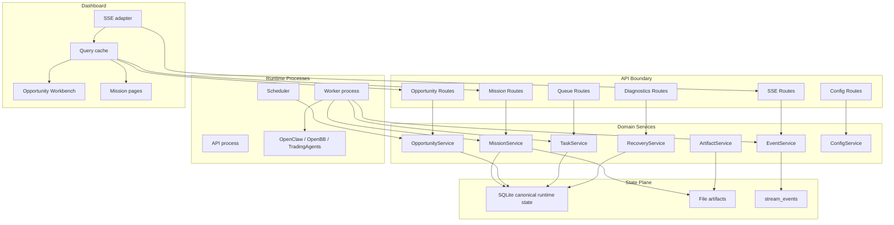

# Next Phase Technical Design

Last updated: 2026-05-01
Baseline branch: `codex/opportunity-runtime-maturity`  
Scope: API service layer, SQLite migrations, Mission canonical store, cancellation, Workbench query layer, provenance, recovery UX, frontend performance.

## 1. Executive Summary

当前系统已经完成了第一轮成熟化：

- Mission 入队保留完整 input，并用 `inputHash / dedupeKey / idempotencyKey` 防止语义丢失；Mission retry/recovery 也已有服务端 active retry dedupe、recoveryAudit 和成本提示。
- Opportunity 和 Mission events 已经开始写入 durable `stream_events`。
- Mission API 已经优先读 SQLite index，artifact 缺失时能返回 partial stub。
- Mission 主 artifact、事件日志和 evidence refs 已经统一登记到 `mission_artifacts`，并记录 sha256、size、contentType。
- `app.ts` 已经压成薄挂载层，health、queue、Mission diagnostics、artifact、TrendRadar、Opportunity operations/stream 等 API 已拆到独立 route/service。
- Opportunity 写入已经有深层 Zod validation。
- Workbench 已经有轻量 query hooks 的第一版。
- 窄屏底部 macro strip 的布局错位已修复。

下一阶段目标不是继续堆数据源，而是把系统变成一个“日常可用、可恢复、可审计、可解释”的交易机会工作台。

一句话目标：

> 让用户每天打开 Workbench 时，可以清楚知道哪些机会值得行动、为什么排序靠前、背后证据是什么、失败任务如何恢复、系统状态是否可信。

本方案把 README 中的后续路线拆成 9 个工程 workstream，其中第 9 个是基于当前运行机制补充的诊断能力：

1. API service layer：把 routes 从“大杂烩”变薄。
2. SQLite migration system：把已有 migration registry 产品化，替代散落的 `ALTER TABLE ... catch {}`。
3. Mission canonical DB：进一步把 Mission 状态收敛到 SQLite。
4. Cancellation lifecycle：把取消语义传到 OpenClaw / TradingAgents / OpenBB 调用链。
5. Workbench query layer v2：统一 cache、invalidation、SSE reconnect 和 polling fallback。
6. Field provenance：给 Opportunity 字段加证据来源链。
7. Mission recovery UX：失败/取消任务能给出恢复建议和成本提示。
8. Frontend performance：做 code splitting 和样式拆分，解决 bundle warning 和长期维护问题。
9. Observability and diagnostics：让系统健康、事件滞后、vendor 状态、artifact 状态可见。

## 2. Design Principles

### 2.1 SQLite owns runtime state

SQLite 负责可查询、可恢复、可审计的运行态状态：

- task
- mission
- run
- event
- evidence ref
- opportunity
- snapshot
- provenance

文件 artifact 继续保存大文本：

- OpenClaw report
- TradingAgents result
- OpenBB evidence snapshot
- trace JSON
- generated markdown report

### 2.2 Routes only speak HTTP

Routes 不应该知道复杂业务细节。下一阶段 routes 只做：

- 解析 request
- 调用 validation
- 调用 domain service
- 返回统一 response

业务逻辑进入 service layer。

### 2.3 Event log is the replay boundary

`eventBus` 只负责本进程 fanout。跨进程、断线重连、审计和回放都以 `stream_events` 为准。

### 2.4 Frontend state ownership must be explicit

Workbench 的状态分成四类：

| State | Owner |
| --- | --- |
| Server cache | query layer |
| Live update | SSE adapter + query invalidation |
| URL state | router/search params |
| Local UI state | component state/localStorage |

页面组件不再自己手写多个 polling 和多个 merge effect。

### 2.5 Incremental rollout, no big bang rewrite

现有系统已经能用。所有重构都要：

- additive first
- dual-write where needed
- fallback where possible
- feature flag for risky read path
- tests before removing old path

## 3. Current Baseline

### 3.1 Already implemented

| Area | Current baseline |
| --- | --- |
| Task identity | `inputPayload`, `inputHash`, `dedupeKey`, `idempotencyKey`, retry-specific active dedupe, retry recovery audit |
| Durable event | `stream_events`, Opportunity SSE replay/tail |
| Mission read path | canonical `missions` table first, then `missions_index`, indexed events, evidence refs |
| Mission artifact refs | `mission_artifacts` tracks mission/event_log/evidence file references with sha256/size/contentType |
| Mission artifact health | `/api/diagnostics/mission-artifacts` checks missing/corrupt/incomplete artifact refs |
| Mission artifact backfill | `npm run db:mission-artifacts:backfill` and API backfill historical refs |
| Mission artifact refresh | `npm run db:mission-artifacts:refresh` fills missing integrity metadata without overwriting mismatches by default |
| Opportunity field evidence backfill | `npm run db:opportunity-field-evidence:backfill` fills historical `field_evidence_*` events into canonical rows |
| Migration registry | `src/db/migrations.ts`, checksum metadata, `npm run db:migrate:check`, API diagnostics |
| API route boundaries | thin `app.ts`, separate health/queue/mission-diagnostics/artifacts/trendradar routes |
| Opportunity route extraction | heat-transfer graph, New Code Radar, and Opportunity SSE stream logic live in services |
| Validation | deep Opportunity profile schemas |
| Frontend query | `dashboard/src/queries/*`, Mission/Opportunity PageEnvelope wrappers, shared queue/diagnostics/heat graph hooks, Opportunity live store, plus Workbench view/action/interaction/derived-state hooks |
| Responsive | macro strip uses CSS variables |
| Performance | route-level lazy imports and split Workbench components |
| Tests | 339 passing tests at last validation |

### 3.2 Main remaining gaps

| Gap | User-visible symptom |
| --- | --- |
| Pagination rollout incomplete | Mission and Opportunity list envelopes exist; remaining list endpoints still need cursor/page contracts |
| Migration registry rollout | registry exists; future schema work should continue through explicit migrations |
| Mission canonical state split | `missions` table exists, dual-writes new saves, has historical backfill, and exposes coverage diagnostics; status transition hardening still needs work |
| Cancellation not fully bounded | long vendor calls may continue after user cancels |
| Workbench state still mixed | query layer, Mission/Opportunity list page wrappers, queue/diagnostics/heat graph hooks, Opportunity SSE invalidation map, live state store, interaction hooks, action controller hooks, storage adapter, pinned/default saved views, last-session restore, SSE replay/helper tests, and stream reconnect lifecycle tests exist; broader page split still needs hardening |
| Provenance missing | user sees a field but not “where did this come from?” |
| Recovery UX shallow | failed task shows status, retry dedupe is server-protected, and recovery actions show cost hints; remaining work is historical filtering and empirical cost statistics |
| CSS/front-end productization | route chunks, Workbench per-column virtual scrolling with dynamic row estimate, active-row keyboard navigation, drawer focus restoration, and keyboard/scroll-restoration QA, route-level Workbench/Mission Viewer/Command Center/Watchlist/Settings/TrendRadar CSS, shared workflow CSS, app-shell CSS, Workbench responsive-rule split, stable vendor chunks, lightweight shell icons, build-size QA, viewport QA, and aggregate dashboard quality QA exist; real-data overscan/card-action focus tuning remains |

## 4. Target Architecture


```mermaid
flowchart TB
  subgraph API["API Boundary"]
    MissionRoutes["Mission Routes"]
    OpportunityRoutes["Opportunity Routes"]
    QueueRoutes["Queue Routes"]
    ConfigRoutes["Config Routes"]
    DiagnosticsRoutes["Diagnostics Routes"]
    StreamRoutes["SSE Routes"]
  end

  subgraph Services["Domain Services"]
    MissionService["MissionService"]
    OpportunityService["OpportunityService"]
    TaskService["TaskService"]
    EventService["EventService"]
    ArtifactService["ArtifactService"]
    RecoveryService["RecoveryService"]
    ConfigService["ConfigService"]
  end

  subgraph State["State Plane"]
    DB["SQLite canonical runtime state"]
    Artifacts["File artifacts"]
    StreamLog["stream_events"]
  end

  subgraph Runtime["Runtime Processes"]
    APIProcess["API process"]
    WorkerProcess["Worker process"]
    Scheduler["Scheduler"]
    Vendors["OpenClaw / OpenBB / TradingAgents"]
  end

  subgraph Dashboard["Dashboard"]
    QueryClient["Query cache"]
    SseAdapter["SSE adapter"]
    Workbench["Opportunity Workbench"]
    MissionPages["Mission pages"]
  end

  MissionRoutes --> MissionService
  OpportunityRoutes --> OpportunityService
  QueueRoutes --> TaskService
  ConfigRoutes --> ConfigService
  DiagnosticsRoutes --> RecoveryService
  StreamRoutes --> EventService

  MissionService --> DB
  MissionService --> Artifacts
  OpportunityService --> DB
  TaskService --> DB
  EventService --> StreamLog
  ArtifactService --> Artifacts
  RecoveryService --> DB

  WorkerProcess --> TaskService
  WorkerProcess --> MissionService
  WorkerProcess --> Vendors
  WorkerProcess --> EventService
  Scheduler --> OpportunityService

  QueryClient --> MissionRoutes
  QueryClient --> OpportunityRoutes
  SseAdapter --> StreamRoutes
  SseAdapter --> QueryClient
  QueryClient --> Workbench
  QueryClient --> MissionPages
```

## 5. Workstream A: API Service Layer

### 5.1 Problem

当前 routes 仍然承担太多责任，尤其是 Opportunity routes：

- 拼 summary
- 读 latest mission/run/events
- 计算 board health
- 处理 SSE replay/tail
- 调用 automation
- 处理 validation 后的业务参数

这会导致：

- API behavior 难测试。
- route 文件继续变大。
- 同一段 summary 构造逻辑很难被 CLI、daemon、tests 复用。
- 分页和 include 参数难做。

### 5.2 Target structure

新增：

```text
src/server/services/
  mission-service.ts
  opportunity-service.ts
  task-service.ts
  event-service.ts
  artifact-service.ts
  recovery-service.ts
  config-service.ts
  diagnostics-service.ts
  errors.ts
```

Routes 只保留 HTTP glue：

```ts
router.get('/opportunities', async (req, res) => {
  const query = parseOpportunityListQuery(req.query);
  const result = await opportunityService.list(query);
  res.json(result);
});
```

Service 负责业务：

```ts
type OpportunityListQuery = {
  limit: number;
  cursor?: string;
  include?: Array<'mission' | 'diff' | 'timeline' | 'playbook' | 'history'>;
};

type OpportunityService = {
  list(query: OpportunityListQuery): Promise<OpportunitySummaryPage>;
  get(id: string, include: OpportunityInclude[]): Promise<OpportunityDetail | null>;
  create(input: CreateOpportunityInput): Promise<OpportunityRecord>;
  update(id: string, input: UpdateOpportunityInput): Promise<OpportunityRecord>;
  buildSummary(record: OpportunityRecord, include: OpportunityInclude[]): Promise<OpportunitySummaryRecord>;
};
```

### 5.3 Unified API error shape

Current errors are mixed. Standardize:

```json
{
  "error": "Invalid request payload",
  "code": "validation_failed",
  "details": [
    {
      "path": "heatProfile.edges.0.weight",
      "message": "Expected number between 0 and 100"
    }
  ],
  "requestId": "req_..."
}
```

Suggested error codes:

| Code | Meaning |
| --- | --- |
| `validation_failed` | request payload/query invalid |
| `not_found` | requested entity missing |
| `conflict` | duplicate or incompatible state |
| `canceled` | user/system canceled operation |
| `vendor_unavailable` | OpenClaw/OpenBB/TA unavailable |
| `artifact_missing` | DB row exists but artifact missing |
| `internal_error` | unexpected failure |

### 5.4 API include strategy

Opportunity list should be lighter by default:

```text
GET /api/opportunities?limit=60
GET /api/opportunities?limit=60&include=mission,playbook
GET /api/opportunities/:id?include=events,timeline,diff,evidence,provenance
```

Default list should include:

- base opportunity fields
- latest event metadata
- lightweight why now
- suggested primary action

Heavy fields move to detail:

- full recent timeline
- full diff
- evidence refs
- provenance
- heat history

### 5.5 Implementation steps

1. Add `src/server/services/errors.ts`.
2. Extract `buildOpportunitySummary()` from route into `opportunity-service.ts`.
3. Extract mission list/detail/retry into `mission-service.ts`.
4. Move SSE replay/tail helpers into `event-service.ts`.
5. Replace route logic with service calls.
6. Add service-level unit tests with mocked workflows.
7. Add route-level tests for HTTP shape only.

### 5.6 Acceptance

- `src/server/routes/opportunities.ts` no longer owns summary construction.
- `src/server/routes/missions.ts` no longer owns list detail assembly.
- Service tests cover happy path and missing artifact path.
- API errors use consistent `{ error, code, details }`.
- Existing API clients continue working.

## 6. Workstream B: SQLite Migration System

### 6.1 Problem

Current DB layer now has `schema_migrations`, `src/db/migrations.ts`, checksums, duration/status/error metadata, an API diagnostic endpoint, and `npm run db:migrate:check`.

The remaining risk is future drift or old-style schema edits reappearing. Older historical changes used:

```ts
try { await db.exec(`ALTER TABLE ...`); } catch {}
```

That pattern hides:

- whether migration ran
- why it failed
- whether column already existed or SQL broke
- migration order
- checksum drift

### 6.2 Target migration registry

The migration registry exists:

```text
src/db/migrations.ts
```

```ts
export interface SchemaMigration {
  id: string;
  description: string;
  checksumSource: string;
  apply: (db: Database) => Promise<void>;
}

export const SCHEMA_MIGRATIONS: SchemaMigration[] = [
  {
    id: '001_core_schema_registry',
    description: 'Create schema_migrations',
    checksumSource: '001:v1:schema_migrations_metadata_columns',
    apply: async () => undefined,
  },
];
```

`schema_migrations` stores:

```sql
CREATE TABLE IF NOT EXISTS schema_migrations (
  id TEXT PRIMARY KEY,
  description TEXT,
  checksum TEXT,
  appliedAt TEXT NOT NULL,
  durationMs INTEGER,
  status TEXT,
  error TEXT
);
```

### 6.3 Column-safe helper

For existing local DB compatibility, use explicit helpers instead of silent catch:

```ts
async function addColumnIfMissing(
  db: Database,
  table: string,
  column: string,
  definition: string,
): Promise<void>
```

It should:

1. Read `PRAGMA table_info(table)`.
2. If column exists, log skip.
3. If missing, run `ALTER TABLE`.
4. Record migration id.

### 6.4 Backup and dry-run

Before larger canonical Mission migrations:

```bash
npm run db:backup
npm run db:migrate:check
```

Current script:

```bash
npm run db:migrate:check
```

Recommended remaining addition:

```bash
npm run db:backup
```

### 6.5 Acceptance

- No new schema change uses silent `catch {}`.
- `schema_migrations` records description/checksum/duration/status/error.
- Existing local DB migrates without losing data.
- Failed migration records enough diagnostic info.
- Tests cover fresh DB and old DB shape.

## 7. Workstream C: Mission Canonical DB

### 7.1 Problem

Current Mission read path is now safer, but still transitional:

- `missions` stores canonical metadata, original input, input hash, and mission artifact integrity for newly saved missions.
- `missions_index` still exists as a compatibility fallback for older rows.
- full Mission artifact remains the main detailed record.
- status transitions still need stronger DB canonical update semantics.
- artifact refs exist through `mission_artifacts`, with sha256/size/contentType recorded when files are readable.

### 7.2 Target tables

Current canonical `missions` table:

```sql
CREATE TABLE missions (
  id TEXT PRIMARY KEY,
  mode TEXT NOT NULL,
  query TEXT NOT NULL,
  tickers TEXT,
  depth TEXT,
  source TEXT,
  opportunityId TEXT,
  status TEXT NOT NULL,
  createdAt TEXT NOT NULL,
  updatedAt TEXT NOT NULL,
  inputPayload TEXT NOT NULL,
  inputHash TEXT NOT NULL,
  latestRunId TEXT,
  latestEventId TEXT,
  artifactPath TEXT,
  artifactSha256 TEXT,
  artifactSizeBytes INTEGER
);

CREATE INDEX idx_missions_updated
  ON missions (updatedAt DESC);

CREATE INDEX idx_missions_opportunity_updated
  ON missions (opportunityId, updatedAt DESC);

CREATE INDEX idx_missions_status_updated
  ON missions (status, updatedAt DESC);
```

Current v1 artifact reference table exists:

```sql
CREATE TABLE mission_artifacts (
  id TEXT PRIMARY KEY,
  missionId TEXT NOT NULL,
  runId TEXT,
  kind TEXT NOT NULL,
  artifactPath TEXT NOT NULL,
  sha256 TEXT,
  sizeBytes INTEGER,
  contentType TEXT,
  createdAt TEXT NOT NULL,
  updatedAt TEXT NOT NULL,
  meta TEXT
);

CREATE INDEX idx_mission_artifacts_mission_kind
  ON mission_artifacts (missionId, kind, updatedAt DESC);
```

Next additions:

- dry-run repair reports for historical `missions` rows
- stale canonical row repair helpers
- backfill coverage report
- missing/corrupt artifact repair helpers

### 7.3 Write path

Mission creation:

1. Build normalized input.
2. Compute `inputHash`.
3. Write `missions` and legacy `missions_index` during transition.
4. Register the mission artifact in `mission_artifacts`.
5. Create `mission_run`.
6. Enqueue task with `missionId`, `runId`, `inputPayload`, `inputHash`.

Mission status update:

1. Update `mission_runs`.
2. Update `missions.status`, `updatedAt`, `latestRunId`.
3. Append `mission_event`.
4. Append `stream_event`.
5. If linked to Opportunity, append Opportunity event.

### 7.4 Read path

Default:

```text
GET /api/missions -> missions table, then missions_index fallback
GET /api/missions/:id -> missions table + artifact, then missions_index/file fallback
GET /api/missions/:id/artifacts -> mission_artifacts
GET /api/missions/:id/runs/:runId/evidence -> mission_artifacts lookup + file read
```

Fallback:

- If `missions` row missing, fallback to `missions_index`.
- If artifact missing, return partial detail with `artifact_missing` diagnostic.

### 7.5 Backfill

Current artifact ref backfill exists:

```text
src/db/backfill-canonical-missions.ts
npm run db:missions:backfill
POST /api/diagnostics/missions/backfill
GET /api/diagnostics/missions
GET /api/diagnostics/mission-artifacts/repair-plan
POST /api/diagnostics/mission-artifacts/repair
src/db/backfill-mission-artifacts.ts
npm run db:mission-artifacts:backfill
POST /api/diagnostics/mission-artifacts/backfill
src/db/refresh-mission-artifact-integrity.ts
npm run db:mission-artifacts:refresh
npm run db:opportunity-field-evidence:backfill
POST /api/diagnostics/mission-artifacts/refresh-integrity
```

Backfill sequence:

1. Scan `missions_index`.
2. Scan `mission_events`.
3. Scan `mission_evidence_refs`.
4. Upsert `mission_artifacts`.
5. Record sha/size/contentType when files are readable.
6. Report present/missing/unreadable file counts.

Integrity refresh:

- fills missing `sha256`, `sizeBytes`, and `contentType`
- skips checksum/size mismatches by default
- supports explicit overwrite only for operator-confirmed repair

Current canonical mission backfill:

1. Scans `missions_index`.
2. Parses `inputPayload`, with indexed-column fallback for malformed historical rows.
3. Computes `inputHash`.
4. Inserts or refreshes `missions`.
5. Links latest run/event/artifact refs.

Current canonical Mission diagnostics check:

1. Rows present in `missions_index` but absent from `missions`.
2. Rows present in `missions` but absent from `missions_index`.
3. Canonical rows older than `missions_index`.
4. Artifact path mismatch.
5. Missing/unreadable artifacts and checksum/size/integrity gaps.

Remaining canonical mission work:

1. Add a dry-run mode and per-row repair report before destructive maintenance.
2. Add a stale-row repair API that can be scoped to selected Mission ids.

Current Mission artifact repair plan:

1. Missing integrity metadata becomes an automatic `refresh_integrity` action.
2. Checksum/size mismatch becomes a manual-review overwrite action.
3. Missing artifact files become blocked restore actions.
4. Unreadable files become manual-review permission actions.

Current Mission artifact repair execution:

1. Automatic actions can be applied without overwrite.
2. Manual-review actions are skipped unless explicitly allowed.
3. Missing/unreadable artifacts are reported as skipped/blocked and never auto-mutated.
4. Repair can be scoped to selected artifact ids.

### 7.6 Acceptance

- Mission list does not scan `out/missions`.
- Mission detail works if artifact exists.
- Mission detail returns partial metadata if artifact missing.
- Backfill is idempotent.
- Mission status can be recovered from DB without in-memory queue.

## 8. Workstream D: Cancellation And Execution Lifecycle

### 8.1 Problem

Task cancellation currently marks DB state and relies on cooperative checks. Some vendor calls already accept `AbortSignal`, but the lifecycle is not fully consistent across:

- Task
- MissionRun
- Mission
- Opportunity event
- OpenClaw
- OpenBB
- TradingAgents

### 8.2 Target lifecycle

Keep public compatibility, but internally track richer lifecycle:

```text
queued
running
cancel_requested
canceled
completed
failed
interrupted
```

Compatibility mapping:

| Internal state | Existing public state |
| --- | --- |
| `queued` | `pending` / `queued` |
| `running` | `running` |
| `cancel_requested` | `running` with `cancelRequestedAt` |
| `canceled` | `canceled` |
| `completed` | `done` / `completed` |
| `failed` | `failed` |
| `interrupted` | `failed` with `failureCode=interrupted` |

### 8.3 RunExecutionContext

Add a shared context:

```ts
interface RunExecutionContext {
  taskId: string;
  missionId: string;
  runId: string;
  leaseId: string;
  abortController: AbortController;
  signal: AbortSignal;
  shouldCancel(): Promise<boolean>;
  heartbeat(stage: MissionRunStage): Promise<void>;
  markDegraded(flag: string, detail?: string): Promise<void>;
}
```

### 8.4 External call wrapper

All external calls use:

```ts
async function withAbortableTimeout<T>(
  label: string,
  timeoutMs: number,
  signal: AbortSignal,
  fn: (signal: AbortSignal) => Promise<T>,
): Promise<T>
```

Behavior:

- If user cancels, abort signal fires.
- If timeout expires, abort signal fires and failureCode becomes `timeout`.
- If vendor ignores signal, wrapper still resolves by timeout rejection.

### 8.5 Cancel endpoint behavior

Current:

```text
DELETE /api/queue/:id
```

Target:

1. Set task `cancelRequestedAt`.
2. Set run `cancelRequestedAt`.
3. Abort in-process controller if task is local.
4. Append `mission.canceled_requested` event.
5. Final state becomes `canceled` when worker exits.
6. If worker does not exit before grace period, mark `interrupted`.

### 8.6 Acceptance

- Cancel while OpenBB request is running ends as `canceled`, not `completed`.
- Cancel while TradingAgents request is running ends as `canceled`, not `completed`.
- Cancel event is visible in Opportunity timeline.
- Worker shutdown marks stale running task as interrupted or requeues by policy.
- Tests cover cancel before start, cancel during vendor call, timeout, worker recovery.

## 9. Workstream E: Workbench Query Layer v2

### 9.1 Problem

The first query layer exists, but Workbench still has:

- `useOpportunityLiveStore` now owns `liveInbox`, `liveOpportunities`, and `liveBoardHealth`
- `useOpportunityLiveUpdates` maps SSE events to focused refreshes through a deduped refresh plan, but broader live-update ownership still needs hardening
- `interaction-state.ts` owns live clock, lane focus refs/timeouts, and Action Inbox keyboard shortcuts
- `actions.ts` is now a compatibility facade over creation/detail/mission/automation action hooks
- `workbench-storage.ts` owns safe draft/saved-view/last-view localStorage JSON read/write
- `OpportunityWorkbench.tsx` is now a thin entry that delegates state orchestration to `workbench-controller.ts`, page ordering to `OpportunityWorkbenchView.tsx`, and large layout sections to `WorkbenchSections.tsx`
- search filtering now produces field-level match explanations consumed by board cards, and board item rendering is split into `BoardOpportunityList.tsx`
- old page-level polling has been removed from CommandCenter and OpportunityWorkbench; broader query ownership still needs hardening
- invalidation registry covers Opportunity stream events, including queue refresh for mission lifecycle events

### 9.2 Target query client

Without adding a new dependency yet:

```text
dashboard/src/queries/
  query-client.ts
  query-store.ts
  invalidation.ts
  opportunity-queries.ts
  opportunity-live-store.ts
  mission-queries.ts
  queue-queries.ts
  stream-invalidation.ts
```

Core concepts:

```ts
type QueryKey = readonly string[];

interface QueryState<T> {
  data: T | null;
  loading: boolean;
  error: string | null;
  updatedAt: number;
  staleAt: number;
}

interface QueryClient {
  get<T>(key: QueryKey): QueryState<T> | undefined;
  set<T>(key: QueryKey, updater: T | ((current: T | null) => T)): void;
  invalidate(key: QueryKey): void;
  subscribe<T>(key: QueryKey, listener: (state: QueryState<T>) => void): () => void;
}
```

### 9.3 SSE invalidation map

Opportunity event to query invalidation:

| Event type | Invalidate/update |
| --- | --- |
| `created` | opportunities list, inbox, board health |
| `updated` | opportunity detail, list item, inbox item, board health |
| `mission_queued` | opportunity detail, inbox, queue |
| `mission_completed` | opportunity detail, inbox, board health, missions |
| `mission_failed` | opportunity detail, inbox, recovery panel |
| `mission_canceled` | opportunity detail, inbox, recovery panel |
| `relay_triggered` | heat board, inbox |
| `proxy_ignited` | proxy board, inbox |
| `thesis_degraded` | review lane, board health |

### 9.4 Workbench controller split

Target files:

```text
dashboard/src/pages/opportunity-workbench/
  OpportunityWorkbenchView.tsx
  WorkbenchSections.tsx
  BoardOpportunityList.tsx
  OpportunitySearchMatchBlock.tsx
  workbench-controller.ts
  useWorkbenchViewState.ts
  useOpportunityLiveUpdates.ts
  selectors.ts
  components/*
```

Ownership:

| File | Responsibility |
| --- | --- |
| `../OpportunityWorkbench.tsx` | thin route entry |
| `OpportunityWorkbenchView.tsx` | page section ordering |
| `WorkbenchSections.tsx` | header, control, action/review, creation/feed, board, and detail layout sections |
| `BoardOpportunityList.tsx` | board empty-state and opportunity card iteration boundary |
| `OpportunitySearchMatchBlock.tsx` | visible field-level search match reasons for filtered cards |
| `workbench-controller.ts` | data/action/view-state/derived-state orchestration |
| `actions.ts` | facade used by the page |
| `creation-actions.ts` | create and save/analyze opportunity actions |
| `detail-actions.ts` | detail drawer open/save state |
| `mission-actions.ts` | analyze, recover, and primary mission actions |
| `automation-actions.ts` | radar/heat graph automation and graph-to-opportunity seed mapping |
| `useWorkbenchViewState.ts` | URL, filters, saved views, default/pinned view, last-view restore |
| `workbench-storage.ts` | safe localStorage adapter for draft, saved views, and last view |
| `dashboard/src/queries/opportunity-live-updates.ts` | current SSE to query invalidation and deduped refresh planning |
| `dashboard/src/queries/opportunity-live-store.ts` | live inbox/opportunity/board snapshot merge and upsert/remove state |
| `interaction-state.ts` | live clock, lane focus, and keyboard shortcuts |
| `selectors.ts` | derived board/inbox view models |

### 9.5 Acceptance

- Workbench page no longer owns manual polling for opportunities/inbox/board/events.
- SSE event updates only affected cache entries.
- Polling cannot overwrite fresher SSE data.
- Workbench usable with SSE disconnected.
- Tests cover query invalidation, deduped refresh planning, live snapshot merge/remove behavior, Action Inbox shortcut mapping, Heat Graph seed payload mapping, storage JSON fallback behavior, replay cursor construction, lastEventId priority, and replay frame dedupe.

## 10. Workstream F: Field Provenance

### 10.1 Problem

The user can see fields like:

- `nextCatalystAt`
- `retainedStakePercent`
- `validationStatus`
- `breadthScore`
- `proxyProfile.legitimacyScore`
- `policyStatus`

But cannot always answer:

- Where did this value come from?
- Was it extracted by AI or confirmed by filing?
- Which Mission produced it?
- When was it observed?
- Is there conflicting evidence?

### 10.2 Target model

Generalize evidence beyond IPO profile:

```sql
CREATE TABLE opportunity_field_evidence (
  id TEXT PRIMARY KEY,
  opportunityId TEXT NOT NULL,
  field TEXT NOT NULL,
  label TEXT NOT NULL,
  kind TEXT NOT NULL,
  source TEXT NOT NULL,
  confidence TEXT NOT NULL,
  status TEXT NOT NULL,
  value TEXT,
  note TEXT,
  observedAt TEXT,
  recordedAt TEXT NOT NULL,
  updatedAt TEXT NOT NULL,
  createdEventId TEXT,
  invalidatedEventId TEXT,
  restoredEventId TEXT,
  meta TEXT
);

CREATE INDEX idx_opportunity_field_evidence_lookup
  ON opportunity_field_evidence (opportunityId, status, field, updatedAt DESC);
```

Supported `sourceType`:

- `mission_evidence`
- `edgar_filing`
- `rss_item`
- `trendradar_report`
- `manual`
- `system_derived`
- `openbb`

Confidence:

- `confirmed`
- `inferred`
- `placeholder`
- `conflicted`

### 10.3 API

```text
GET /api/opportunities/:id/provenance
GET /api/opportunities/:id/provenance?fieldPath=ipoProfile.lockupDate
POST /api/opportunities/:id/provenance
```

Response:

```json
{
  "opportunityId": "opp_...",
  "fields": {
    "ipoProfile.lockupDate": [
      {
        "sourceType": "edgar_filing",
        "confidence": "confirmed",
        "sourceUrl": "https://...",
        "observedAt": "2026-04-28T00:00:00.000Z",
        "note": "Extracted from S-1 lockup section"
      }
    ]
  }
}
```

### 10.4 UI

Opportunity Detail Drawer:

- field label shows evidence indicator
- click opens provenance popover
- conflict state highlights field
- manual override records `sourceType=manual`

### 10.5 Acceptance

- IPO fields show source and confidence.
- Heat validation fields show derived source.
- Proxy rule fields show source and timestamp.
- Manual edits create provenance records.
- Conflicting evidence can be displayed without overwriting the current field silently.

## 11. Workstream G: Mission Recovery UX

### 11.1 Problem

The system can show failed/canceled missions, but the user needs clearer next actions:

- retry same mission?
- rerun quick review?
- archive opportunity?
- downgrade opportunity?
- wait for vendor recovery?
- inspect evidence?

### 11.2 Failure taxonomy

Standardize `failureCode`:

| Code | Meaning | Suggested action |
| --- | --- | --- |
| `canceled` | user canceled | rerun if still relevant |
| `timeout` | external call timeout | retry quick or standard |
| `vendor_unavailable` | OpenClaw/OpenBB/TA unavailable | wait/retry later |
| `input_invalid` | input cannot be executed | edit mission/opportunity |
| `evidence_partial` | some providers failed | review partial evidence |
| `execution_failed` | generic failure | inspect logs, retry |
| `interrupted` | worker stopped mid-run | retry same run |
| `artifact_missing` | result state exists but file missing | recover from DB or rerun |

### 11.3 Recovery service

```ts
interface MissionRecoveryOption {
  id: string;
  label: string;
  kind: 'retry' | 'review' | 'archive' | 'inspect' | 'wait';
  depth?: 'quick' | 'standard' | 'deep';
  estimatedCost: 'low' | 'medium' | 'high';
  reason: string;
  disabled?: boolean;
}
```

API:

```text
GET /api/missions/:id/recovery-options
GET /api/opportunities/:id/recovery-options
POST /api/missions/:id/recover
```

### 11.4 UI

Mission Recovery Panel shows:

- failure reason
- failed stage
- last heartbeat
- affected providers
- suggested options
- estimated cost/time
- links to evidence and trace

### 11.5 Acceptance

- Failed/canceled mission has at least one recovery option.
- Recovery option creates mission with correct `opportunityId`.
- Recovery action records Opportunity event.
- Inbox review lane surfaces recoverable opportunities.

## 12. Workstream H: Frontend Performance And CSS Structure

### 12.1 Problem

Dashboard previously had a main JS chunk above Vite warning threshold. `App.css` has been retired: Workbench route styles and Workbench responsive rules live in `dashboard/src/pages/opportunity-workbench/opportunity-workbench.css`, Mission Viewer route styles in `dashboard/src/pages/mission-viewer.css`, Command Center route styles in `dashboard/src/pages/command-center.css`, Watchlist route styles in `dashboard/src/pages/watchlist.css`, Settings route styles in `dashboard/src/pages/settings.css`, TrendRadar route styles in `dashboard/src/pages/trend-radar.css`, shared workflow/feed/stream/timeline styles in `dashboard/src/styles/workflow-shared.css`, and app shell/layout styles in `dashboard/src/styles/app-shell.css`. The remaining performance risk is gradual vendor/route chunk drift, not an oversized app entry.

### 12.2 Code splitting

Use lazy routes:

```ts
const OpportunityWorkbench = lazy(() => import('./pages/OpportunityWorkbench'));
const MissionViewer = lazy(() => import('./pages/MissionViewer'));
const Settings = lazy(() => import('./pages/Settings'));
```

Split heavy Workbench submodules:

- Strategy review
- Score explanation
- Detail drawer
- Mission viewer markdown sections

Current explicit chunk groups:

- `react-vendor`: React, React DOM, React Router, and React Router DOM. This keeps the app runtime dependency stable across route edits.
- `markdown-vendor`: ReactMarkdown and the unified/remark/micromark parsing chain. Rolldown dependency recursion is disabled so this chunk does not absorb React/JSX runtime or become part of the app entry preload path.

Current build shape after explicit chunk groups:

- `react-vendor-*.js`: about 222 kB raw / 70 kB gzip.
- `markdown-vendor-*.js`: about 110 kB raw / 33 kB gzip.
- `MissionViewer-*.js`: about 32 kB raw / 10 kB gzip after markdown extraction.
- `lucide-react-*.js`: about 16 kB raw / 6 kB gzip, lazy route-only.
- `index-*.js`: about 14 kB raw / 5.3 kB gzip app entry, with React runtime loaded through `react-vendor`.
- Initial JS is about 75.9 kB gzip and excludes `markdown-vendor` and `lucide-react`.
- Route CSS and shared CSS chunks remain split.

### 12.3 CSS split

Target:

```text
dashboard/src/styles/
  app-shell.css
  workflow-shared.css
  layout.css
  cards.css
  forms.css
  mission.css
  opportunity-workbench.css
  settings.css
```

Keep:

- `index.css`: CSS variables and base reset
- `dashboard/src/styles/app-shell.css`: app shell, base page frame, macro strip, shared loading/empty states, and lightweight animations

Current first step:

- `dashboard/src/pages/opportunity-workbench/opportunity-workbench.css` is route-loaded by `OpportunityWorkbench.tsx`.
- `dashboard/src/pages/mission-viewer.css` is route-loaded by `MissionViewer.tsx`.
- `dashboard/src/pages/command-center.css` is route-loaded by `CommandCenter.tsx`.
- `dashboard/src/pages/watchlist.css` is route-loaded by `Watchlist.tsx`.
- `dashboard/src/pages/settings.css` is route-loaded by `Settings.tsx`.
- `dashboard/src/pages/trend-radar.css` is route-loaded by `TrendRadarHub.tsx` and `TrendRadarRaw.tsx`.
- `dashboard/src/styles/app-shell.css` is imported once by `App.tsx`.
- `dashboard/src/styles/workflow-shared.css` is imported by Command Center, Mission Timeline, Mission Viewer, and Opportunity Workbench for shared feed/stream/timeline UI.
- Workbench responsive rules live with `opportunity-workbench.css` instead of global `App.css`.
- Vite build emits dedicated CSS assets for Workbench, Mission Viewer, Command Center, Watchlist, Settings, TrendRadar, and shared workflow UI; app shell is imported once by `App.tsx` and bundled into the smaller main `index-*.css`.
- Vite build emits stable JS vendor chunks for React/Router and markdown parsing through `dashboard/vite.config.ts`. The config uses Rolldown `codeSplitting.groups` with dependency recursion disabled so `markdown-vendor` does not absorb React/JSX runtime and become an initial resource.
- App shell and ErrorBoundary icons use lightweight local SVG components, so `lucide-react` remains a route-lazy chunk instead of an initial resource.
- `npm run dashboard:viewport-check` starts local Vite, warms route chunks, mocks core API responses, captures screenshots, and checks Workbench / Command Center / Mission Timeline / TrendRadar / TrendRadar Raw / Mission Viewer / Watchlist / Settings at 720 / 960 / 1440 for horizontal overflow, text overflow, and console errors. It also covers Workbench empty/detail-drawer states, Workbench failed-recovery success/failure action states, a default 120-card Workbench stress state with virtual board scrolling, Command Center diagnostics-degraded state, Mission Timeline empty and failed-recovery states, Mission Viewer running-cancel state, Mission Viewer failed-recovery state, TrendRadar empty and 72-row long-title stress states, TrendRadar Raw empty and 260-row long-table stress states, Watchlist empty and 84-card stress states, and Settings error state. Reports are written to `out/viewport-qa` as screenshots, `report.json`, `latest.json`, and `summary.md`.
- Command Center diagnostics now expose stable `data-command-service` and `data-command-action` hooks. The diagnostics-degraded QA route asserts DB migration degraded status, Mission canonical backfill visibility, Mission artifact repair/refresh visibility, Opportunity field evidence canonical backfill visibility, non-overlapping multi-action buttons, and successful repair/refresh/backfill clicks without surfacing a UI error. Mission recovery QA asserts failed timeline cards, failed run metadata, missing baseline evidence messaging, long trace rendering, retry clicks, and diagnostics navigation.
- TrendRadar Raw now has a small state layer for filtering, source tabs, stats, page clamping, and pagination. The route supports text search across title/source/tag fields, 80-row pages, compact status/source/tag cells, and a keyboard-focusable horizontal table container for narrow viewports. The 260-row stress route now runs hard interaction checks for initial pagination, single-result search, status filtering, next-page navigation, and narrow horizontal table scrolling.
- TrendRadar Hub now has a small aggregation layer for summary stats, top items, and platform groups, avoiding repeated render-time filtering. Watchlist now has a state helper for search, status grouping, score/time sorting, stats, labels, price movement, and visible group windows; the page exposes search, status chips, long-text card clamps, and show-more controls. The 84-card Watchlist stress route now defaults to 9 visible cards per status group, keeps the 720px page height around 8308px, and runs hard interaction checks for collapsed preview, search filtering, expand-more, and collapse restoration across 720 / 960 / 1440. The latest full interaction suite passed 150/150 checks, including Mission Timeline recovery audit, filter coverage, Workbench source provenance drawer coverage, field evidence filter/artifact link/recording/invalidation/restoration, score evidence/contribution drilldown coverage, catalyst action drawer coverage and pre-trade catalyst link coverage, and manual pre-trade confirmation and audit trail coverage.
- The Workbench board columns now use per-column virtual scrolling for large board lists. The list measures visible virtual rows, stores a board/filter-level row estimate, and feeds that estimate back into both virtual range math and `content-visibility` intrinsic size. The virtual list now exposes an active row: `ArrowUp` / `ArrowDown` move between opportunity cards, `Enter` opens the active card's detail drawer, and `PageUp` / `PageDown` keep page scrolling behavior. The detail drawer focuses its close button on open, closes with `Escape`, and restores focus to the original trigger or virtual list. The default 120-card stress route mounts 9 opportunity cards, tops out at 3979 DOM nodes in the latest run, and runs hard `Interaction Checks` for drawer focus restoration, virtual-card drawer focus restoration, active-row navigation, Enter-to-open behavior, keyboard scrolling, filter-scope reset, and scroll restoration across 720 / 960 / 1440. The Workbench stress portion passes 21/21 checks; the Workbench failed-recovery success route asserts Quick retry submission, recovery cost hints, duplicate-click retry protection, top feedback, inline card feedback, and the view-task entry; the failed-recovery error route asserts 503 handling, service-check advice, inline failure advice, and no view-task entry, bringing the Workbench portion, including drawer provenance/field evidence/evidence/catalyst/pre-trade/manual confirmation + audit trail checks, to 81/81 checks. The combined Workbench + Command Center diagnostics + Mission running controls + Mission recovery + Mission Timeline recovery audit filters + Workbench source provenance + field evidence filter/artifact link/record/invalidate/restore + score evidence/contribution drilldown + catalyst action drawer checks + pre-trade catalyst link checks + manual pre-trade confirmation + audit trail checks + TrendRadar Raw + Watchlist interaction suite passes 150/150 checks.
- Opportunity source provenance now has a derived API summary and a Workbench detail panel. The first pass derives provenance from IPO field evidence, catalyst calendar source/confidence metadata, the latest linked Mission, and the latest Opportunity event, then shows source, confidence, field value, and notes. Opportunity summaries also expose a unified `fieldEvidence` index for record fields, score snapshots, relay/proxy profile fields, source provenance refs, Mission refs, event refs, and manual field evidence events. Field label/kind/source/confidence defaults now live in `src/workflows/opportunity-field-registry.ts`, so backend summary generation, manual evidence recording, audit restore/invalidate metadata, and the Workbench record form use normalized descriptors instead of local string-prefix guesses. Manual field evidence now dual-writes `opportunity_field_evidence` canonical rows using the `field_evidence_recorded` event id as the evidence id; invalidation/restoration update canonical status while keeping the event stream as the audit log, and summary reads canonical rows first with legacy event reconstruction as fallback. Historical `field_evidence_*` events can be backfilled into canonical rows from CLI or diagnostics API, and coverage diagnostics report missing rows, orphan rows, status mismatch, and missing field metadata. The drawer shows field coverage next to confirmed provenance, can record manual evidence/source/confidence/note back into the Opportunity event stream as `field_evidence_recorded`, can invalidate stale manual evidence through `field_evidence_invalidated`, and can restore it through `field_evidence_restored`; the audit view filters recorded / invalidated / restored events by field, source, and confidence. Field evidence refs can now carry Mission artifact backlinks, so score/profile refs can deep-link to the latest Mission run evidence and Mission/event refs can jump back to the Mission artifact context.
- Score explanations now attach lightweight evidence refs plus contribution direction/weight to each key factor. The Workbench card and detail surfaces show source/confidence chips and positive-driver / risk-drag / watch-factor contribution bands for score drivers such as Mission evidence, relay breadth/validation, IPO windows, supply overhang, catalyst calendar, and thesis movement. Score explanations prefer unified `fieldEvidence` and fall back to older provenance/profile refs so old summaries remain explainable.
- Catalyst reminders now map missed, overdue, today, soon, missing-date, observed, and watch states into explicit next actions. Single-opportunity reminders are sorted before downstream consumers use them, so pre-trade does not accidentally read the first raw calendar item. The Workbench detail drawer surfaces action labels such as review missed, verify today, prepare, fill date, and review observed; the pre-trade checklist links the same reminder action into readiness, turning missed / overdue / missing-date into blockers, observed / watch into warnings, and today / soon into passes. Non-pass pre-trade items can be manually confirmed with a local evidence/source note and mirrored to the Opportunity event stream through the pre-trade confirmation API; Opportunity event queries now support type filters, and the drawer fetches the pre-trade audit trail instead of relying only on summary timeline entries. This records human progress without overriding system readiness. Viewport QA asserts drawer catalyst actions, the pre-trade `fill_date` catalyst link, and manual confirmation audit trail across 720 / 960 / 1440.
- Virtual board lists remember scroll position per board/filter, support keyboard scrolling, and expose mounted count, visible range, and scroll progress in the status row.
- The Workbench stress fixture can be scaled with `--stress-opportunities <n>`. `--stress-expand-rounds <n>` adds a `workbench-stress-expand` route and records per-round `Interaction Metrics` after scrolling the virtual lists. A 500-card, 3-round run currently mounts at most 9 opportunity cards, tops out at 3821 DOM nodes, and emits 0 soft warnings across 720 / 960 / 1440.
- Viewport QA blocks remote Google font requests and has both navigation and screenshot retry sections, so external font loading jitter does not turn into a hung or flaky screenshot pass.
- The viewport report includes smoke-level performance observations, not lab-grade benchmarks: navigation/action/screenshot/inspect timing, DOM node counts, visible node counts, page height, rendered card counts, screenshot size, and `performanceSummary` buckets for slowest, largest DOM, and tallest pages. It also emits soft warnings for Workbench stress DOM above 10k, total check time above 5s, screenshot size above 6MB, page body height above 60k px, or stress rendered opportunity cards above 48. Trend warnings compare the same route/viewport against the previous snapshot and require both relative and absolute regression: current total time at least 5s plus +30% and +1000ms, DOM +15% and +500 nodes, screenshot +30% and +0.5MB, or body height +25% and +2000px. These warnings stay non-blocking unless `--fail-on-warning` is used.
- Navigation has one retry for transient `page.goto` failures. Successful retries are still visible in the `Navigation Retries` section of the summary so local dev-server jitter is observable without turning every one-off timeout into a hard UI regression.
- `npm run dashboard:build-size-check` runs a production dashboard build and converts `dashboard/dist` into `out/dashboard-build-size/report.json`, `latest.json`, and `summary.md`. It tracks raw/gzip size for all assets, initial resources from `index.html`, largest JS/CSS chunks, React vendor, markdown vendor, and the Opportunity Workbench route chunk. It emits non-blocking warnings for absolute size limits, trend regressions, and lazy-only chunks such as `markdown-vendor`, route chunks, or shared workflow chunks unexpectedly appearing in initial resources, with `--fail-on-warning` available for stricter CI.
- `npm run dashboard:quality-check` orchestrates build-size and viewport QA, then writes a single aggregate report to `out/dashboard-quality/report.json` and `summary.md`. `--from-existing` aggregates the latest child reports without rerunning build/screenshots, which is useful for quick review after a long QA pass.

### 12.4 Acceptance

- Main JS chunk under warning threshold, or documented intentional split warning remains only for vendor chunk.
- App shell loads before heavy route code.
- Workbench, Mission Viewer, Command Center, Watchlist, and Settings CSS are isolated enough to edit without affecting each other.
- 720 / 960 / 1440 viewport QA has no overlap.

## 13. Workstream I: Observability And Diagnostics

This is not explicitly listed in README, but it is necessary once the system becomes daily-use infrastructure.

### 13.1 Add diagnostics endpoint

```text
GET /api/diagnostics/runtime
GET /api/diagnostics/db-migrations
GET /api/diagnostics/mission-artifacts
```

Response includes:

- DB path
- migration status
- Mission artifact missing/corrupt/incomplete counts
- queue counts
- stale running tasks
- SSE stream latest ids
- vendor health
- artifact directory status
- last scheduler run

### 13.2 Add health levels

```ts
type HealthLevel = 'ok' | 'degraded' | 'down';
```

### 13.3 Acceptance

- Settings page can show runtime health without reading logs.
- Degraded vendor state is visible.
- SSE lag or DB tail issues are visible.

## 14. Data Model Summary

New or upgraded tables:

| Table | Purpose |
| --- | --- |
| `schema_migrations` | migration registry with checksum/duration |
| `missions` | canonical mission metadata and latest state |
| `mission_artifacts` | artifact refs by mission/run/kind with sha/size/contentType |
| `opportunity_field_evidence` | field-level provenance |

Existing tables retained:

| Table | Treatment |
| --- | --- |
| `tasks` | keep, add lifecycle helpers |
| `mission_runs` | keep, align lifecycle states |
| `missions_index` | temporary fallback during migration |
| `mission_events` | keep, dual-write with `stream_events` |
| `mission_evidence_refs` | keep during transition; evidence also writes `mission_artifacts` |
| `opportunities` | keep |
| `opportunity_events` | keep compatibility event table |
| `opportunity_snapshots` | keep |
| `stream_events` | canonical event replay log |

## 15. API Summary

New or changed APIs:

| API | Change |
| --- | --- |
| `GET /api/opportunities` | current opt-in pagination envelope; dashboard API/query layer can consume it; include/provenance still future |
| `GET /api/opportunities/:id` | add include/provenance detail |
| `GET /api/opportunities/:id/provenance` | new |
| `GET /api/missions` | canonical `missions` table plus current opt-in pagination envelope; dashboard API wrapper preserves legacy arrays |
| `GET /api/missions/:id/artifacts` | current indexed artifact refs |
| `GET /api/diagnostics/missions` | current canonical Mission coverage diagnostics |
| `POST /api/diagnostics/missions/backfill` | current canonical Mission backfill |
| `GET /api/diagnostics/mission-artifacts` | current artifact health diagnostics |
| `GET /api/diagnostics/mission-artifacts/repair-plan` | current dry-run repair plan |
| `POST /api/diagnostics/mission-artifacts/repair` | current selective safe repair executor |
| `POST /api/diagnostics/mission-artifacts/backfill` | current artifact ref backfill |
| `POST /api/diagnostics/mission-artifacts/refresh-integrity` | current conservative integrity refresh |
| `GET /api/missions/:id/recovery-options` | new |
| `POST /api/missions/:id/recover` | new |
| `GET /api/diagnostics/runtime` | new |
| `GET /api/opportunities/stream` | keep, add diagnostics and stronger reconnect tests |

## 16. Implementation Phases

### Phase 1: Service layer extraction

Goal: no behavior change, route files thinner.

Tasks:

- Keep `app.ts` as mount-only.
- Keep health, queue, Mission diagnostics, artifacts, TrendRadar in independent route/service files.
- Keep Opportunity graph/radar/SSE stream logic in service files.
- Keep Opportunity detail events, heat-history, and common route error handling in query/helper modules.
- Keep the formal API error envelope.
- Keep opt-in pagination envelopes for Mission and Opportunity lists.
- Continue pagination rollout to remaining list endpoints and richer dashboard query hooks.
- Add unified error helpers.

Validation:

- Existing tests pass.
- Route snapshots unchanged.

### Phase 2: Migration system hardening

Goal: schema changes are explicit and auditable.

Tasks:

- Keep all new schema changes in `src/db/migrations.ts`.
- Add backup command before larger canonical Mission migrations.
- Add checksum mismatch and failed migration regression tests if migration runner becomes public.
- Continue removing any old silent migration patterns if they reappear.

Validation:

- Fresh DB boots.
- Existing DB boots.
- `npm run db:migrate:check` passes.
- `/api/diagnostics/db-migrations` reports `ok`.

### Phase 3: Mission canonical DB

Goal: Mission state can be recovered from SQLite.

Tasks:

- Add scoped canonical Mission repair APIs.
- Tighten status update semantics so Mission state can be recovered without artifact reads.
- Keep read path on `missions` first with `missions_index` fallback until backfill is complete.

Validation:

- Mission list does not scan artifacts.
- Missing artifact returns partial detail.
- Backfill idempotent.

### Phase 4: Cancellation lifecycle

Goal: cancel is bounded and deterministic.

Tasks:

- Add `RunExecutionContext`.
- Add abortable timeout wrapper.
- Wire OpenClaw/OpenBB/TA calls through signal.
- Add cancel requested event.
- Add interrupted recovery policy.

Validation:

- Cancel during vendor call ends canceled.
- Timeout has `failureCode=timeout`.
- Recovery after worker restart is deterministic.

### Phase 5: Workbench query layer v2

Goal: server cache and live events have one owner.

Tasks:

- Extend the existing query layer into a query store.
- Extend the current Opportunity invalidation map to runtime diagnostics and native Mission stream events.
- Continue moving Workbench live effects through `useOpportunityLiveUpdates`; keep refresh planning deduped and snapshot/upsert ownership in `useOpportunityLiveStore`.
- Add remaining mission/runtime query hooks.
- Keep stream reconnect lifecycle tests around replay cursor and cleanup.

Validation:

- SSE reconnect keeps replay cursor and cache refresh ownership clear.
- Polling cannot overwrite newer streamed entity.
- Live merge/remove behavior stays covered by query-layer tests.
- Workbench works with SSE off.

### Phase 6: Provenance and recovery UI

Goal: user can inspect evidence and act on failures.

Tasks:

- Add `opportunity_field_evidence`.
- Add provenance service/API.
- Add detail drawer provenance UI.
- Add recovery service/API.
- Expand recovery panel.

Validation:

- Field source visible in drawer.
- Failed mission shows recovery options.
- Recovery action creates linked Mission and event.

### Phase 7: Performance and CSS split

Goal: app loads faster and styles are easier to maintain.

Tasks:

- Keep route lazy imports.
- Continue splitting Workbench heavy components.
- Keep CSS and JS chunk boundaries stable; Workbench, Mission Viewer, Command Center, Watchlist, Settings, TrendRadar, shared workflow/feed/stream/timeline, Workbench responsive, app-shell CSS, React/Router vendor, and markdown vendor are already split.
- Keep per-column Workbench virtual scrolling, dynamic row estimate, active-row keyboard navigation, drawer focus restoration, and `content-visibility`; 500-card, 3-round stress now stays under soft thresholds. Continue tuning overscan, card-action focus movement, and restored scroll offsets against real opportunity cards.
- Keep `npm run dashboard:viewport-check` in the release gate and expand it when more route-level smoke states need coverage.
- Track `performanceSummary` trend warnings over time through `out/viewport-qa/latest.json` and `summary.md`; if Workbench stress node count or screenshot/interaction time keeps climbing, tune virtual row height, overscan, and per-column scroll behavior.
- Keep `npm run dashboard:build-size-check` near the release gate so chunk boundaries and vendor size growth are visible before they become load-time problems.
- Use `npm run dashboard:quality-check` as the human-friendly aggregate gate once build-size and viewport QA are both green.

Validation:

- Build passes.
- Bundle warning reduced or documented.
- `npm run dashboard:viewport-check` passes with no horizontal overflow, text overflow, or console error at 720/960/1440.

## 17. Recommended First PR Sequence

Small PRs, low merge risk:

| PR | Scope | Why first |
| --- | --- | --- |
| 1 | Extract `OpportunityService.buildSummary()` | High value, low behavior change |
| 2 | Add unified API error helper | Enables service routes |
| 3 | Move migrations into registry | Blocks future DB work |
| 4 | Backfill `missions` and repair latest run/event links | Completes canonical Mission recovery |
| 5 | Expand query invalidation map tests | Stabilizes frontend before bigger split |
| 6 | Add provenance table and read API | Enables UI without changing existing fields |
| 7 | Add recovery options API | Improves failed task UX |
| 8 | Lazy-load routes | Isolated frontend performance win |

## 18. Test Strategy

Backend:

- service unit tests
- route validation tests
- migration fresh/old DB tests
- Mission canonical write/read tests
- cancel during vendor call tests
- provenance API tests
- recovery option tests

Frontend:

- query store tests
- invalidation map tests
- SSE reconnect lifecycle tests
- Workbench selector tests
- detail drawer provenance rendering tests
- recovery panel action tests

Manual QA:

- 720px / 960px / 1440px Workbench
- create Opportunity
- launch Mission
- cancel running Mission
- retry failed Mission
- disconnect/reconnect SSE
- inspect provenance

Required commands:

```bash
npm test
npm run typecheck
npm --prefix dashboard run lint
npm --prefix dashboard run build
git diff --check
```

## 19. Risks And Mitigations

| Risk | Impact | Mitigation |
| --- | --- | --- |
| DB migration corrupts local state | High | backup script, additive migrations, old DB tests |
| Mission dual-write divergence | High | DB write first, artifact ref checksum, fallback read |
| Cancel breaks successful long run | Medium | feature flag, clear state machine, cancel tests |
| Query layer changes UI behavior | Medium | incremental hook migration, selector tests |
| Provenance adds noisy UI | Medium | hidden-by-default popover, field indicator only |
| API include causes inconsistent summaries | Medium | explicit include contract and service tests |
| Code splitting breaks route imports | Low | build test and smoke navigation |

## 20. Feature Flags

Suggested:

```text
OPENCLAW_USE_MISSIONS_CANONICAL_TABLE=0
OPENCLAW_USE_QUERY_LAYER_V2=0
OPENCLAW_USE_FIELD_PROVENANCE=0
OPENCLAW_USE_RECOVERY_OPTIONS=0
OPENCLAW_STRICT_CANCEL_LIFECYCLE=0
```

Use flags for read-path changes and frontend behavior changes. Do not flag pure additive writes unless needed.

## 21. Definition Of Done

This next phase is done when:

- Routes are thin and service tests cover core business behavior.
- New DB changes are tracked by explicit migrations.
- Mission list/detail/recovery can be reconstructed from SQLite.
- Cancel/retry/recover behavior is deterministic and visible to the user.
- Workbench data flow has one query/cache owner.
- Opportunity fields can show where important values came from.
- Failed/canceled tasks show useful recovery options.
- Dashboard build and responsive QA are stable.
- The user no longer needs to inspect raw queue or logs to understand what happened.
