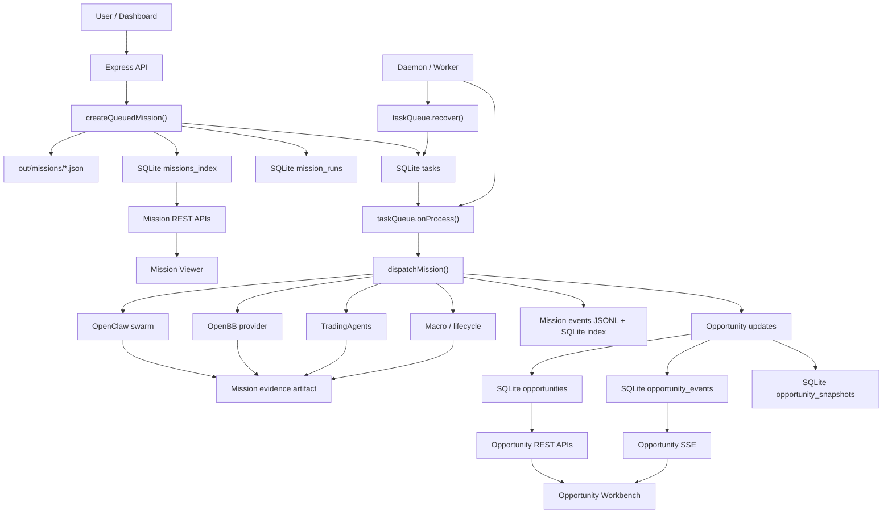
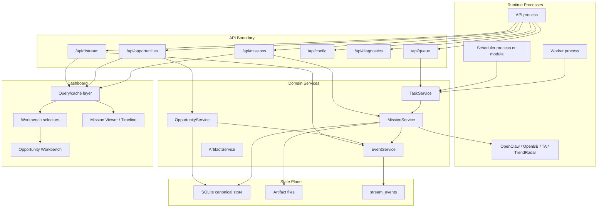

# Opportunity Runtime Maturity Technical Plan

Last updated: 2026-04-28  
Branch baseline: `codex/opportunity-runtime-maturity`  
Scope: Mission execution core, Opportunity OS, durable state, eventing, API boundary, Workbench frontend state.

## 1. Executive Summary

当前系统已经从单纯的 AI 分析任务运行器，升级成了两层系统：

- **Mission Execution Core**：负责接单、排队、执行 OpenClaw / TradingAgents / OpenBB、生成 evidence、记录 run、trace、diff。
- **Opportunity OS**：负责机会对象、机会事件、快照、评分、催化日历、Inbox、Playbook、Workbench。

方向正确。下一阶段最重要的不是继续堆更多数据源，而是把系统收紧成一个可长期日常使用的交易机会工作台。

核心目标：

- SQLite 成为状态、索引、事件、恢复的 canonical store。
- 文件系统只保存大文本 artifact，例如报告、trace、evidence snapshot。
- Task、Mission、MissionRun、Opportunity 的生命周期语义统一。
- EventBus 从进程内通知升级为 durable event log + SSE projection。
- API 从路由堆叠变为 domain route + service + validation。
- 前端从页面内手工合并轮询/SSE，升级为统一查询层 + 轻量 UI state。

成功标准：

- 用户提交一次 opportunity-linked mission 后，`mode / tickers / opportunityId / source / depth` 永不丢失。
- 任务取消、重试、恢复后，Task、MissionRun、Mission、Opportunity 四者状态一致。
- API 和 daemon 分进程运行时，Workbench 仍能看到完整事件流，不依赖进程内 EventBus。
- Workbench 的列表、Inbox、详情抽屉、事件流不会因为轮询/SSE 竞争出现明显状态回跳。
- `npm run typecheck`、`npm test`、`npm --prefix dashboard run lint` 持续通过。

## 2. Current Runtime Flow



关键文件：

- Mission 入队：[src/workflows/mission-submission.ts](../src/workflows/mission-submission.ts)
- 队列：[src/utils/task-queue.ts](../src/utils/task-queue.ts)
- Worker：[src/worker.ts](../src/worker.ts)
- Mission dispatcher：[src/workflows/dispatch-engine.ts](../src/workflows/dispatch-engine.ts)
- Opportunity store：[src/workflows/opportunities.ts](../src/workflows/opportunities.ts)
- API routes：[src/server/routes](../src/server/routes)
- Workbench：[dashboard/src/pages/OpportunityWorkbench.tsx](../dashboard/src/pages/OpportunityWorkbench.tsx)

## 3. Main Problems To Solve

### 3.1 Mission canonical state is still split

Mission 主体仍写在 `out/missions/*.json`，SQLite 保存 `missions_index`、`mission_events`、`mission_evidence_refs`。这能运行，但会带来：

- 文件写成功、SQLite index 写失败时不一致。
- API 列表仍需要扫文件，分页和筛选成本高。
- 恢复时无法只依赖 DB 重建完整运行视图。
- JSON artifact schema 无迁移机制。

目标：

- SQLite 保存 Mission 的 canonical metadata 和 latest materialized summary。
- 文件只保存大文本 report、trace、evidence snapshot。
- Mission API 默认从 SQLite 查询，只有详情大字段需要读 artifact。

### 3.2 Task dedupe key too coarse

当前 TaskQueue 按 `query + pending/running` 去重。问题：

- 同一个 query 但不同 `opportunityId` 会被误判重复。
- 同一个 query 但不同 `mode/tickers/depth/source` 语义不同。
- 重试时可能被旧 pending/running 任务挡住。

目标：

- 引入 explicit `dedupeKey`。
- 默认 dedupeKey = hash of `mode + query + tickers + opportunityId + source + depth`。
- 手动重试可带 `idempotencyKey` 或 `forceNewRun`。

### 3.3 Cancellation is cooperative but not fully bounded

当前已有 AbortSignal 和 cancel polling，但外部调用如果不响应 signal，任务可能继续耗时。

目标：

- 所有外部调用统一接收 `AbortSignal`。
- 每个外部服务调用配置 timeout。
- 任务取消后进入 `cancel_requested`，最终必须落到 `canceled` 或 `cancel_failed`。
- Worker shutdown 时不只 drain，也要对超过 grace period 的任务标记 interrupted。

### 3.4 EventBus is process-local

API 和 daemon 是不同 Node 进程，各自有自己的 `eventBus`。daemon emit 的事件不会自动进入 API 的 SSE 连接。现在 Workbench 依靠轮询兜底，这对日常使用够用，但不是真正的 durable live stream。

目标：

- 新增 `stream_events` 表作为 durable event log。
- EventBus 只作为本进程 fanout adapter。
- SSE endpoint 从 DB replay，再订阅本进程事件，同时定期 tail DB。
- API 和 daemon 分进程时仍能 replay 所有事件。

### 3.5 Opportunity API summary is expensive

`GET /opportunities` 对每个 opportunity 组合 latest mission、runs、diff、heat history、events、timeline、playbook、suggested missions。机会数增加后会变慢。

目标：

- 列表 API 返回 materialized summary。
- 详情 API 再补全 events、timeline、diff、evidence。
- Inbox 和 board health 允许缓存或基于 snapshot 增量刷新。

### 3.6 Frontend state sources are fragmented

Workbench 当前同时依赖：

- 6 组 polling
- Opportunity SSE
- URL query
- localStorage draft / saved views
- 页面内 `liveInbox/liveOpportunities/liveBoardHealth`
- detail drawer 内部状态

目标：

- 服务端数据进入统一 query/cache 层。
- URL 只保存可分享视图状态。
- localStorage 只保存草稿和 saved views。
- 组件只消费 selector 输出，不直接拼接多个数据源。

### 3.7 Runtime validation is shallow for profile objects

`heatProfile/proxyProfile/ipoProfile` 目前是 passthrough。畸形对象可能进入 DB，然后靠 normalize 兜底。

目标：

- 给 Opportunity profile 建深层 Zod schema。
- 对 score 范围做 `0..100` clamp 或 reject。
- 日期字段统一 ISO date / datetime 语义。

### 3.8 CSS and layout still carry control-room legacy

`dashboard/src/App.css` 很大，固定底栏、历史控制台样式和 Workbench 样式混在一起。

目标：

- Workbench 样式独立成模块文件。
- 固定底栏和侧栏布局用 CSS variables 管理。
- 720 / 960 / 1440 三档验收，避免按钮、长标题、底栏重叠。

## 4. Target Architecture



原则：

- API routes 不直接拼业务细节，只做 validation、auth-like boundary、HTTP shape。
- Domain services 只操作 store/service，不知道 React 或 Express。
- Worker 只消费任务，不承担 Cron 和 Telegram 的全部职责。
- DB 保存状态事实，Artifacts 保存大文本。
- Frontend 组件只关心 view model。

## 5. Data Model Plan

### 5.1 Task table

新增或规范字段：

| Field | Purpose |
| --- | --- |
| `dedupeKey` | 任务唯一性判断 |
| `idempotencyKey` | 外部请求重放保护 |
| `inputPayload` | immutable MissionInput |
| `statePayload` | OpenClaw resume state |
| `leaseId` | worker ownership |
| `heartbeatAt` | worker health |
| `cancelRequestedAt` | user/system requested cancel |
| `failureCode` | machine-readable failure |
| `degradedFlags` | partial success flags |

状态建议：

```text
pending -> running -> done
pending -> canceled
running -> cancel_requested -> canceled
running -> failed
running -> interrupted -> pending
```

兼容策略：

- 第一阶段保持现有 `status` 枚举，只在 `failureCode/degradedFlags` 里表达更细语义。
- 第二阶段再引入 `cancel_requested/interrupted` 等状态。

### 5.2 Mission canonical tables

建议逐步引入：

```sql
missions (
  id TEXT PRIMARY KEY,
  status TEXT NOT NULL,
  mode TEXT NOT NULL,
  query TEXT NOT NULL,
  source TEXT,
  depth TEXT,
  opportunityId TEXT,
  latestRunId TEXT,
  createdAt TEXT NOT NULL,
  updatedAt TEXT NOT NULL,
  inputPayload TEXT NOT NULL,
  summaryPayload TEXT,
  artifactPath TEXT
);

mission_runs (
  id TEXT PRIMARY KEY,
  missionId TEXT NOT NULL,
  taskId TEXT,
  status TEXT NOT NULL,
  stage TEXT NOT NULL,
  attempt INTEGER NOT NULL,
  workerLeaseId TEXT,
  createdAt TEXT NOT NULL,
  startedAt TEXT,
  heartbeatAt TEXT,
  completedAt TEXT,
  cancelRequestedAt TEXT,
  failureCode TEXT,
  failureMessage TEXT,
  degradedFlags TEXT
);

mission_artifacts (
  id TEXT PRIMARY KEY,
  missionId TEXT NOT NULL,
  runId TEXT,
  kind TEXT NOT NULL,
  path TEXT NOT NULL,
  contentType TEXT,
  createdAt TEXT NOT NULL,
  sizeBytes INTEGER,
  sha256 TEXT
);
```

短期不需要一次性删除 `missions_index`。可以先让新 `missions` 和旧 `missions_index` 双写，然后 API 切读新表。

### 5.3 Durable stream events

```sql
stream_events (
  id TEXT PRIMARY KEY,
  stream TEXT NOT NULL,
  type TEXT NOT NULL,
  version INTEGER NOT NULL,
  entityId TEXT,
  occurredAt TEXT NOT NULL,
  payload TEXT NOT NULL,
  source TEXT NOT NULL,
  runId TEXT
);

CREATE INDEX idx_stream_events_stream_time
  ON stream_events (stream, occurredAt ASC);

CREATE INDEX idx_stream_events_entity_time
  ON stream_events (entityId, occurredAt ASC);
```

统一 envelope：

```ts
export interface StreamEnvelope<TPayload> {
  id: string;
  stream: 'mission' | 'opportunity' | 'system';
  type: string;
  version: 1;
  occurredAt: string;
  entityId?: string;
  payload: TPayload;
  source: {
    service: 'api' | 'daemon' | 'worker' | 'scheduler' | 'trendradar' | 'openbb' | 'trading_agents';
    runId?: string;
  };
}
```

### 5.4 Opportunity profile validation

把 passthrough 改成明确 schema：

- `heatProfile.temperature`: `cold | warming | hot | crowded | broken`
- `heatProfile.validationStatus`: `forming | confirmed | fragile | broken`
- `heatProfile.edges[]`: `from/to/kind/weight/reason`
- `proxyProfile`: `mappingTarget/legitimacyScore/legibilityScore/tradeabilityScore/ruleStatus`
- `ipoProfile`: trading date, spinout date, retained stake, lockup, greenshoe, first earnings, first coverage, field evidence。

日期策略：

- 只有日期的催化用 `YYYY-MM-DD`。
- 有具体时刻的事件用 ISO datetime。
- API 接受 datetime，但 store 保持原始字符串加 parsed sortable key。

## 6. Mission Execution Lifecycle Plan

### 6.1 Mission input immutability

当前已修复：入队保存完整 `inputPayload`，Worker 优先从 task input 恢复。下一步：

- `MissionInput` 入队后不可变。
- Retry 创建新 run，但默认复用原始 input。
- 若 retry 允许 overrides，需要写入 mission event：`input_overridden`。
- Task `inputPayload` 与 Mission `inputPayload` 需要 hash 比对，发现不一致时拒绝运行或记录 `input_mismatch`。

### 6.2 Dedupe and idempotency

新增 helper：

```ts
buildTaskDedupeKey(input: MissionInput): string
```

默认规则：

```text
mission:v1:{mode}:{normalizedQuery}:{sortedTickers}:{opportunityId || none}:{source}:{depth}
```

API 支持：

- `idempotencyKey`：同一次用户操作重复提交返回同一 mission/run。
- `forceNewRun`：明确允许绕过 dedupe，用于手动重新运行。

### 6.3 Lease and recovery

Worker 领取任务：

1. 原子更新 `pending -> running`，写入 `leaseId`。
2. 每 15 秒 heartbeat。
3. 任务完成前检查 task 是否仍归当前 lease。
4. 启动时查找 heartbeat 过期的 running task，标记 interrupted，再 requeue。

建议 lease timeout：

- quick: 10 分钟
- standard: 30 分钟
- deep: 90 分钟

### 6.4 Failure semantics

统一 `failureCode`：

| Code | Meaning |
| --- | --- |
| `canceled` | 用户取消 |
| `timeout` | 外部调用或 mission 超时 |
| `execution_failed` | dispatcher 未分类错误 |
| `openclaw_failed` | OpenClaw 主脑失败 |
| `openbb_unavailable` | OpenBB 不可用 |
| `ta_unavailable` | TradingAgents 不可用 |
| `input_invalid` | inputPayload 不合法 |
| `artifact_write_failed` | artifact 保存失败 |
| `event_write_failed` | durable event 写失败 |

`degradedFlags`：

- `main_only`
- `openbb_skipped`
- `ta_skipped`
- `macro_skipped`
- `partial_evidence`
- `event_replay_lagging`

## 7. API Plan

### 7.1 Routes

保持现有路由，但内部重组：

```text
src/server/routes/
  missions.ts
  opportunities.ts
  queue.ts
  config.ts
  diagnostics.ts
  artifacts.ts
  streams.ts

src/server/services/
  mission-service.ts
  opportunity-service.ts
  queue-service.ts
  event-service.ts
  artifact-service.ts
```

### 7.2 Response shape

列表接口：

- 返回轻量 summary。
- 默认分页：`limit + cursor`。
- 返回 `nextCursor`。

详情接口：

- 返回完整 record。
- 可通过 query 参数 include 子资源：
  - `include=events,runs,evidence,timeline,diff`

### 7.3 Validation

所有写接口使用 Zod：

- `POST /api/missions`
- `POST /api/missions/:id/retry`
- `POST /api/opportunities`
- `PATCH /api/opportunities/:id`
- `PATCH /api/config/runtime`
- `PATCH /api/config/models`

错误统一：

```json
{
  "error": "Invalid request payload",
  "code": "validation_failed",
  "details": [
    { "path": "scores.relayScore", "message": "Expected number between 0 and 100" }
  ]
}
```

## 8. Eventing Plan

### 8.1 Durable event writer

新增 `EventService.append(envelope)`：

- 写 `stream_events`。
- 如果是 opportunity event，同步或兼容写 `opportunity_events`。
- emit 到本进程 `eventBus`，供本进程 SSE 立即推送。

### 8.2 SSE projection

SSE endpoint 流程：

1. 读取 `Last-Event-ID` 或 `?since=...`。
2. 从 `stream_events` replay。
3. 订阅本进程 EventBus。
4. 每 N 秒 tail DB，补齐跨进程事件。
5. heartbeat 保持连接。

### 8.3 Event taxonomy

Mission:

- `mission.created`
- `mission.queued`
- `mission.started`
- `mission.stage_changed`
- `mission.degraded`
- `mission.completed`
- `mission.failed`
- `mission.canceled`

Opportunity:

- `opportunity.created`
- `opportunity.updated`
- `opportunity.snapshot_created`
- `opportunity.thesis_upgraded`
- `opportunity.thesis_degraded`
- `opportunity.catalyst_due`
- `opportunity.relay_triggered`
- `opportunity.leader_broken`
- `opportunity.proxy_ignited`
- `opportunity.mission_queued`
- `opportunity.mission_completed`
- `opportunity.mission_failed`
- `opportunity.mission_canceled`

System:

- `service.degraded`
- `service.recovered`
- `config.reloaded`
- `scheduler.job_started`
- `scheduler.job_failed`

## 9. Frontend Plan

### 9.1 State ownership

把状态分成四类：

| State | Owner | Examples |
| --- | --- | --- |
| Server cache | query layer | opportunities, inbox, board health, queue, events |
| URL state | router | search, filters, selected lane |
| Local persistent UI | localStorage | draft, saved views |
| Ephemeral UI | component/store | open drawer, loading action key, focused lane |

禁止模式：

- 组件内同时复制 server cache 和 SSE cache，然后多个 effect 互相覆盖。
- API 请求散落在深层组件。
- 子组件自行更新 Workbench 全局列表。

### 9.2 Query/cache layer

短期不引入新依赖也可以做一个轻量 store：

```text
dashboard/src/queries/
  query-client.ts
  opportunity-queries.ts
  mission-queries.ts
  queue-queries.ts
```

职责：

- 统一 fetch、retry、stale time、error。
- SSE event 到达后 invalidate 对应 key。
- polling 降级由 query layer 管理，不在页面手工写 6 个 `usePolling`。

如果允许引入依赖，优先考虑 TanStack Query。若不想新增依赖，先实现内部 mini query layer。

### 9.3 Workbench decomposition

当前已经拆出多个子组件，下一步拆状态和 selectors：

```text
dashboard/src/pages/opportunity-workbench/
  WorkbenchPage.tsx
  useWorkbenchController.ts
  useWorkbenchViewState.ts
  useOpportunityLiveUpdates.ts
  selectors.ts
  components/*
```

目标：

- Page 只组装布局。
- Controller 负责 actions。
- Query hooks 负责数据。
- Selectors 负责 derived view model。
- Components 只渲染。

### 9.4 Interaction upgrades

优先做这些：

- 全局搜索保留，但结果要显示命中原因。
- Saved views 增加 pinned/default。
- 机会详情抽屉加入 field provenance。
- Inbox 排序显示 score breakdown。
- Mission recovery 面板显示失败原因、建议动作和预计成本。
- Catalyst reminder 支持 due soon / overdue / completed。
- 批量操作：批量归档、批量刷新、批量启动 review。

### 9.5 Responsive acceptance

验收宽度：

- 720px：侧栏变顶部，底栏不遮挡内容，卡片按钮换行。
- 960px：两列布局可读，详情抽屉不挤压主列表。
- 1440px：Inbox、Board、EventFeed 信息密度稳定。

## 10. Implementation Phases

### Phase 0: Baseline lock

目标：确认当前分支作为稳定基线。

Tasks:

- 记录当前通过的命令。
- 确认工作区干净。
- 将本方案作为后续 issue/checklist 基线。

Validation:

- `npm run typecheck`
- `npm test`
- `npm --prefix dashboard run lint`
- `npm --prefix dashboard run build`

### Phase 1: Task identity and lifecycle hardening

目标：解决 dedupe、input hash、cancel/recovery 语义。

Files:

- `src/utils/task-queue.ts`
- `src/workflows/mission-submission.ts`
- `src/worker.ts`
- `src/workflows/mission-runs.ts`
- `src/__tests__/task-queue.test.ts`
- `src/__tests__/mission-submission.test.ts`

Tasks:

- Add `dedupeKey`, `idempotencyKey`, `inputHash`.
- Change duplicate lookup from query-only to dedupeKey.
- Add task lifecycle helper functions.
- Add stale heartbeat recovery.
- Add failureCode coverage tests.

Acceptance:

- Same query with different opportunityId can create separate tasks.
- Same user idempotencyKey returns same mission/run.
- Running task with stale heartbeat requeues cleanly on daemon restart.

### Phase 2: Durable stream event log

目标：解决 API/daemon 分进程实时事件不共享的问题。

Files:

- `src/db/index.ts`
- `src/workflows/events.ts` or `src/workflows/stream-events.ts`
- `src/utils/event-bus.ts`
- `src/server/routes/opportunities.ts`
- `src/server/routes/missions.ts`
- `dashboard/src/hooks/useAgentStream.ts`

Tasks:

- Add `stream_events`.
- Implement `appendStreamEvent`.
- Dual-write mission/opportunity events.
- SSE replay from durable event log.
- SSE tail DB to capture cross-process events.

Acceptance:

- Daemon writes opportunity event, API SSE can replay it after reconnect.
- Browser refresh with `Last-Event-ID` receives missed events.
- Polling fallback can be reduced without losing updates.

### Phase 3: Mission canonical DB read path

目标：Mission 列表和详情不再依赖扫描文件。

Files:

- `src/db/index.ts`
- `src/workflows/mission-index.ts`
- `src/workflows/dispatch-engine.ts`
- `src/server/routes/missions.ts`

Tasks:

- Add `missions` and `mission_artifacts`.
- Backfill from `missions_index` and existing artifacts.
- Write mission canonical row before queueing.
- Update mission row on every status transition.
- Change list API to read DB first.

Acceptance:

- `GET /api/missions` works when artifact files are large.
- Missing artifact path returns partial metadata, not 500.
- Mission state can be recovered from DB and artifact refs.

### Phase 4: API services and deep validation

目标：路由变薄，Opportunity 写入边界变硬。

Files:

- `src/server/routes/*.ts`
- `src/server/services/*.ts`
- `src/server/validation.ts`
- `src/workflows/opportunities.ts`

Tasks:

- Extract service layer.
- Add profile schemas.
- Add pagination/cursor helpers.
- Add unified error response.
- Cache or materialize opportunity summary.

Acceptance:

- Invalid profile fields return 400 with precise path.
- Opportunity list latency does not grow linearly with heavy timeline includes.
- Route tests cover mission/opportunity/config writes.

### Phase 5: Workbench query layer

目标：页面不再手工合并 polling/SSE/local state。

Files:

- `dashboard/src/api.ts`
- `dashboard/src/hooks/useAgentStream.ts`
- `dashboard/src/pages/OpportunityWorkbench.tsx`
- `dashboard/src/pages/opportunity-workbench/*`
- `dashboard/src/queries/*`

Tasks:

- Add query/cache layer.
- Move Workbench actions into controller hook.
- Move live update handling into `useOpportunityLiveUpdates`.
- Keep URL state and localStorage state explicit.
- Add tests for selectors and live merge behavior.

Acceptance:

- SSE event updates only affected opportunity/inbox item.
- Polling refresh cannot overwrite newer streamed data with older payload.
- Workbench remains usable with SSE disconnected.

### Phase 6: Product interaction polish

目标：把工作台从“信息丰富”变成“决策明确”。

Tasks:

- Add score explanation drilldown.
- Add field provenance in detail drawer.
- Add bulk filters and bulk actions.
- Add failure recovery entry in Inbox and detail.
- Add responsive CSS split and layout QA.

Acceptance:

- 用户能看懂为什么一个机会排在前面。
- 用户能从失败任务直接选择 retry/review/archive。
- 720 / 960 / 1440 截图无重叠。

## 11. Test Strategy

Backend:

- Task dedupe key tests.
- Mission input immutability tests.
- Cancel running task tests.
- Stale heartbeat recovery tests.
- Stream event replay tests.
- Opportunity validation tests.
- Mission DB read path tests.

Frontend:

- Workbench selector tests.
- Query invalidation tests.
- SSE reconnect tests.
- URL state serialization tests.
- Draft/saved view persistence tests.
- Responsive manual screenshot QA.

Required commands before merge:

```bash
npm run typecheck
npm test
npm --prefix dashboard run lint
npm --prefix dashboard run build
```

## 12. Rollout And Backward Compatibility

Recommended rollout:

1. Add new DB fields/tables without deleting old ones.
2. Dual-write old and new stores.
3. Switch read path behind a small feature flag or fallback.
4. Run backfill script for local artifacts.
5. Remove old read path after tests and one stable usage cycle.

Feature flags:

```text
OPENCLAW_USE_DURABLE_STREAM_EVENTS=1
OPENCLAW_USE_MISSION_DB_READS=1
OPENCLAW_WORKBENCH_QUERY_LAYER=1
```

Rollback:

- If DB mission read path fails, fallback to `out/missions` scanner.
- If durable stream fails, fallback to existing SSE + polling.
- If query layer misbehaves, keep existing page state path until replaced.

## 13. Risks And Mitigations

| Risk | Impact | Mitigation |
| --- | --- | --- |
| DB migration corrupts local runtime DB | High | Add backup step, additive migrations, backfill dry-run |
| Event dual-write creates duplicates | Medium | Stable event ids and idempotent insert |
| Query layer changes UI behavior | Medium | Selector tests and feature flag |
| Worker recovery replays expensive jobs | High | Lease timeout by depth, explicit interrupted event |
| Artifact read path mismatch | Medium | Store artifact sha/size and graceful partial detail |
| External services ignore AbortSignal | Medium | Add per-call timeout and mark degraded/canceled at boundary |

## 14. First Concrete Backlog

Recommended next implementation sequence:

1. Add `dedupeKey/inputHash/idempotencyKey` to task queue.
2. Add `buildTaskDedupeKey()` and tests for same-query different-opportunity missions.
3. Add `stream_events` table and `appendStreamEvent()`.
4. Convert Opportunity events to durable stream dual-write.
5. Update Opportunity SSE to replay from `stream_events`.
6. Add deep Zod schemas for Opportunity profiles.
7. Add Workbench query layer wrapper for opportunities/inbox/board/events.
8. Move Workbench live merge logic out of page component.
9. Add responsive CSS fixes for fixed bottom strip and Workbench card actions.
10. Add backfill/read path plan for Mission canonical DB.

## 15. Definition Of Done

This maturity program is complete when:

- Mission execution can be audited from DB without depending on in-memory state.
- Opportunity state changes are replayable as durable events.
- API/daemon split process mode does not lose live updates.
- Workbench data flow is understandable from one query/cache layer.
- Cancel/retry/recover behavior is deterministic and test-covered.
- The app can be used daily without the user needing to inspect raw queue state to understand what happened.
