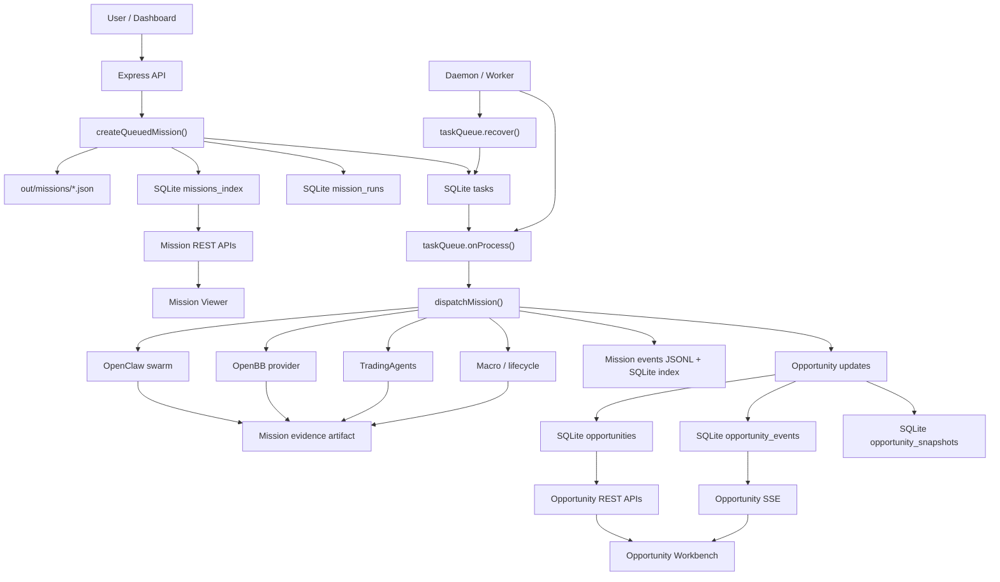
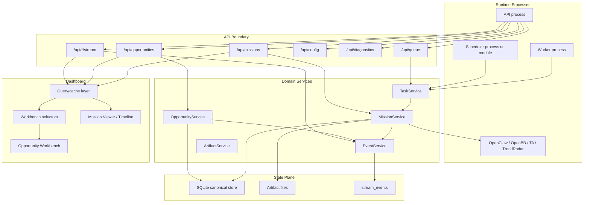

# Opportunity Runtime Maturity Technical Plan

Last updated: 2026-05-01
Branch baseline: `codex/opportunity-runtime-maturity`  
Scope: Mission execution core, Opportunity OS, durable state, eventing, API boundary, Workbench frontend state.

## 1. Executive Summary

当前系统已经从单纯的 AI 分析任务运行器，升级成了两层系统：

- **Mission Execution Core**：负责接单、排队、执行 OpenClaw / TradingAgents / OpenBB、生成 evidence、记录 run、trace、diff。
- **Opportunity OS**：负责机会对象、机会事件、快照、评分、催化日历、Inbox、Playbook、Workbench。

方向正确。下一阶段最重要的不是继续堆更多数据源，而是把系统收紧成一个可长期日常使用的交易机会工作台。

核心目标：

- SQLite 成为状态、索引、事件、恢复的 canonical store。
- 文件系统只保存大文本 artifact，例如报告、trace、evidence snapshot。
- Task、Mission、MissionRun、Opportunity 的生命周期语义统一。
- EventBus 从进程内通知升级为 durable event log + SSE projection。
- API 从路由堆叠变为 domain route + service + validation。
- 前端从页面内手工合并轮询/SSE，升级为统一查询层 + 轻量 UI state。

成功标准：

- 用户提交一次 opportunity-linked mission 后，`mode / tickers / opportunityId / source / depth` 永不丢失。
- 任务取消、重试、恢复后，Task、MissionRun、Mission、Opportunity 四者状态一致。
- API 和 daemon 分进程运行时，Workbench 仍能看到完整事件流，不依赖进程内 EventBus。
- Workbench 的列表、Inbox、详情抽屉、事件流不会因为轮询/SSE 竞争出现明显状态回跳。
- `npm run typecheck`、`npm test`、`npm --prefix dashboard run lint` 持续通过。

## 2. Current Runtime Flow


```mermaid
flowchart TB
  User["User / Dashboard"] --> API["Express API"]
  API --> MissionSubmit["createQueuedMission()"]
  MissionSubmit --> MissionFile["out/missions/*.json"]
  MissionSubmit --> MissionIndex["SQLite missions_index"]
  MissionSubmit --> Run["SQLite mission_runs"]
  MissionSubmit --> Task["SQLite tasks"]

  Daemon["Daemon / Worker"] --> Recover["taskQueue.recover()"]
  Recover --> Task
  Daemon --> QueueConsumer["taskQueue.onProcess()"]
  Task --> QueueConsumer
  QueueConsumer --> Dispatcher["dispatchMission()"]

  Dispatcher --> OpenClaw["OpenClaw swarm"]
  Dispatcher --> OpenBB["OpenBB provider"]
  Dispatcher --> TA["TradingAgents"]
  Dispatcher --> Macro["Macro / lifecycle"]
  OpenClaw --> Evidence["Mission evidence artifact"]
  OpenBB --> Evidence
  TA --> Evidence
  Macro --> Evidence

  Dispatcher --> MissionEvents["Mission events JSONL + SQLite index"]
  Dispatcher --> OpportunityUpdate["Opportunity updates"]
  OpportunityUpdate --> OppStore["SQLite opportunities"]
  OpportunityUpdate --> OppEvents["SQLite opportunity_events"]
  OpportunityUpdate --> OppSnapshots["SQLite opportunity_snapshots"]

  OppStore --> OppAPI["Opportunity REST APIs"]
  OppEvents --> OppSSE["Opportunity SSE"]
  MissionIndex --> MissionAPI["Mission REST APIs"]

  OppAPI --> Workbench["Opportunity Workbench"]
  OppSSE --> Workbench
  MissionAPI --> MissionViewer["Mission Viewer"]
```

关键文件：

- Mission 入队：[src/workflows/mission-submission.ts](../src/workflows/mission-submission.ts)
- 队列：[src/utils/task-queue.ts](../src/utils/task-queue.ts)
- Worker：[src/worker.ts](../src/worker.ts)
- Mission dispatcher：[src/workflows/dispatch-engine.ts](../src/workflows/dispatch-engine.ts)
- Opportunity store：[src/workflows/opportunities.ts](../src/workflows/opportunities.ts)
- API routes：[src/server/routes](../src/server/routes)
- Workbench：[dashboard/src/pages/OpportunityWorkbench.tsx](../dashboard/src/pages/OpportunityWorkbench.tsx)

## 3. Main Problems To Solve

### 3.1 Mission canonical state is still split

Mission 主体仍写在 `out/missions/*.json`，SQLite 保存 `missions_index`、`mission_events`、`mission_evidence_refs`。这能运行，但会带来：

- 文件写成功、SQLite index 写失败时不一致。
- API 列表仍需要扫文件，分页和筛选成本高。
- 恢复时无法只依赖 DB 重建完整运行视图。
- JSON artifact schema 无迁移机制。

当前 JS chunk 边界也已经补上：`dashboard/vite.config.ts` 通过 Rolldown `codeSplitting.groups` 固定 `react-vendor` 和 `markdown-vendor`，让 React/Router 与 Mission Viewer markdown 解析链有稳定缓存边界，并避免 markdown 解析链进入首页 initial resources。App shell 和 ErrorBoundary 的首屏图标已改为本地轻量 SVG，`lucide-react` 保持为路由懒加载 chunk。

目标：

- SQLite 保存 Mission 的 canonical metadata 和 latest materialized summary。
- 文件只保存大文本 report、trace、evidence snapshot。
- Mission API 默认从 SQLite 查询，只有详情大字段需要读 artifact。

### 3.2 Task dedupe key too coarse

当前 TaskQueue 按 `query + pending/running` 去重。问题：

- 同一个 query 但不同 `opportunityId` 会被误判重复。
- 同一个 query 但不同 `mode/tickers/depth/source` 语义不同。
- 重试时可能被旧 pending/running 任务挡住。

目标：

- 引入 explicit `dedupeKey`。
- 默认 dedupeKey = hash of `mode + query + tickers + opportunityId + source + depth`。
- 手动重试可带 `idempotencyKey` 或 `forceNewRun`。

### 3.3 Cancellation is cooperative but not fully bounded

当前已有 AbortSignal 和 cancel polling，但外部调用如果不响应 signal，任务可能继续耗时。

目标：

- 所有外部调用统一接收 `AbortSignal`。
- 每个外部服务调用配置 timeout。
- 任务取消后进入 `cancel_requested`，最终必须落到 `canceled` 或 `cancel_failed`。
- Worker shutdown 时不只 drain，也要对超过 grace period 的任务标记 interrupted。

### 3.4 EventBus is process-local

API 和 daemon 是不同 Node 进程，各自有自己的 `eventBus`。daemon emit 的事件不会自动进入 API 的 SSE 连接。现在 Workbench 依靠轮询兜底，这对日常使用够用，但不是真正的 durable live stream。

目标：

- 新增 `stream_events` 表作为 durable event log。
- EventBus 只作为本进程 fanout adapter。
- SSE endpoint 从 DB replay，再订阅本进程事件，同时定期 tail DB。
- API 和 daemon 分进程时仍能 replay 所有事件。

### 3.5 Opportunity API summary is expensive

`GET /opportunities` 对每个 opportunity 组合 latest mission、runs、diff、heat history、events、timeline、playbook、suggested missions。机会数增加后会变慢。

目标：

- 列表 API 返回 materialized summary。
- 详情 API 再补全 events、timeline、diff、evidence。
- Inbox 和 board health 允许缓存或基于 snapshot 增量刷新。

### 3.6 Frontend state sources are fragmented

Workbench 当前同时依赖：

- 6 组 polling
- Opportunity SSE
- URL query
- localStorage draft / saved views
- 页面内 `liveInbox/liveOpportunities/liveBoardHealth`
- detail drawer 内部状态

目标：

- 服务端数据进入统一 query/cache 层。
- URL 只保存可分享视图状态。
- localStorage 只保存草稿和 saved views。
- 组件只消费 selector 输出，不直接拼接多个数据源。

### 3.7 Runtime validation is shallow for profile objects

`heatProfile/proxyProfile/ipoProfile` 目前是 passthrough。畸形对象可能进入 DB，然后靠 normalize 兜底。

目标：

- 给 Opportunity profile 建深层 Zod schema。
- 对 score 范围做 `0..100` clamp 或 reject。
- 日期字段统一 ISO date / datetime 语义。

### 3.8 CSS and layout still carry control-room legacy

`dashboard/src/App.css` 曾经把固定底栏、历史控制台样式、Workbench 样式、Mission Viewer 样式、Watchlist 样式、Settings 样式、TrendRadar 样式和共享 workflow/feed/stream/timeline 样式混在一起。Workbench route 样式和响应式规则已经拆到 `dashboard/src/pages/opportunity-workbench/opportunity-workbench.css`，Mission Viewer route 样式已经拆到 `dashboard/src/pages/mission-viewer.css`，Command Center route 样式已经拆到 `dashboard/src/pages/command-center.css`，Watchlist route 样式已经拆到 `dashboard/src/pages/watchlist.css`，Settings route 样式已经拆到 `dashboard/src/pages/settings.css`，TrendRadar route 样式已经拆到 `dashboard/src/pages/trend-radar.css`，共享 workflow/feed/stream/timeline 样式已经拆到 `dashboard/src/styles/workflow-shared.css`，app shell/layout 样式已经拆到 `dashboard/src/styles/app-shell.css`，`App.css` 已退役。

目标：

- Workbench、Mission Viewer、Command Center、Watchlist、Settings、TrendRadar、app shell 和共享 workflow UI 样式已独立成 route/shared CSS 文件，Workbench 响应式规则也已随 Workbench route CSS 管理。
- React/Router 和 markdown 解析链已独立成稳定 vendor chunk；`lucide-react` 已退出 initial resources。
- 固定底栏和侧栏布局用 CSS variables 管理。
- `npm run dashboard:viewport-check` 固化 720 / 960 / 1440 三档验收，避免按钮、长标题、底栏重叠。

## 4. Target Architecture


```mermaid
flowchart TB
  subgraph Runtime["Runtime Processes"]
    API["API process"]
    Worker["Worker process"]
    Scheduler["Scheduler process or module"]
    Vendors["OpenClaw / OpenBB / TA / TrendRadar"]
  end

  subgraph StatePlane["State Plane"]
    DB["SQLite canonical store"]
    Artifacts["Artifact files"]
    EventLog["stream_events"]
  end

  subgraph DomainServices["Domain Services"]
    MissionService["MissionService"]
    TaskService["TaskService"]
    OpportunityService["OpportunityService"]
    EventService["EventService"]
    ArtifactService["ArtifactService"]
  end

  subgraph APIBoundary["API Boundary"]
    MissionRoutes["/api/missions"]
    OpportunityRoutes["/api/opportunities"]
    QueueRoutes["/api/queue"]
    ConfigRoutes["/api/config"]
    DiagnosticsRoutes["/api/diagnostics"]
    StreamRoutes["/api/*/stream"]
  end

  subgraph Frontend["Dashboard"]
    QueryClient["Query/cache layer"]
    WorkbenchStore["Workbench selectors"]
    WorkbenchUI["Opportunity Workbench"]
    MissionUI["Mission Viewer / Timeline"]
  end

  Worker --> TaskService
  Scheduler --> TaskService
  TaskService --> MissionService
  MissionService --> Vendors
  MissionService --> DB
  MissionService --> Artifacts
  MissionService --> EventService
  OpportunityService --> DB
  OpportunityService --> EventService
  EventService --> EventLog

  API --> MissionRoutes
  API --> OpportunityRoutes
  API --> QueueRoutes
  API --> ConfigRoutes
  API --> DiagnosticsRoutes
  API --> StreamRoutes
  MissionRoutes --> MissionService
  OpportunityRoutes --> OpportunityService
  QueueRoutes --> TaskService
  StreamRoutes --> EventService

  MissionRoutes --> QueryClient
  OpportunityRoutes --> QueryClient
  StreamRoutes --> QueryClient
  QueryClient --> WorkbenchStore
  WorkbenchStore --> WorkbenchUI
  QueryClient --> MissionUI
```

原则：

- API routes 不直接拼业务细节，只做 validation、auth-like boundary、HTTP shape。
- Domain services 只操作 store/service，不知道 React 或 Express。
- Worker 只消费任务，不承担 Cron 和 Telegram 的全部职责。
- DB 保存状态事实，Artifacts 保存大文本。
- Frontend 组件只关心 view model。

## 5. Data Model Plan

### 5.1 Task table

新增或规范字段：

| Field | Purpose |
| --- | --- |
| `dedupeKey` | 任务唯一性判断 |
| `idempotencyKey` | 外部请求重放保护 |
| `inputPayload` | immutable MissionInput |
| `statePayload` | OpenClaw resume state |
| `leaseId` | worker ownership |
| `heartbeatAt` | worker health |
| `cancelRequestedAt` | user/system requested cancel |
| `failureCode` | machine-readable failure |
| `degradedFlags` | partial success flags |

状态建议：

```text
pending -> running -> done
pending -> canceled
running -> cancel_requested -> canceled
running -> failed
running -> interrupted -> pending
```

兼容策略：

- 第一阶段保持现有 `status` 枚举，只在 `failureCode/degradedFlags` 里表达更细语义。
- 第二阶段再引入 `cancel_requested/interrupted` 等状态。

### 5.2 Mission canonical tables

当前已经引入 `missions` + `mission_artifacts`，并保留 `missions_index` 作为迁移期 fallback：

```sql
missions (
  id TEXT PRIMARY KEY,
  mode TEXT NOT NULL,
  query TEXT NOT NULL,
  tickers TEXT NOT NULL DEFAULT '[]',
  depth TEXT,
  source TEXT,
  opportunityId TEXT,
  status TEXT NOT NULL,
  createdAt TEXT NOT NULL,
  updatedAt TEXT NOT NULL,
  inputPayload TEXT NOT NULL,
  inputHash TEXT NOT NULL,
  latestRunId TEXT,
  latestEventId TEXT,
  artifactPath TEXT,
  artifactSha256 TEXT,
  artifactSizeBytes INTEGER
);

mission_runs (
  id TEXT PRIMARY KEY,
  missionId TEXT NOT NULL,
  taskId TEXT,
  status TEXT NOT NULL,
  stage TEXT NOT NULL,
  attempt INTEGER NOT NULL,
  workerLeaseId TEXT,
  createdAt TEXT NOT NULL,
  startedAt TEXT,
  heartbeatAt TEXT,
  completedAt TEXT,
  cancelRequestedAt TEXT,
  failureCode TEXT,
  failureMessage TEXT,
  degradedFlags TEXT
);

mission_artifacts (
  id TEXT PRIMARY KEY,
  missionId TEXT NOT NULL,
  runId TEXT,
  kind TEXT NOT NULL,
  artifactPath TEXT NOT NULL,
  sha256 TEXT,
  sizeBytes INTEGER,
  contentType TEXT,
  createdAt TEXT NOT NULL,
  updatedAt TEXT NOT NULL,
  meta TEXT
);
```

短期不需要一次性删除 `missions_index`。当前新 Mission 已经双写 `missions` 和旧 `missions_index`，API 读路径优先读 `missions`，再回退旧 index 和文件 artifact；历史行可以通过 `npm run db:missions:backfill` 或 `POST /api/diagnostics/missions/backfill` 补齐，覆盖率可通过 `GET /api/diagnostics/missions` 检查，artifact 修复建议可通过 `GET /api/diagnostics/mission-artifacts/repair-plan` 查看，安全自动修复可通过 `POST /api/diagnostics/mission-artifacts/repair` 执行。

### 5.3 Durable stream events

```sql
stream_events (
  id TEXT PRIMARY KEY,
  stream TEXT NOT NULL,
  type TEXT NOT NULL,
  version INTEGER NOT NULL,
  entityId TEXT,
  occurredAt TEXT NOT NULL,
  payload TEXT NOT NULL,
  source TEXT NOT NULL,
  runId TEXT
);

CREATE INDEX idx_stream_events_stream_time
  ON stream_events (stream, occurredAt ASC);

CREATE INDEX idx_stream_events_entity_time
  ON stream_events (entityId, occurredAt ASC);
```

统一 envelope：

```ts
export interface StreamEnvelope<TPayload> {
  id: string;
  stream: 'mission' | 'opportunity' | 'system';
  type: string;
  version: 1;
  occurredAt: string;
  entityId?: string;
  payload: TPayload;
  source: {
    service: 'api' | 'daemon' | 'worker' | 'scheduler' | 'trendradar' | 'openbb' | 'trading_agents';
    runId?: string;
  };
}
```

### 5.4 Opportunity profile validation

把 passthrough 改成明确 schema：

- `heatProfile.temperature`: `cold | warming | hot | crowded | broken`
- `heatProfile.validationStatus`: `forming | confirmed | fragile | broken`
- `heatProfile.edges[]`: `from/to/kind/weight/reason`
- `proxyProfile`: `mappingTarget/legitimacyScore/legibilityScore/tradeabilityScore/ruleStatus`
- `ipoProfile`: trading date, spinout date, retained stake, lockup, greenshoe, first earnings, first coverage, field evidence。

日期策略：

- 只有日期的催化用 `YYYY-MM-DD`。
- 有具体时刻的事件用 ISO datetime。
- API 接受 datetime，但 store 保持原始字符串加 parsed sortable key。

## 6. Mission Execution Lifecycle Plan

### 6.1 Mission input immutability

当前已修复：入队保存完整 `inputPayload`，Worker 优先从 task input 恢复。下一步：

- `MissionInput` 入队后不可变。
- Retry 创建新 run，但默认复用原始 input。
- 若 retry 允许 overrides，需要写入 mission event：`input_overridden`。
- Task `inputPayload` 与 Mission `inputPayload` 需要 hash 比对，发现不一致时拒绝运行或记录 `input_mismatch`。

### 6.2 Dedupe and idempotency

新增 helper：

```ts
buildTaskDedupeKey(input: MissionInput): string
buildMissionRetryDedupeKey(missionId: string, input: Pick<MissionInput, 'depth' | 'opportunityId'>): string
```

默认规则：

```text
mission:v1:{mode}:{normalizedQuery}:{sortedTickers}:{opportunityId || none}:{source}:{depth}
```

API 支持：

- `idempotencyKey`：同一次用户操作重复提交返回同一 mission/run。
- Mission retry/recovery active dedupe：同一 `missionId + depth + opportunityId` 的 pending/running retry 会被识别并复用，不再重复入队。
- Retry response 会返回 `recoveryAudit`，Mission event meta 也会记录 `operation/recoveryAction/reusedExistingRetry/dedupeKey/idempotencyKey`，用于后续审计和 UI 解释。
- Recovery action 会带成本提示，区分 Quick 低成本、Review/Standard 中成本、Deep 高成本。
- `forceNewRun`：明确允许绕过 dedupe，用于手动重新运行。

### 6.3 Lease and recovery

Worker 领取任务：

1. 原子更新 `pending -> running`，写入 `leaseId`。
2. 每 15 秒 heartbeat。
3. 任务完成前检查 task 是否仍归当前 lease。
4. 启动时查找 heartbeat 过期的 running task，标记 interrupted，再 requeue。

建议 lease timeout：

- quick: 10 分钟
- standard: 30 分钟
- deep: 90 分钟

### 6.4 Failure semantics

统一 `failureCode`：

| Code | Meaning |
| --- | --- |
| `canceled` | 用户取消 |
| `timeout` | 外部调用或 mission 超时 |
| `execution_failed` | dispatcher 未分类错误 |
| `openclaw_failed` | OpenClaw 主脑失败 |
| `openbb_unavailable` | OpenBB 不可用 |
| `ta_unavailable` | TradingAgents 不可用 |
| `input_invalid` | inputPayload 不合法 |
| `artifact_write_failed` | artifact 保存失败 |
| `event_write_failed` | durable event 写失败 |

`degradedFlags`：

- `main_only`
- `openbb_skipped`
- `ta_skipped`
- `macro_skipped`
- `partial_evidence`
- `event_replay_lagging`

## 7. API Plan

### 7.1 Routes

保持现有路由，但内部重组：

```text
src/server/routes/
  health.ts
  missions.ts
  opportunities.ts
  queue.ts
  mission-diagnostics.ts
  config.ts
  diagnostics.ts
  artifacts.ts
  streams.ts

src/server/services/
  health-service.ts
  mission-service.ts
  opportunity-service.ts
  opportunity-operations-service.ts
  opportunity-stream-service.ts
  queue-service.ts
  event-service.ts
  artifact-service.ts
```

### 7.2 Response shape

列表接口：

- 返回轻量 summary。
- 默认分页：`limit + cursor`。
- 返回 `nextCursor`。

详情接口：

- 返回完整 record。
- 可通过 query 参数 include 子资源：
  - `include=events,runs,evidence,timeline,diff`

### 7.3 Validation

所有写接口使用 Zod：

- `POST /api/missions`
- `POST /api/missions/:id/retry`
- `POST /api/opportunities`
- `PATCH /api/opportunities/:id`
- `PATCH /api/config/runtime`
- `PATCH /api/config/models`

错误统一：

```json
{
  "error": "Invalid request payload",
  "code": "validation_failed",
  "details": [
    { "path": "scores.relayScore", "message": "Expected number between 0 and 100" }
  ]
}
```

## 8. Eventing Plan

### 8.1 Durable event writer

新增 `EventService.append(envelope)`：

- 写 `stream_events`。
- 如果是 opportunity event，同步或兼容写 `opportunity_events`。
- emit 到本进程 `eventBus`，供本进程 SSE 立即推送。

### 8.2 SSE projection

SSE endpoint 流程：

1. 读取 `Last-Event-ID` 或 `?since=...`。
2. 从 `stream_events` replay。
3. 订阅本进程 EventBus。
4. 每 N 秒 tail DB，补齐跨进程事件。
5. heartbeat 保持连接。

### 8.3 Event taxonomy

Mission:

- `mission.created`
- `mission.queued`
- `mission.started`
- `mission.stage_changed`
- `mission.degraded`
- `mission.completed`
- `mission.failed`
- `mission.canceled`

Opportunity:

- `opportunity.created`
- `opportunity.updated`
- `opportunity.snapshot_created`
- `opportunity.thesis_upgraded`
- `opportunity.thesis_degraded`
- `opportunity.catalyst_due`
- `opportunity.relay_triggered`
- `opportunity.leader_broken`
- `opportunity.proxy_ignited`
- `opportunity.mission_queued`
- `opportunity.mission_completed`
- `opportunity.mission_failed`
- `opportunity.mission_canceled`

System:

- `service.degraded`
- `service.recovered`
- `config.reloaded`
- `scheduler.job_started`
- `scheduler.job_failed`

## 9. Frontend Plan

### 9.1 State ownership

把状态分成四类：

| State | Owner | Examples |
| --- | --- | --- |
| Server cache | query layer | opportunities, inbox, board health, queue, events |
| URL state | router | search, filters, selected lane |
| Local persistent UI | localStorage | draft, saved views with pinned/default metadata, last workbench view |
| Ephemeral UI | component/store | open drawer, loading action key, focused lane |

禁止模式：

- 组件内同时复制 server cache 和 SSE cache，然后多个 effect 互相覆盖。
- API 请求散落在深层组件。
- 子组件自行更新 Workbench 全局列表。

### 9.2 Query/cache layer

短期不引入新依赖也可以做一个轻量 store：

```text
dashboard/src/queries/
  query-client.ts
  opportunity-queries.ts
  opportunity-live-store.ts
  opportunity-live-updates.ts
  mission-queries.ts
  queue-queries.ts
  diagnostics-queries.ts
  heat-graph-queries.ts
```

职责：

- 统一 fetch、retry、stale time、error。
- 统一 list page envelope，legacy array caller 只从 wrapper 取 `items`。
- Opportunity SSE event 到达后通过 `useOpportunityLiveUpdates`、invalidation map 和 deduped refresh plan 刷新对应 key；mission 生命周期事件会同步触发 queue refresh，单个刷新失败不会产生未处理 rejection。
- Workbench live inbox/opportunity/board state 由 `useOpportunityLiveStore` 统一合并轮询快照、SSE 详情刷新和删除操作。
- Queue polling、stale task 判定和 recoverable task 判定由 `queue-queries.ts` 统一提供。
- CommandCenter diagnostics polling 由 `diagnostics-queries.ts` 统一提供。
- Heat Transfer Graph polling 由 `heat-graph-queries.ts` 统一提供。
- polling 降级由 query layer 管理，不在页面手工写 6 个 `usePolling`。

如果允许引入依赖，优先考虑 TanStack Query。若不想新增依赖，先实现内部 mini query layer。

### 9.3 Workbench decomposition

当前已经拆出多个子组件，下一步拆状态和 selectors：

```text
dashboard/src/pages/opportunity-workbench/
  OpportunityWorkbenchView.tsx
  WorkbenchSections.tsx
  BoardOpportunityList.tsx
  OpportunitySearchMatchBlock.tsx
  workbench-controller.ts
  actions.ts
  creation-actions.ts
  detail-actions.ts
  mission-actions.ts
  automation-actions.ts
  useWorkbenchViewState.ts
  interaction-state.ts
  workbench-storage.ts
  query/live update hooks
  selectors.ts
  components/*
```

目标：

- `OpportunityWorkbench.tsx` 只保留 route/page 入口。
- `workbench-controller.ts` 负责数据、动作、view state、derived state 和快捷键编排。
- `OpportunityWorkbenchView.tsx` 只负责页面大区块顺序。
- `WorkbenchSections.tsx` 负责 header、control、action/review、creation/feed、board、detail 这些 layout section。
- `BoardOpportunityList.tsx` 负责 board 空态和机会卡迭代边界，并已为大列表启用 per-column 虚拟滚动、滚动位置记忆、键盘滚动和动态 row estimate；`dashboard:viewport-check` 会硬断言键盘滚动、filter scope reset 和滚动位置恢复。
- `OpportunitySearchMatchBlock.tsx` 负责把 search query 的字段级命中原因显示在卡片上。
- `actions.ts` 只保留兼容门面，creation/detail/mission/automation hooks 分别负责各自动作。
- Storage adapter 负责 draft、saved views、default/pinned view metadata 和 last workbench view 的安全 localStorage JSON 读写。
- Query hooks 负责数据。
- Interaction state 负责 live clock、lane focus timeout/ref 和 Action Inbox 快捷键。
- Selectors 负责 derived view model。
- Components 只渲染。

### 9.4 Interaction upgrades

优先做这些：

- 全局搜索保留，但结果要显示命中原因。
- Saved views 已支持 pinned/default，后续继续打磨命中原因和视图管理体验。
- 机会详情抽屉加入 field provenance。
- Inbox 排序显示 score breakdown。
- Mission recovery 面板显示失败原因、建议动作和预计成本。
- Catalyst reminder 支持 due soon / overdue / completed。
- 批量操作：批量归档、批量刷新、批量启动 review。

### 9.5 Responsive acceptance

验收宽度：

- 720px：侧栏变顶部，底栏不遮挡内容，卡片按钮换行。
- 960px：两列布局可读，详情抽屉不挤压主列表。
- 1440px：Inbox、Board、EventFeed 信息密度稳定。

自动化入口：

```bash
npm run dashboard:viewport-check
npm run dashboard:build-size-check
npm run dashboard:quality-check
```

脚本默认自动启动 Vite、warm up route chunks、mock 核心 API、检查 Workbench / Command Center / Mission Timeline / TrendRadar / TrendRadar Raw / Mission Viewer / Watchlist / Settings，并覆盖 Workbench 空态/详情抽屉态、Workbench 失败恢复成功/失败动作态、Workbench 默认 120 张机会卡压力态、Command Center 诊断异常态、Mission Timeline 空态、Mission Timeline 失败恢复态、Mission Viewer 运行中取消态、Mission Viewer 失败恢复态、TrendRadar 空态和 72 条长标题压力态、TrendRadar Raw 空态和 260 条长表格压力态、Watchlist 空态和 84 标的大监控池压力态、Settings 错误态；截图、`report.json`、`latest.json` 和 `summary.md` 写入 `out/viewport-qa`。Command Center 诊断异常态会在 720 / 960 / 1440 下硬断言 DB migrations 降级状态、Mission canonical backfill 入口、Mission artifacts repair/refresh 入口、Opportunity field evidence backfill 入口、多操作按钮无重叠，并点击修复、刷新、回填操作验证无错误提示。Mission 失败恢复态会硬断言失败时间线卡片、失败 run metadata、最近恢复审计、恢复筛选、缺失 baseline evidence 提示、长 trace 渲染、检查 trace、重试按钮和跳转 CommandCenter 诊断。TrendRadar Raw 已拆出过滤/统计/分页状态 helper，支持标题/来源/标签搜索、80 条稳定分页、长标题双行截断、紧凑状态/来源/标签单元格和可聚焦横向表格。TrendRadar Raw 压力态会在 720 / 960 / 1440 下硬断言初始分页、搜索单条命中、状态筛选、下一页翻页和窄屏横向滚动。TrendRadar Hub 已拆出聚合 helper，统一生成 summary、top items 和 platform groups，避免渲染中重复 filter；Watchlist 已拆出搜索/分组/排序/统计 helper，支持状态统计、代码/名称/趋势/来源搜索、长文本卡片布局、价格变化和每组预览窗口，大分组默认展示前 9 个并可展开，84 标的压力态 720px 页面高度已收敛到 8308px。`watchlist-stress` 会在 720 / 960 / 1440 下硬断言初始折叠窗口、搜索过滤、展开更多和收起恢复；当前 Workbench + Command Center diagnostics + Mission running controls + Mission recovery + Mission Timeline recovery filters + Workbench source provenance + field evidence filter/artifact link/record/invalidate/restore + score evidence/contribution drilldown + catalyst action drawer checks + pre-trade catalyst link checks + manual pre-trade confirmation + audit trail checks + TrendRadar Raw + Watchlist 总 Interaction Checks 为 150/150 通过。`--stress-opportunities <n>` 可以把 Workbench 压力态切到 500/1000 张并输出独立报告；当前 Board column 已使用 per-column 虚拟滚动，默认 120 张压力态只挂载 9 张机会卡，workbench-stress 最新最大 DOM 3979。虚拟列表会按 board/filter 记忆滚动位置，支持键盘滚动，并在状态条显示挂载数、范围、定位和进度；它也会测量当前可见行的真实高度，动态调整 board/filter 级 row estimate，并同步 `content-visibility` intrinsic size。虚拟列表获得焦点后支持 `ArrowUp/ArrowDown` 定位卡片、`Enter` 打开当前卡片详情、`PageUp/PageDown` 滚动列表。详情抽屉会在打开后聚焦关闭按钮，支持 `Escape` 关闭，并恢复焦点到原触发按钮或虚拟列表。默认 `workbench-stress` 还会执行 `Interaction Checks`，在 720 / 960 / 1440 下硬断言 drawer 初始焦点、drawer 焦点恢复、虚拟卡片 drawer 焦点恢复、active row 键盘定位、Enter 打开详情后恢复列表焦点、键盘滚动、filter scope reset 和滚动位置恢复，压力态检查为 21/21 通过；`workbench-recovery-action` 额外硬断言 Quick 重跑、恢复动作成本提示、重复点击只提交一次 retry 请求、顶部反馈、卡片内反馈和查看任务入口；`workbench-recovery-failure` 额外硬断言 503 失败反馈、先检查服务建议、卡片内失败建议和不展示查看任务入口，Workbench 相关检查合计 81/81 通过，覆盖 source provenance、field evidence filter/artifact link/record/invalidate/restore、score evidence/contribution 和 catalyst action 抽屉断言、pre-trade catalyst link 断言、manual pre-trade confirmation、审计同步与详情抽屉 audit trail 断言。`--stress-expand-rounds <n>` 会增加 `workbench-stress-expand` 场景并记录每轮虚拟滚动后的 `Interaction Metrics`；500 张、滚动 3 轮时最多挂载 9 张机会卡，DOM 到 3821 节点，0 soft warning。报告也记录 smoke 级性能观测：navigation/action/screenshot/inspect 耗时、DOM 节点数、可见节点数、页面高度、渲染卡片数、截图体积，以及 slowest/largest DOM/tallest pages 汇总。Workbench stress DOM 超过 10k、总耗时超过 5s、截图超过 6MB、页面高度超过 60k px 或压力态渲染机会卡超过 48 张时会产生 soft warning；同一路由相对上次快照出现明显趋势退化时也会产生 warning，默认规则是总耗时当前至少 5s 且同时增加 30% 和 1000ms、DOM 同时增加 15% 和 500 节点、截图同时增加 30% 和 0.5MB、页面高度同时增加 25% 和 2000px。导航阶段会对瞬时 `page.goto` 失败做一次重试，截图阶段也会重试；attempts 会分别写入 `Navigation Retries` 和 `Screenshot Retries`。默认只提示，使用 `--fail-on-warning` 才会让 warning 变成失败。该数据用于观察趋势，不作为精确 benchmark。

Opportunity source provenance 已经扩展出统一 `fieldEvidence` summary：后端在 Opportunity summary 中同时索引基础字段、score snapshot、relay/proxy profile、IPO/catalyst source refs、最新 Mission、最新 event 和人工补充的 `field_evidence_recorded` 事件；Workbench 详情抽屉会在 provenance header 显示字段覆盖数。字段 label、kind、source、confidence 的基础规则已收口到 `src/workflows/opportunity-field-registry.ts`，后端 summary、手动 evidence 记录、作废/恢复审计和前端记录表单都复用同一套归一化结果，避免继续用 `scores.*` 这类字符串规则推断语义。人工字段证据现在会双写 `opportunity_field_evidence` canonical 表，并以 `field_evidence_recorded` 事件 id 作为 evidence id；作废/恢复会更新 canonical status，summary 优先读表，旧事件流继续作为历史 fallback。历史 `field_evidence_*` 事件可以通过 CLI 或 diagnostics API backfill 到 canonical 表，覆盖率诊断会报告 missing canonical、orphan canonical、status mismatch 和 missing field meta。字段证据现在可以携带 Mission artifact 反查链接：score/profile 在有 latest run evidence 时深链到 Mission Viewer 的 `?run=` 视图，Mission/event refs 回到对应 Mission artifact context。详情抽屉也可以为任意已索引字段补充 evidence/source/confidence/note，并写入 Opportunity 事件流，刷新后反投进 `fieldEvidence.items`；人工证据可通过 `field_evidence_invalidated` 作废，summary 会排除已作废项并保留作废审计事件；作废证据可通过 `field_evidence_restored` 恢复，审计视图支持按 recorded / invalidated / restored、field、source、confidence 筛选。评分解释器现在优先使用统一 field evidence，缺失时回退旧的 sourceProvenance/profile refs，保证新旧 summary 都能解释为什么某个排序因子靠前。

催化日历提醒已经从简单日期提示升级为行动提示：missed、overdue、today、soon、missing date、observed 和 watch 会分别派生复核错过、今天验证、提前准备、补日期、复盘观察或继续观察等下一步。单机会提醒现在也会先按紧急度排序，再提供给 Workbench drawer 和 pre-trade checklist；交易前检查清单会把 missed / overdue / missing date 变成 block，把 observed / watch 变成 warn，把 today / soon 变成 pass。非 pass 清单项可以在前端本地标记已处理并记录 evidence/source note，并会通过 pre-trade confirmation API 写入 Opportunity 事件流；Opportunity event 查询支持 type filter，详情抽屉会拉取并展示 pre-trade audit trail，人工确认只代表处理进度，不覆盖系统自动 readiness。Workbench drawer 的 catalyst action、pre-trade catalyst link 和 manual confirmation、审计同步与 audit trail 检查会在三档 viewport 下断言缺日期和已观察催化的行动文案。

`dashboard:build-size-check` 默认先执行 production build，再读取 `dashboard/dist` 并生成 `out/dashboard-build-size/report.json`、`latest.json` 和 `summary.md`。它记录所有产物的原始体积与 gzip 体积、`index.html` initial resources、largest JS/CSS chunks、React vendor、markdown vendor 和 Opportunity Workbench chunk，并对绝对体积、趋势退化、lazy-only chunk 意外进入 initial resources 做 soft warning。当前 Vite chunk 策略使用 Rolldown `codeSplitting.groups` 并关闭依赖递归吸附，避免 `markdown-vendor` 把 React/JSX runtime 吸进去后出现在首页 preload 链路；首屏入口约 75.9KB gzip，入口 `index` chunk 约 5.3KB gzip。该脚本补齐 viewport QA 没覆盖的打包边界：如果 route chunk、vendor chunk 或 initial JS 慢慢膨胀，可以在用户体感变慢前先看到。

`dashboard:quality-check` 是聚合入口：默认串联 build size QA 和 viewport QA，再输出 `out/dashboard-quality/report.json` 与 `summary.md`。它把 hard failure、soft warning、initial resources、slowest viewport check、largest DOM 和 warning/failure preview 放在同一份报告中；`--from-existing` 可以只汇总最近一次子报告，适合长 QA 后快速复读结果。

## 10. Implementation Phases

### Phase 0: Baseline lock

目标：确认当前分支作为稳定基线。

Tasks:

- 记录当前通过的命令。
- 确认工作区干净。
- 将本方案作为后续 issue/checklist 基线。

Validation:

- `npm run typecheck`
- `npm test`
- `npm --prefix dashboard run lint`
- `npm --prefix dashboard run build`

### Phase 1: Task identity and lifecycle hardening

目标：解决 dedupe、input hash、cancel/recovery 语义。

Files:

- `src/utils/task-queue.ts`
- `src/workflows/mission-submission.ts`
- `src/worker.ts`
- `src/workflows/mission-runs.ts`
- `src/__tests__/task-queue.test.ts`
- `src/__tests__/mission-submission.test.ts`

Tasks:

- Add `dedupeKey`, `idempotencyKey`, `inputHash`.
- Change duplicate lookup from query-only to dedupeKey.
- Add task lifecycle helper functions.
- Add stale heartbeat recovery.
- Add failureCode coverage tests.

Acceptance:

- Same query with different opportunityId can create separate tasks.
- Same user idempotencyKey returns same mission/run.
- Same active retry/recovery request returns the existing mission/run instead of enqueuing a duplicate.
- Running task with stale heartbeat requeues cleanly on daemon restart.

### Phase 2: Durable stream event log

目标：解决 API/daemon 分进程实时事件不共享的问题。

Files:

- `src/db/index.ts`
- `src/workflows/events.ts` or `src/workflows/stream-events.ts`
- `src/utils/event-bus.ts`
- `src/server/routes/opportunities.ts`
- `src/server/routes/missions.ts`
- `dashboard/src/hooks/useAgentStream.ts`

Tasks:

- Add `stream_events`.
- Implement `appendStreamEvent`.
- Dual-write mission/opportunity events.
- SSE replay from durable event log.
- SSE tail DB to capture cross-process events.

Acceptance:

- Daemon writes opportunity event, API SSE can replay it after reconnect.
- Browser refresh with `Last-Event-ID` receives missed events.
- Polling fallback can be reduced without losing updates.

### Phase 3: Mission canonical DB read path

目标：Mission 列表和详情不再依赖扫描文件。

Files:

- `src/db/index.ts`
- `src/workflows/mission-index.ts`
- `src/workflows/dispatch-engine.ts`
- `src/server/routes/missions.ts`

Tasks:

- Update mission row on every status transition.
- Add dry-run repair reports for canonical Mission rows.
- Keep list/detail API on canonical DB first, with fallback until backfill is complete.

Acceptance:

- `GET /api/missions` works when artifact files are large.
- Missing artifact path returns partial metadata, not 500.
- Mission state can be recovered from DB and artifact refs.

### Phase 4: API services and deep validation

目标：路由变薄，Opportunity 写入边界变硬。

Files:

- `src/server/routes/*.ts`
- `src/server/services/*.ts`
- `src/server/validation.ts`
- `src/workflows/opportunities.ts`

Tasks:

- Extract service layer.
- Add profile schemas.
- Add pagination/cursor helpers.
- Add unified error response.
- Cache or materialize opportunity summary.

Acceptance:

- Invalid profile fields return 400 with precise path.
- Mission and Opportunity list APIs can opt into `{ items, pageInfo }` without breaking default array responses.
- Dashboard API/query layer can consume Mission/Opportunity page envelopes while preserving legacy array helpers and list hooks.
- Opportunity list latency does not grow linearly with heavy timeline includes.
- Route tests cover mission/opportunity/config writes.

### Phase 5: Workbench query layer

目标：页面不再手工合并 polling/SSE/local state。

Files:

- `dashboard/src/api.ts`
- `dashboard/src/hooks/useAgentStream.ts`
- `dashboard/src/pages/OpportunityWorkbench.tsx`
- `dashboard/src/pages/opportunity-workbench/*`
- `dashboard/src/queries/*`

Tasks:

- Add query/cache layer.
- Keep `PageEnvelope<T>` wrappers as the list contract for Mission/Opportunity queries.
- Keep queue polling behind `useQueueQuery`.
- Keep CommandCenter diagnostics behind `useCommandCenterDiagnostics`.
- Keep heat graph polling behind `useHeatTransferGraphsQuery`.
- Keep Workbench actions split into creation/detail/mission/automation controller hooks behind the existing `actions.ts` facade.
- Continue moving live update handling into `useOpportunityLiveUpdates`.
- Keep live snapshot/upsert/remove merging in `useOpportunityLiveStore`.
- Keep live clock, lane focus, and keyboard shortcut state in `interaction-state.ts`.
- Keep URL state explicit and route draft/saved-view/default/last-view persistence through `workbench-storage.ts`.
- Add tests for selectors and live merge behavior.

Acceptance:

- SSE event updates only affected opportunity/inbox item.
- Polling refresh cannot overwrite newer streamed data with older payload.
- Live inbox rows can be removed when the detail endpoint reports they no longer belong in Action Inbox.
- Query invalidation map covers high-signal Opportunity events.
- Refresh planning dedupes repeated stream events and repeated opportunity ids before touching cache.
- Action Inbox shortcut mapping stays stable while focus timeout/ref behavior lives outside the page component.
- Heat Graph to Relay Opportunity seed payload mapping is covered by helper tests.
- Draft/saved-view/last-view storage falls back safely for malformed JSON, missing browser storage, and failed writes.
- SSE helper tests cover replay cursor construction, lastEventId priority, and replay frame dedupe.
- Workbench remains usable with SSE disconnected.

### Phase 6: Product interaction polish

目标：把工作台从“信息丰富”变成“决策明确”。

Tasks:

- Score explanation drilldown now exposes factor evidence plus positive-driver / risk-drag / watch-factor contribution direction and relative weight; continue calibrating weights against real ranking data.
- Add field provenance in detail drawer.
- Add bulk filters and bulk actions.
- Add failure recovery entry in Inbox and detail.
- Continue responsive CSS split and layout QA; Workbench, Mission Viewer, Command Center, Watchlist, Settings, TrendRadar, app shell, shared workflow/feed/stream/timeline, Workbench responsive CSS, React/Router vendor chunk, markdown vendor chunk, shell icon lightening, and dashboard quality aggregation are done.

Acceptance:

- 用户能看懂为什么一个机会排在前面。
- 用户能从失败任务直接选择 retry/review/archive。
- `npm run dashboard:viewport-check` 在 720 / 960 / 1440 下无横向溢出、文本溢出和 console error。

## 11. Test Strategy

Backend:

- Task dedupe key tests.
- Mission input immutability tests.
- Cancel running task tests.
- Stale heartbeat recovery tests.
- Stream event replay tests.
- Opportunity validation tests.
- Mission DB read path tests.

Frontend:

- Workbench selector tests.
- Query invalidation tests.
- Hook-level SSE reconnect tests cover replay cursor reuse and pending timer cleanup.
- URL state serialization tests.
- Draft/saved view/default view/last-view persistence tests.
- Board list tests cover large-list render windows, virtual ranges, and stable render increments.
- Responsive manual screenshot QA.

Required commands before merge:

```bash
npm run typecheck
npm test
npm --prefix dashboard run lint
npm --prefix dashboard run build
```

## 12. Rollout And Backward Compatibility

Recommended rollout:

1. Add new DB fields/tables without deleting old ones.
2. Dual-write old and new stores.
3. Switch read path behind a small feature flag or fallback.
4. Run backfill script for local artifacts.
5. Remove old read path after tests and one stable usage cycle.

Feature flags:

```text
OPENCLAW_USE_DURABLE_STREAM_EVENTS=1
OPENCLAW_USE_MISSION_DB_READS=1
OPENCLAW_WORKBENCH_QUERY_LAYER=1
```

Rollback:

- If DB mission read path fails, fallback to `out/missions` scanner.
- If durable stream fails, fallback to existing SSE + polling.
- If query layer misbehaves, keep existing page state path until replaced.

## 13. Risks And Mitigations

| Risk | Impact | Mitigation |
| --- | --- | --- |
| DB migration corrupts local runtime DB | High | Add backup step, additive migrations, backfill dry-run |
| Event dual-write creates duplicates | Medium | Stable event ids and idempotent insert |
| Query layer changes UI behavior | Medium | Selector tests and feature flag |
| Worker recovery replays expensive jobs | High | Lease timeout by depth, explicit interrupted event |
| Artifact read path mismatch | Medium | Store artifact sha/size and graceful partial detail |
| External services ignore AbortSignal | Medium | Add per-call timeout and mark degraded/canceled at boundary |

## 14. First Concrete Backlog

Recommended next implementation sequence:

1. Add `dedupeKey/inputHash/idempotencyKey` to task queue.
2. Add `buildTaskDedupeKey()` and tests for same-query different-opportunity missions.
3. Add `stream_events` table and `appendStreamEvent()`.
4. Convert Opportunity events to durable stream dual-write.
5. Update Opportunity SSE to replay from `stream_events`.
6. Add deep Zod schemas for Opportunity profiles.
7. Add Workbench query layer wrapper for opportunities/inbox/board/events.
8. Move Workbench live merge logic out of page component into `useOpportunityLiveStore`.
9. Add responsive CSS fixes for fixed bottom strip and Workbench card actions.
10. Add backfill/read path plan for Mission canonical DB.

## 15. Definition Of Done

This maturity program is complete when:

- Mission execution can be audited from DB without depending on in-memory state.
- Opportunity state changes are replayable as durable events.
- API/daemon split process mode does not lose live updates.
- Workbench data flow is understandable from one query/cache layer.
- Cancel/retry/recover behavior is deterministic and test-covered.
- The app can be used daily without the user needing to inspect raw queue state to understand what happened.
