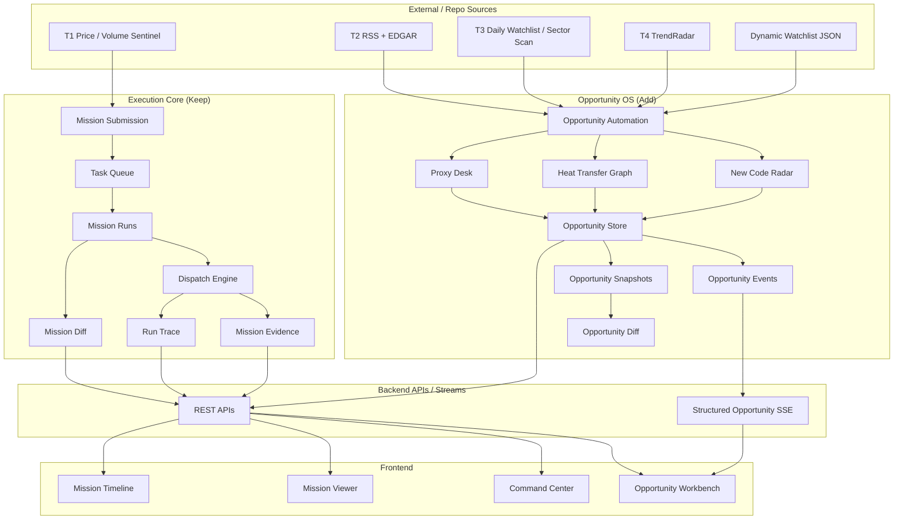
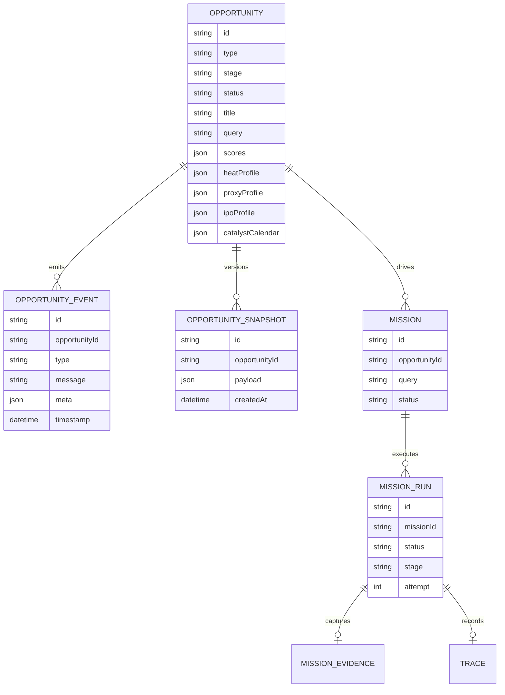
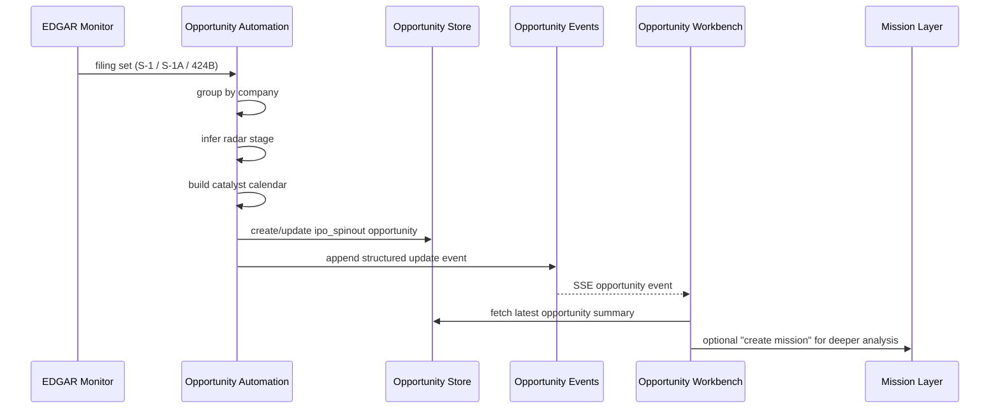
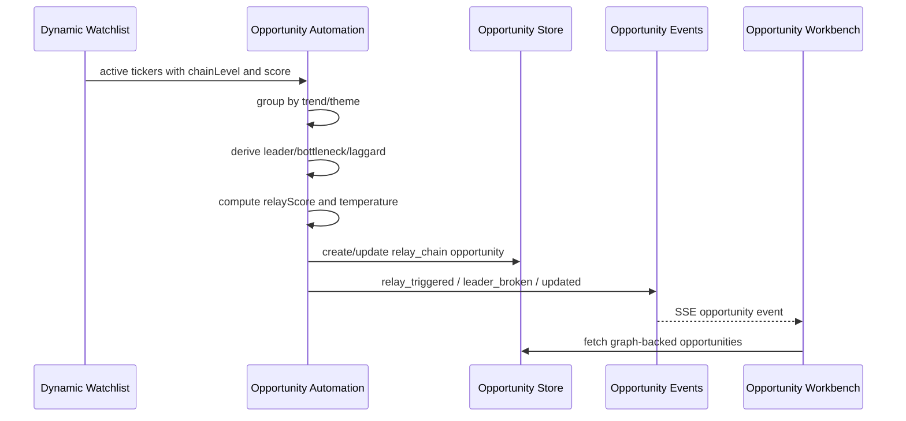

# Opportunity System Technical Blueprint

## 1. Intent

This blueprint defines the target architecture for the app as a **dual-layer system**:

- Layer A: keep the current app as an **analysis execution and evidence platform**
- Layer B: add an **opportunity operating system** that models market transmission and trading workflows

This is an additive architecture, not a replacement architecture.

The execution core remains the system of record for:

- `mission`
- `mission_run`
- `mission_evidence`
- `trace`
- run-level compare

The new opportunity layer becomes the system of record for:

- `opportunity`
- `opportunity_event`
- `opportunity_snapshot`
- thesis-level diff
- catalyst calendar
- heat-transfer graph
- proxy / new-code / relay workflows

## 2. Design Principles

### 2.1 Preserve the execution core

The current mission platform is already strong in:

- queueing
- retries
- cancellation
- evidence capture
- auditability
- replayability

It should remain the lower runtime substrate.

### 2.2 Put trading logic one layer above execution

The opportunity layer should decide:

- what is worth tracking
- what phase it is in
- what changed in the thesis
- what catalyst matters next
- whether the market is transmitting heat

The mission layer should decide:

- how analysis runs
- which agents are executed
- what evidence is captured
- what the run state is

### 2.3 Favor structured state over free text

Free text is still useful for reports and reasoning, but the opportunity layer should persist structured objects whenever possible:

- calendar items
- transmission nodes
- relay score
- proxy score
- stage
- status
- changed categories

### 2.4 The UI should reflect trader workflows, not operator workflows only

The system should keep the control plane, but the default homepage should optimize for:

- what is new
- what is changing
- what is about to trigger
- what is degrading

## 3. Target System Architecture

## 4. Domain Model

### 4.1 Execution core entities

- `mission`
  - durable analysis request
- `mission_run`
  - one execution attempt of a mission
- `mission_evidence`
  - run-scoped evidence snapshot
- `trace`
  - run-scoped agent trace
- `mission_diff`
  - compare current run vs previous run

### 4.2 Opportunity layer entities

- `opportunity`
  - trader-facing object
  - one opportunity can trigger many missions over time
- `opportunity_event`
  - structured event stream for the opportunity layer
- `opportunity_snapshot`
  - versioned thesis snapshot
- `opportunity_diff`
  - compare latest snapshot vs previous snapshot

### 4.3 Relationship model

## 5. Opportunity Types

### 5.1 Type `3`: New Code Radar

Purpose:

- detect new tradable symbols early
- convert filing progression into a structured trading calendar
- keep supply-overhang and identity milestones visible

Current repo-backed inputs:

- EDGAR filing stream
- manual opportunity creation
- mission analysis on demand

Target object fields:

- `type = ipo_spinout`
- `stage = radar | tracking | ready`
- `ipoProfile`
- `catalystCalendar`
- `supplyOverhang`
- `latestFilingType`
- `latestFiledAt`

Target lifecycle:

1. detect `S-1`
2. detect `S-1/A`
3. detect `424B`
4. confirm actual trading date
5. attach retained-stake / lockup / first-earnings / first-coverage milestones
6. trigger mission analysis around milestone windows

### 5.2 Type `4`: Heat Transfer Graph

Purpose:

- make transmission from leader to bottleneck to laggard explicit
- model where heat is going, not just which tickers were detected

Current repo-backed inputs:

- dynamic watchlist
- chain levels
- multibagger scores
- lifecycle engine context

Target object fields:

- `type = relay_chain`
- `leaderTicker`
- `relatedTickers`
- `relayTickers`
- `heatProfile`
- `relayScore`
- `transmissionSummary`

Target lifecycle:

1. aggregate dynamic watchlist by theme
2. identify leader / bottleneck / laggard sets
3. build a transmission graph
4. score transmission quality
5. emit structured events when relay triggers or breaks
6. trigger missions when relay becomes actionable

### 5.3 Type `5`: Proxy Desk

Purpose:

- model public symbols that the market uses as thematic proxies
- separate symbol-trading logic from product-quality logic

Current repo-backed inputs:

- TrendRadar
- narrative memory
- manual opportunity creation

Target object fields:

- `type = proxy_narrative`
- `proxyTicker`
- `proxyProfile`
- `policyStatus`
- `purity / scarcity / legitimacy / legibility / tradeability`

Target lifecycle:

1. detect theme
2. identify public proxy candidates
3. score them
4. track rule-state changes
5. emit ignition / degradation events

## 6. Data Flow by Subsystem

### 6.1 New Code Radar flow

### 6.2 Heat Transfer Graph flow

## 7. Storage Strategy

### 7.1 Keep current hybrid storage temporarily

Current state:

- runs and opportunities in SQLite
- missions in JSON files
- dynamic watchlist in JSON

This is acceptable for the current phase because the mission core is already running and stable.

### 7.2 Preferred medium-term storage direction

Move trader-facing decision objects toward SQLite first:

- `opportunities`
- `opportunity_events`
- `opportunity_snapshots`
- `heat_transfer_edges`
- `new_code_calendar_items`
- `proxy_candidates`

Then decide whether missions should later migrate from file-based JSON into SQLite as well.

Recommendation:

- do **not** migrate missions immediately
- first finish opportunity-layer modeling
- migrate mission persistence only after opportunity APIs stabilize

## 8. Backend Component Plan

### 8.1 Keep these modules as execution core

- [src/workflows/mission-submission.ts](/Users/sineige/Desktop/AIAnalysisStock/src/workflows/mission-submission.ts:1)
- [src/utils/task-queue.ts](/Users/sineige/Desktop/AIAnalysisStock/src/utils/task-queue.ts:1)
- [src/workflows/dispatch-engine.ts](/Users/sineige/Desktop/AIAnalysisStock/src/workflows/dispatch-engine.ts:1)
- [src/workflows/mission-runs.ts](/Users/sineige/Desktop/AIAnalysisStock/src/workflows/mission-runs.ts:1)
- [src/workflows/mission-evidence.ts](/Users/sineige/Desktop/AIAnalysisStock/src/workflows/mission-evidence.ts:1)
- [src/workflows/mission-diff.ts](/Users/sineige/Desktop/AIAnalysisStock/src/workflows/mission-diff.ts:1)

### 8.2 Keep these modules as opportunity core

- [src/workflows/opportunities.ts](/Users/sineige/Desktop/AIAnalysisStock/src/workflows/opportunities.ts:1)
- [src/workflows/opportunity-diff.ts](/Users/sineige/Desktop/AIAnalysisStock/src/workflows/opportunity-diff.ts:1)
- [src/workflows/opportunity-automation.ts](/Users/sineige/Desktop/AIAnalysisStock/src/workflows/opportunity-automation.ts:1)

### 8.3 Add next

Recommended next backend modules:

- `opportunity-calendars.ts`
  - normalize all calendar items
  - compute due-soon and stale states
- `heat-transfer-graph.ts`
  - separate graph-building from sync side effects
  - support edge weights and validation history
- `proxy-scoring.ts`
  - centralize proxy score calculation
- `opportunity-ranking.ts`
  - sort workbench items by tradability and urgency

Current branch status:

- `opportunity-calendars.ts` is now implemented.
- `heat-transfer-graph.ts` is now implemented.
- `opportunity-ranking.ts` is now implemented and drives the workbench inbox.

## 9. API Plan

### 9.1 Keep current mission APIs

- `/api/missions`
- `/api/missions/:id`
- `/api/missions/:id/runs`
- `/api/missions/:id/runs/:runId/evidence`
- mission SSE

### 9.2 Keep and expand opportunity APIs

Current:

- `/api/opportunities`
- `/api/opportunities/:id`
- `/api/opportunity-events`
- `/api/opportunities/stream`
- `/api/opportunities/graphs/heat-transfer`
- `/api/opportunities/graphs/heat-transfer/sync`
- `/api/opportunities/radar/new-codes/refresh`

Recommended next:

- `GET /api/opportunities/radar/new-codes`
- `GET /api/opportunities/:id/snapshots`
- `GET /api/opportunities/:id/diff`
- `GET /api/opportunities/:id/graph`
- `POST /api/opportunities/:id/analyze`

## 10. Frontend Information Architecture

### 10.1 Keep two entry points

- `OpportunityWorkbench`
  - trader-first
- `CommandCenter`
  - operator-first

This is important. The system needs both.

### 10.2 Target workbench layout

1. Top summary strip
2. Action inbox
3. New Code Radar board
4. Heat Transfer Graph board
5. Proxy Desk board
6. Structured event stream

### 10.3 Action inbox ranking

Sort by:

1. catalyst due soon
2. thesis degraded
3. relay just triggered
4. proxy just ignited
5. new code entered trading window

### 10.4 Frontend interaction improvements

Recommended next UX upgrades:

- replace some polling with more structured SSE consumption
- add “why now” explanations per card
- add “what changed in thesis” summary line before mission metadata
- add graph detail drawer for relay chains
- add calendar detail drawer for new-code opportunities
- add explicit stale-data badges

## 11. Event Model

Current opportunity events:

- `created`
- `updated`
- `mission_linked`
- `mission_queued`
- `mission_completed`
- `mission_failed`
- `mission_canceled`
- `signal_changed`
- `thesis_upgraded`
- `thesis_degraded`
- `leader_broken`
- `relay_triggered`
- `proxy_ignited`
- `catalyst_due`

Recommended additions:

- `new_code_detected`
- `new_code_pricing_window`
- `new_code_trading_confirmed`
- `lockup_window_due`
- `coverage_initiated`
- `breadth_expanding`
- `breadth_contracting`
- `proxy_rule_changed`

## 12. Optimization Priorities

### 12.1 New Code Radar

Current weakness:

- filing-aware, not exchange-calendar-aware

Next improvements:

- real trading-date confirmation
- retained-stake tracking
- lockup calendar precision
- first independent earnings schedule
- initiation / coverage ingestion

### 12.2 Heat Transfer Graph

Current weakness:

- graph is mostly static grouping plus score

Next improvements:

- edge weights
- breadth tracking
- leader-health history
- transmission validation history
- junk-tail detection
- laggard ranking confidence

### 12.3 Proxy Desk

Current weakness:

- still mostly manual and lightly modeled

Next improvements:

- explicit private-leader to public-proxy mapping
- rule-state change ingestion
- theme breadth confirmation
- dedicated proxy ranking

### 12.4 Information propagation chain

Current weakness:

- some business logic still lives in frontend assembly or route-level glue

Target direction:

- push derivation into reusable backend services
- let APIs return already-ranked, already-labeled trader objects
- let frontend focus on workflow and actionability

## 13. Delivery Roadmap

### Phase 1

Done:

- mission lifecycle hardening
- opportunity base model
- event stream
- snapshots
- thesis diff

### Phase 2

Done:

- New Code Radar auto-sync from EDGAR filing progression
- Heat Transfer Graph auto-build from dynamic watchlist

### Phase 3

In progress:

- dedicated action inbox ranking

Next:

- exchange-calendar-aware New Code Radar
- weighted Heat Transfer Graph persistence and validation history

### Phase 4

Next:

- Proxy Desk scoring engine
- rule-state ingestion
- breadth-aware opportunity ranking

### Phase 5

Later:

- optional migration of mission persistence into SQLite
- historical analytics over opportunities, relays, and outcomes

## 14. Recommended Immediate Next Step

If development continues from the current branch, the best next build order is:

1. `opportunity-calendars.ts`
2. `heat-transfer-graph.ts`
3. `opportunity-ranking.ts`
4. `proxy-scoring.ts`

That sequence improves precision first, then graph quality, then user-facing prioritization.
