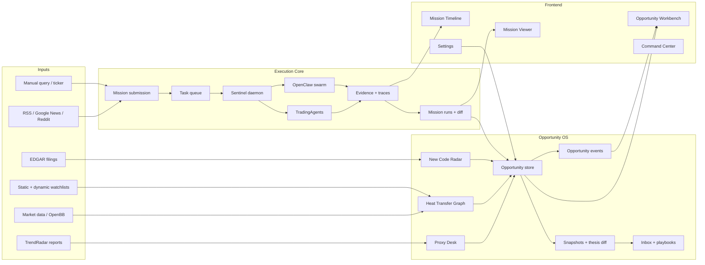
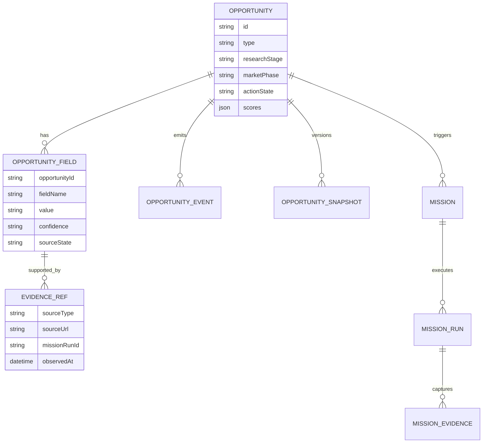
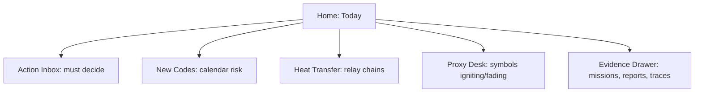

# System Maturity Review And Improvement Plan

Last updated: 2026-04-26

## 1. Executive Summary

The project has evolved from an analysis runner into a two-layer intelligence system:

- **Execution core**: mission submission, task queue, swarm execution, TradingAgents/OpenBB integration, evidence capture, mission runs, trace and run diff.
- **Opportunity OS**: Opportunity model, New Code Radar, Heat Transfer Graph, Proxy Desk, opportunity events, snapshots, thesis diff, inbox, playbooks and Workbench UI.

This additive architecture is directionally right. The biggest remaining gap is maturity: several modules can already express the trading workflow, but the system still lacks enough structured provenance, durable event replay, quantitative validation, and interaction ergonomics to behave like a true day-to-day trading opportunity operating system.

## 2. Current Operating Mechanism



Repo evidence:

- Mission input is still execution-oriented: `src/workflows/mission-submission.ts`.
- Opportunity domain now exists as an additive layer: `src/workflows/opportunities.ts`, `src/workflows/types.ts`.
- New Code Radar and Heat Transfer Graph are partially automated: `src/workflows/opportunity-calendars.ts`, `src/workflows/heat-transfer-graph.ts`.
- Frontend has moved toward an opportunity-first Workbench: `dashboard/src/pages/OpportunityWorkbench.tsx`.
- Structured opportunity SSE exists, but it is still a live stream rather than a durable replayable event pipe: `src/server/app.ts`.

## 3. System Structure Gaps

### 3.1 Domain Model

Current strength:

- `Opportunity` is now a first-class object.
- Mission is no longer the only mental model.
- The system can represent `ipo_spinout`, `relay_chain`, `proxy_narrative`, and `ad_hoc`.

Remaining gaps:

- Opportunity scores are still mostly heuristic. They are useful for prioritization, but not yet sufficiently explainable as “score = evidence + market behavior + confidence”.
- The system does not persist a strong provenance chain per field. A user can see a catalyst or profile, but not always the exact source, extraction confidence, timestamp and conflict state.
- `Opportunity` and `Mission` relationship is present, but not yet rich enough to answer: “which evidence changed my thesis, and which mission proved that change?”
- Opportunity stages still blend research stage, market phase, and action readiness. These should eventually become separate fields.

Recommended model refinement:



### 3.2 Data And Storage

Current strength:

- SQLite supports task queue and mission runs.
- JSON files still make early iteration fast.
- Snapshots and diffs are now present at the Opportunity layer.

Remaining gaps:

- Storage is split across SQLite, `out/missions`, JSON watchlists, TrendRadar SQLite output, vendor output folders and generated reports.
- There is no clear migration layer for Opportunity tables and schema evolution.
- Event data is not yet treated as the canonical audit log. Some state is materialized first and events are added afterward.
- The repo lacks a unified data retention policy for `tmp`, `out`, `vendors/*/output`, and local DB files.

Recommended direction:

- Introduce a small migration system for project-owned SQLite tables.
- Move Opportunity store, snapshots, inbox and action state into SQLite as the canonical store.
- Keep JSON as import/export and seed format, not the long-term operational store.
- Add `source_ref` objects to every derived field.
- Define retention rules: runtime DB remains local, `tmp` and generated reports are ignored/cleanable, user-curated docs stay tracked.

### 3.3 Eventing And Information Transmission

Current strength:

- SSE already streams `agent_log`.
- Opportunity-specific SSE exists through `opportunity_event`.
- UI can react to live opportunity events.

Remaining gaps:

- SSE event payloads do not yet use a versioned envelope.
- There is no cursor or replay. A browser refresh can miss events emitted during disconnect.
- Heartbeats are present, but no server-side connection diagnostics are exposed.
- Backend still mixes logs, lifecycle state and opportunity signals. These need different event types and retention expectations.

Recommended event envelope:

```ts
type StreamEnvelope<T> = {
  id: string;
  stream: 'mission' | 'opportunity' | 'system';
  type: string;
  version: 1;
  occurredAt: string;
  entityId?: string;
  payload: T;
  source: {
    service: 'api' | 'daemon' | 'trendradar' | 'trading_agents' | 'openbb';
    runId?: string;
  };
};
```

Implemented baseline:

- Opportunity SSE now emits this versioned envelope shape.
- The stream writes SSE `id:` lines using the durable `opportunity_events.id`.
- The backend accepts `Last-Event-ID` or `?since=<eventId>` and replays missed Opportunity events.
- The frontend Opportunity stream keeps the last event id and reconnects with `?since=...`.
- REST event APIs still return the raw event record for backward compatibility.

Priority events:

- `opportunity_created`
- `catalyst_due`
- `relay_triggered`
- `proxy_ignited`
- `thesis_upgraded`
- `thesis_degraded`
- `leader_broken`
- `config_reloaded`
- `service_degraded`

### 3.4 Service Architecture

Current strength:

- API and daemon now have separate entrypoints.
- Dev mode has watch-based restarts.
- The new dev stack script can run API, daemon, dashboard and vendors separately.
- `config/models.yaml` is now watched by server and daemon.

Remaining gaps:

- The daemon is still a large monolith: cron scheduling, queue recovery, analysis execution, alerts and automation live in one file.
- Vendor services are started as local child processes in shell scripts, but the app has no service registry or lifecycle state beyond health probes.
- Backpressure is mostly queue-level, not external-service-level.
- Runtime config hot update is stronger for TypeScript services than for Python vendor services.

Recommended split:

- `scheduler`: owns cron and due-work detection.
- `worker`: owns queue leases and mission execution.
- `automation`: owns Opportunity sync jobs.
- `notifier`: owns Telegram and future alert channels.
- `api`: owns REST/SSE and UI state.
- `vendor-adapters`: owns OpenBB, TradingAgents, TrendRadar health and capabilities.

## 4. Trading Workflow Gaps

### 4.1 New Code Radar

Current strength:

- The system has an IPO/spinout type and calendar fields.
- EDGAR monitoring exists.
- Candidate radar can generate initial Opportunity records.

Remaining gaps:

- The system does not yet extract formal trading day, spinout completion date, retained stake, lockup, greenshoe and first independent earnings from filings with evidence references.
- It lacks calendar severity: “identity event”, “supply event”, “validation event”, “coverage event”.
- It does not yet warn when an event is approaching and the thesis has not been refreshed.

Recommended improvement:

- Build a filing-to-calendar extractor with schema validation.
- Add `catalyst_due` and `supply_overhang_due` events.
- Add a calendar heat score: nearer confirmed catalysts count more than inferred placeholders.

### 4.2 Heat Transfer Graph

Current strength:

- The repo already has chain concepts such as leader, bottleneck and hidden gem.
- Lifecycle logic has leader-health guardrails.
- Heat Transfer Graph exists as an Opportunity workflow.

Remaining gaps:

- The graph is not yet explicit enough as a causal transmission chain.
- It needs market confirmation: leader trend, breadth, volume expansion, laggard catch-up and breakdown detection.
- The user should be able to inspect why each edge exists.

Recommended graph object:

```ts
type HeatTransferEdge = {
  fromTicker: string;
  toTicker: string;
  relation: 'leader_to_bottleneck' | 'bottleneck_to_laggard' | 'proxy_mapping';
  causalSentence: string;
  evidenceRefs: EvidenceRef[];
  marketConfirmation: {
    relativeStrength: number;
    volumeExpansion: number;
    trendState: 'forming' | 'confirming' | 'accelerating' | 'weakening' | 'broken';
  };
};
```

### 4.3 Proxy Desk

Current strength:

- Proxy scoring exists conceptually through purity, scarcity, policy, catalyst and tradeability.
- The UI already exposes proxy cards and board health.

Remaining gaps:

- “点火/退潮数” must be made fully explainable. It should not feel like a magic number.
- Policy and rule-state changes are not yet automatically extracted from HKEX/filing/exchange sources.
- The proxy system needs time stop logic: if a proxy does not diffuse within the expected window, it should be downgraded.

Recommended calculation:

- `ignitionCount`: count of recent positive structured events such as `proxy_ignited`, `thesis_upgraded`, `policy_status_improved`, `volume_expansion_confirmed`, `peer_breadth_expanded`.
- `fadeCount`: count of recent negative structured events such as `thesis_degraded`, `leader_broken`, `policy_status_weakened`, `volume_expansion_failed`, `time_stop_triggered`.
- `netProxyMomentum`: weighted `ignitionCount - fadeCount`, decayed by event age.
- Every count should link to the exact event list behind it.

Implemented baseline:

- Proxy Desk board-health metrics now expose `explanation` and `details`.
- `点火` explains whether it came from a `proxy_ignited` event or from purity/scarcity/legitimacy score thresholds.
- `退潮` explains whether it came from `degraded` status or downgrade/failure/cancel events.
- The Workbench shows active metric explanations and the top supporting opportunity details after a metric is selected.

## 5. Frontend Interaction Gaps

### 5.1 Information Architecture

Current strength:

- The Workbench now reflects the 3/4/5 opportunity worldview.
- Mission Viewer and Timeline remain useful as evidence drawers.

Remaining gaps:

- The UI still sometimes feels like a powerful operations console rather than a trader’s daily cockpit.
- User attention is split between tasks, opportunities, logs, graphs and reports without a single “what changed today?” decision lane.
- Opportunity cards show many values, but the most important next action is not always dominant enough.

Recommended home IA:



### 5.2 Card Design And Density

Current strength:

- Opportunity cards are scannable and domain-specific.
- Scores and stages are visible.

Remaining gaps:

- Score labels need tooltips or drilldowns that explain “what produced this number”.
- Catalyst confidence should be visible near every calendar item.
- Related tickers and relay tickers need clearer roles, not just lists.
- A “why now?” sentence should be more prominent than raw metadata.

Recommended card hierarchy:

- Top line: type, ticker, stage, status.
- Main line: why now.
- Decision line: next catalyst, next action, deadline.
- Evidence line: latest mission, latest diff, confidence.
- Expansion: full events, field provenance, chart/graph.

### 5.3 Graph And Timeline Interaction

Current strength:

- Mission Timeline captures execution and evidence.
- Heat Transfer Graph API exists.

Remaining gaps:

- There is no visual causal graph for `leader -> bottleneck -> laggard`.
- Timeline is still mission-centric; opportunity narrative needs its own transmission timeline.
- Users cannot yet compare “what changed in the thesis” directly from the Opportunity card without entering detail mode.

Recommended interaction:

- Add a compact graph strip to relay-chain cards.
- Add edge confidence and market confirmation chips.
- Add “Thesis changed” drawer: previous vs current stage, score, catalyst, leader health and proxy state.
- Add keyboard triage: `A` act, `S` snooze, `R` refresh mission, `D` degrade.

### 5.4 Creation Flow

Current strength:

- Template presets exist for IPO/spinout, relay chain and proxy narrative.

Remaining gaps:

- The creation form still asks the user to know too much up front.
- It should support progressive capture: quick seed now, enrich later.
- It should detect if the new card duplicates an existing opportunity.

Recommended creation flow:

- Step 1: choose template.
- Step 2: enter one ticker/query and one-sentence thesis.
- Step 3: system suggests type-specific fields.
- Step 4: preview scores, catalysts and suggested missions.
- Step 5: create card and queue first mission.

## 6. Reliability, Testing And Observability Gaps

Current strength:

- Core tests pass.
- Typechecking is now split between core and dashboard.
- The development stack now has preflight and logs.

Remaining gaps:

- No browser-level regression tests for Opportunity Workbench.
- No contract tests for SSE event payloads.
- No migration tests for durable Opportunity storage.
- No chaos tests for vendor downtime.
- No redaction audit for logs that may include provider details.

Recommended testing ladder:

- Unit tests: scoring, calendar extraction, graph edge derivation.
- Contract tests: event envelope schemas and REST responses.
- Integration tests: queue -> mission -> opportunity event -> UI polling/SSE.
- Browser tests: Workbench triage, create flow, score drilldown, Settings save.
- Dev smoke: `npm run check:dev-env`, `npm run typecheck`, `npm test`, dashboard build.

## 7. Roadmap

### P0: Stabilize The Platform

- Keep API and daemon split.
- Keep the dev stack preflight and log directory.
- Add durable SSE envelope and replay cursor.
- Move Opportunity store fully into migrated SQLite tables.
- Add structured field provenance.

### P1: Make The Trading Models Explainable

- New Code Radar filing-to-calendar extraction.
- Heat Transfer Graph edge evidence and market confirmation.
- Proxy Desk ignition/fade event ledger.
- Thesis diff surfaced on cards.
- Board health based on structured events, not only summarized state.

### P2: Make The UI A Daily Cockpit

- Home page becomes Today decision lane.
- Opportunity cards show why-now, next action and evidence confidence first.
- Mission Viewer becomes a drawer from the opportunity context.
- Add visual relay graph and proxy momentum drilldown.
- Add keyboard triage and batch actions.

### P3: Production Hardening

- Service registry and lifecycle dashboard.
- Vendor adapter isolation and retry budgets.
- Structured logs with redaction.
- Database backups and retention policy.
- Browser regression tests in CI.

## 8. North Star

The project should keep its original identity as an analysis execution and evidence platform. The Opportunity OS should sit above it as a second path, not replace it.

The mature version of the system should answer five questions quickly:

- What new symbol entered the market’s field of view?
- What theme is transmitting heat from leader to second layer?
- Which public proxy is being used as the market’s symbol?
- What changed since the last thesis snapshot?
- What should I do today: act, refresh, wait, downgrade or ignore?
